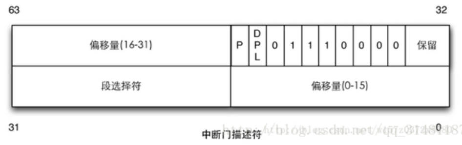
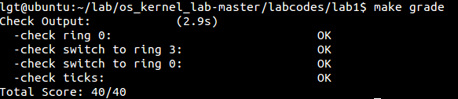

# lab1 实验报告 #
201908010502 林观田

## 练习 ##
### **练习一**

#### 1.操作系统镜像文件ucore.img是如何一步一步生成的？(需要比较详细地解释Makefile中每一条相关命令和命令参数的含义，以及说明命令导致的结果)

答：Makefile文件中定义了许多ucore在qemu模拟器中执行的相关命令及其参数，首先查看Makefile文件中生成ucore.img的相关代码，可知生成ucore.img首先需要生成kernel和bootblock。

```makefile
# create ucore.img
UCOREIMG	:= $(call totarget,ucore.img)

$(UCOREIMG): $(kernel) $(bootblock)
	$(V)dd if=/dev/zero of=$@ count=10000
	$(V)dd if=$(bootblock) of=$@ conv=notrunc
	$(V)dd if=$(kernel) of=$@ seek=1 conv=notrunc

$(call create_target,ucore.img)
```

生成kernel的代码如下：

```makefile
# kernel
#生成kernel需要的文件的位置
KINCLUDE	+= kern/debug/ \
			   kern/driver/ \
			   kern/trap/ \
			   kern/mm/

KSRCDIR		+= kern/init \
			   kern/libs \
			   kern/debug \
			   kern/driver \
			   kern/trap \
			   kern/mm

KCFLAGS		+= $(addprefix -I,$(KINCLUDE))
#生成kernel所需的.o文件的关键代码
$(call add_files_cc,$(call listf_cc,$(KSRCDIR)),kernel,$(KCFLAGS))

KOBJS	= $(call read_packet,kernel libs)

# create kernel target
kernel = $(call totarget,kernel)

$(kernel): tools/kernel.ld

$(kernel): $(KOBJS)
	@echo + ld $@
	$(V)$(LD) $(LDFLAGS) -T tools/kernel.ld -o $@ $(KOBJS)
	@$(OBJDUMP) -S $@ > $(call asmfile,kernel)
	@$(OBJDUMP) -t $@ | $(SED) '1,/SYMBOL TABLE/d; s/ .* / /; /^$$/d' > $(call symfile,kernel)

$(call create_target,kernel)
```

生成bootblock的代码如下：

```makefile
# create bootblock
#生成bootasm.o,bootmain.o的相关makefile代码，由宏定义批量实现
bootfiles = $(call listf_cc,boot)
$(foreach f,$(bootfiles),$(call cc_compile,$(f),$(CC),$(CFLAGS) -Os -nostdinc))

bootblock = $(call totarget,bootblock)

$(bootblock): $(call toobj,$(bootfiles)) | $(call totarget,sign)
	@echo + ld $@
	$(V)$(LD) $(LDFLAGS) -N -e start -Ttext 0x7C00 $^ -o $(call toobj,bootblock)
	@$(OBJDUMP) -S $(call objfile,bootblock) > $(call asmfile,bootblock)
	@$(OBJCOPY) -S -O binary $(call objfile,bootblock) $(call outfile,bootblock)
	@$(call totarget,sign) $(call outfile,bootblock) $(bootblock)

$(call create_target,bootblock)
```

其中生成bootblock需要生成sign工具，代码如下：

```makefile
# create 'sign' tools
$(call add_files_host,tools/sign.c,sign,sign)
$(call create_target_host,sign,sign)
```

通过运行“make V=”命令执行make并显示相关执行信息，由执行结果可知，在lab1中会生成一个bin文件夹，文件夹中包含一个名为bootblock二进制文件、两个名分别为kernel和sign的可执行文件以及ucore.img文件，从终端打印出来的详细信息可得：

##### （1）在生成kernel之前，会编译以下文件生成.o文件：

> kern/init/init.c、kern/libs/readline.c、kern/libs/stdio.c、kern/debug/kdebug.c、kern/debug/kmonitor.c、kern/debug/panic.c、kern/driver/clock.c、kern/driver/console.c、kern/driver/intr.c、kern/driver/picirq.c、kern/trap/trap.c、kern/trap/trapentry.S、kern/trap/vectors.S、kern/mm/pmm.c、libs/printfmt.c、libs/string.c

.o文件生成方式和参数均类似，以init.o为例，编译的命令为：

> gcc -Ikern/init/ -march=i686 -fno-builtin -fno-PIC -Wall -ggdb -m32 -gstabs -nostdinc  -fno-stack-protector -Ilibs/ -Ikern/debug/ -Ikern/driver/ -Ikern/trap/ -Ikern/mm/ -c kern/init/init.c -o obj/kern/init/init.o

参数的含义为：

> -march=i686	指定的是当前cpu的架构为i686
>
> -fno-builtin 	除非用__builtin_前缀，否则不进行builtin函数的优化
>
> -fno-PIC 
>
> -Wall 	编译后显示所有警告
>
> -ggdb 	生成可供gdb使用的调试信息。这样才能用qemu+gdb来调试bootloader or ucore。
>
> -m32 	生成适用于32位环境的代码。我们用的模拟硬件是32bit的80386，所以ucore也要是32位的软件。
>
> -gstabs 	生成stabs格式的调试信息。这样要ucore的monitor可以显示出便于开发者阅读的函数调用栈信息
>
> -nostdinc  	不使用标准库。标准库是给应用程序用的，此处为编译ucore内核，OS内核是提供服务的，所以所有的服务要自给自足。
>
> -fno-stack-protector	不生成用于检测缓冲区溢出的代码。
>
> -I<dir> 	添加搜索头文件的路径

生成kernel的命令为：

> ld bin/kernel
> ld -m elf_i386 -nostdlib -T tools/kernel.ld -o bin/kernel  obj/kern/init/init.o obj/kern/libs/readline.o obj/kern/libs/stdio.o obj/kern/debug/kdebug.o obj/kern/debug/kmonitor.o obj/kern/debug/panic.o obj/kern/driver/clock.o obj/kern/driver/console.o obj/kern/driver/intr.o obj/kern/driver/picirq.o obj/kern/trap/trap.o obj/kern/trap/trapentry.o obj/kern/trap/vectors.o obj/kern/mm/pmm.o  obj/libs/printfmt.o obj/libs/string.o

此处出现的新参数为“-m”、“-T”，其含义为

> -m	模拟为i386上的连接器
>
> -T <scriptfile>  让连接器使用指定的脚本

##### （2）在生成bootblock之前，会编译以下文件生成.o文件：

> boot/bootasm.S、boot/bootmain.c、tools/sign.c

生成bootasm.o、bootmain.o文件的命令如下：

> cc boot/bootasm.S
> gcc -Iboot/ -march=i686 -fno-builtin -fno-PIC -Wall -ggdb -m32 -gstabs -nostdinc  -fno-stack-protector -Ilibs/ -Os -nostdinc -c boot/bootasm.S -o obj/boot/bootasm.o

此处出现的新参数为“-Os”，其含义为

> -Os	为减小代码大小而进行优化。根据硬件spec，主引导扇区只有512字节，我们写的简单bootloader的最终大小不能大于510字节。

生成sign工具的命令如下：

> gcc -Itools/ -g -Wall -O2 -c tools/sign.c -o obj/sign/tools/sign.o
> gcc -g -Wall -O2 obj/sign/tools/sign.o -o bin/sign

此处出现的新参数为“-O2”和“-g”，其含义为

> -O2	采用二级优化优化生成的代码
>
> -g	生成gdb调试信息

生成bootblock的命令如下：

> ld -m    elf_i386 -nostdlib -N -e start -Ttext 0x7C00 obj/boot/bootasm.o obj/boot/bootmain.o -o obj/bootblock.o

此处出现的新参数为“-nostdlib”、“-N”、“-e”、“-Ttext”，其含义为

> -nostdlib  不使用标准库
> -N  设置代码段和数据段均可读写
> -e <entry>  指定入口
> -Ttext  制定代码段开始位置

执行最后输出的信息为：

> 'obj/bootblock.out' size: 472 bytes
> build 512 bytes boot sector: 'bin/bootblock' success!

>  生成一个有10000个块的文件，每个块默认512字节，用0填充
>
> dd if=/dev/zero of=bin/ucore.img count=10000
> 10000+0 records in
> 10000+0 records out
> 5120000 bytes (5.1 MB) copied, 0.0193562 s, 265 MB/s

> 把bootblock中的内容写到第一个块
>
> dd if=bin/bootblock of=bin/ucore.img conv=notrunc
> 1+0 records in
> 1+0 records out
> 512 bytes (512 B) copied, 0.000271679 s, 1.9 MB/s

> 从第二个块开始写kernel中的内容
>
> dd if=bin/kernel of=bin/ucore.img seek=1 conv=notrunc
> 146+1 records in
> 146+1 records out
> 74879 bytes (75 kB) copied, 0.000356628 s, 210 MB/s


#### 2.一个被系统认为是符合规范的硬盘主引导扇区的特征是什么？

由sign.c文件可得，硬盘主引导扇区的特征是只有512个字节，且最后两个字节为0x55AA最为结束标识。

------

### 练习二

为了熟悉使用qemu和gdb进行的调试工作，进行以下练习：

> 1. 从CPU加电后执行的第一条指令开始，单步跟踪BIOS的执行。
> 2. 在初始化位置0x7c00设置实地址断点,测试断点正常。
> 3. 从0x7c00开始跟踪代码运行,将单步跟踪反汇编得到的代码与bootasm.S和 bootblock.asm进行比较。
> 4. 自己找一个bootloader或内核中的代码位置，设置断点并进行测试。

（1）由于默认的gdb需要进行一些额外的配置才进行qemu的调试任务。qemu和gdb之间使用网络端口1234进行通讯。首先修改lab1/tools/gdbinit中的内容为

> set architecture i8086
> target remote :1234

（2）在lab1目录下执行

> make debug

执行后会自动打开另一个终端和QEMU模拟器界面，此时gdb停在BIOS的第一条指令处，此时的`CS=0xf, IP=fff0`,使用“x/i 0xffff0”可以查看到BIOS的第一条指令如下，是一条长跳转指令，将跳转到0xe05b地址执行

```
0xffff0: ljmp $0xf000,$0xe05b
```

下面就可以用调试命令si对BIOS的代码进行单步跟踪，为了方便查看调试过程当前代码和eip对应的机器汇编指令，可以通过“layout split”命令分割终端窗口，使得单步跟踪时可以对照源代码和汇编代码，或通过"x/i $pc"查看当前即将执行的指令，使调试过程更清楚。（qemu的作用：让ucore在qemu模拟的x86硬件环境中执行）

（3）在初始化位置0x7c00设置实地址断点

> b *0x7c00
>

这时成功在0x7c00处停止运行，此时qemu会打印出以下信息：

> Booting from Hard Disk...

继续单步跟踪，然后输入“continue”，最终终端会输出以下的内核信息：此处显示了各种段的起始地址，说明开始执行bootloader之后，存在一个启动段机制的过程。

> os is loading...
>
> Special kernel symbols:
> entry  0x00100000 (phys)	//内核入口地址
> etext  0x0010321c (phys)	//text段起始地址
> edata  0x0010ea16 (phys)	//data段起始地址
> end    0x0010fd20 (phys)	//结束地址
> Kernel executable memory footprint: 64KB //内核可执行内存大小
> ++ setup timer interrupts	//启动时钟，时钟初始化

然后查看此处的反汇编代码如下：

> 0x7c00:      cli    
> 0x7c01:      cld    
> 0x7c02:      xor    %eax,%eax
> 0x7c04:      mov    %eax,%ds
> 0x7c06:      mov    %eax,%es
> 0x7c08:      mov    %eax,%ss 
> 0x7c0a:      in     $0x64,%al
> 0x7c0c:      test   $0x2,%al
> 0x7c0e:      jne    0x7c0a
>  0x7c10:      mov    $0xd1,%al

并打开bootasm.S文件进行对比，发现文件中的“running bootloader”后的汇编代码指令与终端中显示的一致，但是其中的数据有所不同。为了进一步对比，在调用qemu 时增加-d in_asm -D q.log 参数，便可以将运行的汇编指令保存在q.log 中。重新修改Makefile文件和tools/gdbinit文件如下：

> debug: $(UCOREIMG)
> 	#$(V)$(QEMU) -S -s -parallel stdio -hda $< -serial null &
> 	$(V)$(TERMINAL) -e "$(QEMU) -S -s -d in_asm -D $(BINDIR)/q.log -parallel stdio -hda $< -serial null"
> 	$(V)sleep 2
> 	$(V)$(TERMINAL) -e "gdb -q -tui -x tools/gdbinit"

> file bin/kernel
> set architecture i8086
> target remote :1234
> b *0x7c00
> continue
> x /10i $pc

再次运行“make debug”，执行完毕后，可以在bin/q.log中读到"call bootmain"前执行的命令，对比与bootasm.S和 bootblock.asm，发现代码相同。

在设置一个断点“b *0x7c0a"，输入”continue“，可使程序执行至开启A20的起始地址”0x7c0a“处停下。

------

### 练习三

了解如何从实模式切换到保护模式，需要了解：

> - 为何开启A20，以及如何开启A20
> - 如何初始化GDT表
> - 如何使能和进入保护模式

##### **（1）为何需要开启A20**

Intel早期的8086 CPU提供了20根地址线,可寻址空间范围即0~2^20(00000H~FFFFFH)的 1MB内存空间。8086的数据处理位宽位16位，无法直接寻址1MB内存空间，所以8086提供了段地址加偏移地址的地址转换机制。PC机的寻址结构是segment:offset，segment和offset都是16位的寄存器，最大值是0ffffh，换算成物理地址的计算方法是把segment左移4位，再加上offset，segment:offset的地址表示能力，超过了20位地址线的物理寻址能力。所以当寻址到超过1MB的内存时，会发生“回卷”（不会发生异常）。但下一代的基于Intel 80286 CPU的PC AT计算机系统提供了24根地址线，这样CPU的寻址范围变为 2^24=16M,同时也提供了保护模式，可以访问到1MB以上的内存了，此时如果遇到“寻址超过1MB”的情况，系统不会再“回卷”了，这就造成了向下不兼容。为了保持完全的向下兼容性，IBM决定在PC AT计算机系统上加个硬件逻辑，来模仿以上的回绕特征，于是出现了A20 Gate。在实模式下要访问高端内存区，在保护模式下使用了32位地址线，两种模式下均需要打开A20 Gate。

明确打开A20 Gate的步骤：

> 1. 等待8042 Input buffer为空；
> 2. 发送Write 8042 Output Port （P2）命令到8042 Input buffer；
> 3. 等待8042 Input buffer为空；
> 4. 将8042 Output Port（P2）得到字节的第2位置1，然后写入8042 Input buffer；

##### **（2）如何开启A20**

根据bootasm.S文件进行分析，从入口条件和地址“with %cs=0 %ip=7c00”开始执行，首先将flag和段寄存器置0.

```assembly
.code16                                             # Assemble for 16-bit mode
    cli                                             # Disable interrupts
    cld                                             # String operations increment
    # Set up the important data segment registers (DS, ES, SS).
    xorw %ax, %ax                                   # Segment number zero
    movw %ax, %ds                                   # -> Data Segment
    movw %ax, %es                                   # -> Extra Segment
    movw %ax, %ss                                   # -> Stack Segment
```

当 A20 地址线控制禁止时，则程序就像在 早期的8086 中运行，1MB 以上的地址是不可访问的。而在保护模式下 A20 地址线控制是要打开的，所以需要通过将键盘控制器上的A20线置于高电位，使得全部32条地址线可用。

```assembly
    # Enable A20: For backwards compatibility with the earliest PCs, physical
    #  address line 20 is tied low, so that addresses higher than
    #  1MB wrap around to zero by default. This code undoes this.
seta20.1:
    inb $0x64, %al   # Wait for not busy(8042 input buffer empty)，等待8042键盘控制器不忙
    testb $0x2, %al
    jnz seta20.1

    movb $0xd1, %al     # 0xd1 -> port 0x64，发送“写数据到8042输出端口P2”的指令
    outb %al, $0x64     # 0xd1 means: write data to 8042's P2 port/写数据到8042输出端口P2

seta20.2:
    inb $0x64, %al      # Wait for not busy(8042 input buffer empty)，等待8042键盘控制器不忙
    testb $0x2, %al
    jnz seta20.2

    movb $0xdf, %al     # 0xdf -> port 0x60，通过写入数据11011111到0x60，将A20置1
    outb %al, $0x60     # 0xdf = 11011111, means set P2's A20 bit(the 1 bit) to 1
```

##### **（3）如何初始化GDT表**

通过载入已经静态储存在引导区中的GDT全局描述符表（一个保存多个段描述符的“数组”）及其描述符实现初始化。（段描述符包含：段基地址、段界限、段属性等）

```assembly
# Switch from real to protected mode, using a bootstrap GDT and segment translation that # makes virtual addresses identical to physical addresses, so that the effective memory # # map does not change during the switch.
    lgdt gdtdesc
```

##### **（4）如何使能和进入保护模式**

通过将cr0寄存器PE位置1开启保护模式。

```assembly
    movl %cr0, %eax
    orl $CR0_PE_ON, %eax
    movl %eax, %cr0
```

通过长跳转到32位代码段，重装CS和EIP，更新CS的基地址。

```assembly
    # Jump to next instruction, but in 32-bit code segment.
    # Switches processor into 32-bit mode.
    ljmp $PROT_MODE_CSEG, $protcseg
```

重新设置保护模式下的段寄存器。

```assembly
.code32                                             # Assemble for 32-bit mode
protcseg:
    # Set up the protected-mode data segment registers
    movw $PROT_MODE_DSEG, %ax                       # Our data segment selector
    movw %ax, %ds                                   # -> DS: Data Segment
    movw %ax, %es                                   # -> ES: Extra Segment
    movw %ax, %fs                                   # -> FS
    movw %ax, %gs                                   # -> GS
    movw %ax, %ss                                   # -> SS: Stack Segment
```

转换为保护模式完成，建立堆栈并调用进入boot主方法。

```assembly
    # Set up the stack pointer and call into C. The stack region is from 0--start(0x7c00)
    movl $0x0, %ebp
    movl $start, %esp
    call bootmain
```

------

### 练习四

通过阅读bootmain.c，了解bootloader如何加载ELF文件。通过分析源代码和通过qemu来运行并调试bootloader&OS

> - bootloader如何读取硬盘扇区的？
> - bootloader是如何加载ELF格式的OS？

首先明确ELFHDR和proghdr的结构体的定义：

```c
/* file header */
struct elfhdr {
    uint32_t e_magic;     // must equal ELF_MAGIC
    uint8_t e_elf[12];
    uint16_t e_type;      // 1=relocatable, 2=executable, 3=shared object, 4=core image
    uint16_t e_machine;   // 3=x86, 4=68K, etc.
    uint32_t e_version;   // file version, always 1
    uint32_t e_entry;     // entry point if executable
    uint32_t e_phoff;     // file position of program header or 0
    uint32_t e_shoff;     // file position of section header or 0
    uint32_t e_flags;     // architecture-specific flags, usually 0
    uint16_t e_ehsize;    // size of this elf header
    uint16_t e_phentsize; // size of an entry in program header
    uint16_t e_phnum;     // number of entries in program header or 0 -> program header表中的入口数目
    uint16_t e_shentsize; // size of an entry in section header
    uint16_t e_shnum;     // number of entries in section header or 0
    uint16_t e_shstrndx;  // section number that contains section name strings
};
/* program section header */
struct proghdr {
    uint32_t p_type;   // loadable code or data, dynamic linking info,etc. -> 段类型
    uint32_t p_offset; // file offset of segment -> 段相对文件头的偏移值
    uint32_t p_va;     // virtual address to map segment -> 段的第一个字节将被放到内存中的虚拟地址
    uint32_t p_pa;     // physical address, not used
    uint32_t p_filesz; // size of segment in file
    uint32_t p_memsz;  // size of segment in memory (bigger if contains bss） -> 段在内存映像中占用的字节数
    uint32_t p_flags;  // read/write/execute bits
    uint32_t p_align;  // required alignment, invariably hardware page size
};
```

然后分析bootmain函数：

```c
/* bootmain - the entry of bootloader */
void bootmain(void) {
    // read the 1st page off disk	读取磁盘的第一页，此处为ELF的头部
    readseg((uintptr_t)ELFHDR, SECTSIZE * 8, 0);
    // is this a valid ELF?根据读取的ELF的头部判断该ELF文件是否有效
    if (ELFHDR->e_magic != ELF_MAGIC) {
        goto bad;
    }
    struct proghdr *ph, *eph;
    // load each program segment (ignores ph flags)加载各程序段
    //ELF头部有描述ELF文件应加载到内存什么位置的描述表，先将描述表的首地址赋给ph
    ph = (struct proghdr *)((uintptr_t)ELFHDR + ELFHDR->e_phoff);
    eph = ph + ELFHDR->e_phnum;
    //根据描述表将ELF文件中的数据依次载入内存
    for (; ph < eph; ph ++) {
        readseg(ph->p_va & 0xFFFFFF, ph->p_memsz, ph->p_offset);
    }
    // call the entry point from the ELF header
    // note: does not return
    //根据ELF头部储存的入口信息，找到内核的入口
    ((void (*)(void))(ELFHDR->e_entry & 0xFFFFFF))();
bad:
    outw(0x8A00, 0x8A00);
    outw(0x8A00, 0x8E00);
    /* do nothing */
    while (1);
}
```

以上即为bootloader加载ELF格式的OS的过程，我们发现，在bootmain函数中会调用到readseg函数，根据其在bootmain函数的作用判断它应该是将硬盘中的各程序段加载到内存当中，下面分析readseg函数：

```c
/* *
 * readseg - read @count bytes at @offset from kernel into virtual address @va,
 * might copy more than asked.
 * */
static void
readseg(uintptr_t va, uint32_t count, uint32_t offset) {
    uintptr_t end_va = va + count;
    va -= offset % SECTSIZE;
   //translate from bytes to sectors; kernel starts at sector 1，将字节翻译成扇区，从1扇区开始
    uint32_t secno = (offset / SECTSIZE) + 1;
    for (; va < end_va; va += SECTSIZE, secno ++) {
        readsect((void *)va, secno);
    }
}
```

readseg函数用于读取硬盘扇区，从1扇区开始，而readseg函数则循环调用了真正读取硬盘扇区的函数readsect来每次读出一个扇区 ，下面分析readsect函数：

bootloader的访问硬盘都是LBA模式的PIO（Program IO）方式，即所有的IO操作是通过CPU访问硬盘的IO地址寄存器完成。一般主板有2个IDE通道，每个通道可以接2个IDE硬盘。访问第一个硬盘的扇区可设置IO地址寄存器0x1f0-0x1f7实现的，具体参数见下表。一般第一个IDE通道通过访问IO地址0x1f0-0x1f7来实现，第二个IDE通道通过访问0x170-0x17f实现。每个通道的主从盘的选择通过第6个IO偏移地址寄存器来设置。

首先明确读一个扇区的流程，大致如下：

> 1. 等待磁盘准备好
> 2. 发出读取扇区的命令
> 3. 等待磁盘准备好
> 4. 把磁盘扇区数据读到指定内存

```c
#define SECTSIZE 512
#define ELFHDR ((struct elfhdr *)0x10000)      // scratch space
/* waitdisk - wait for disk ready 等待磁盘准备好*/
static void
waitdisk(void) {
    while ((inb(0x1F7) & 0xC0) != 0x40)
        /* do nothing */;
}
/* readsect - read a single sector at @secno into @dst 从单个扇区中读取数据到指定内存*/
static void
readsect(void *dst, uint32_t secno) {
    // wait for disk to be ready，调用waitdisk()，等待磁盘准备好
    waitdisk();
    // 发出读取磁盘的命令
    outb(0x1F2, 1);                         // count = 1 设置读取扇区的数目为1
    outb(0x1F3, secno & 0xFF);
    outb(0x1F4, (secno >> 8) & 0xFF);
    outb(0x1F5, (secno >> 16) & 0xFF);
    outb(0x1F6, ((secno >> 24) & 0xF) | 0xE0);
    // 上面四条指令联合制定了扇区号，在这4个字节线联合构成的32位参数中， 29-31位强制设为1，
	// 28位(=0)表示访问"Disk 0"，0-27位是28位的偏移量
    outb(0x1F7, 0x20);          // cmd 0x20 - read sectors，0x20命令，读取扇区
    // wait for disk to be ready
    waitdisk();

    // read a sector，读取一个扇区
    insl(0x1F0, dst, SECTSIZE / 4);
}
```

以上bootmain()、readseg()、readsect()三个函数的功能关系是：bootmain()函数是要读取ELF格式的OS，因为ELF格式的文件中包含不同的段，因此要计算每个段的起始位置，然后循环调用readseg()函数依次读取每一段，又因为每一段所占用的扇区可能小于或大于一个扇区，因此要循环调用readsect()函数依次读取一个个扇区从而读取整个段的信息。

------

### 练习五

> 在lab1中完成kdebug.c中函数print_stackframe的实现，可以通过函数print_stackframe来跟踪函数调用堆栈中记录的返回地址。
>
> 阅读小节“函数堆栈”，了解编译器如何建立函数调用关系的。在完成lab1编译后，查看lab1/obj/bootblock.asm，了解bootloader源码与机器码的语句和地址等的对应关系；查看lab1/obj/kernel.asm，了解 ucore OS源码与机器码的语句和地址等的对应关系。

在《计算机系统》的课程当中，我们就大致了解了函数调用过程中栈的结构，栈是向低地址方向生长的，因此ebp的值总比esp的值大。调用栈最重要的两点是：栈的结构，EBP寄存器的作用。一个函数调用动作可分解为：零到多个PUSH指令（用于参数入栈），一个CALL指令。CALL指令内部其实还暗含了一个将返回地址（即CALL指令下一条指令的地址）压栈的动作（由硬件完成）。调用函数过程的栈的结构如下：

```
+|  栈底方向      | 高位地址
 |    ...        |
 |    ...        |
 |  参数3        |
 |  参数2        |
 |  参数1        |
 |  返回地址        |
 |  上一层[ebp]    | <-------- [ebp]
 |  局部变量        |  低位地址
```

一般而言，ss:[ebp+4]处为返回地址，ss:[ebp+8]处为第一个参数值（最后一个入栈的参数值，此处假设其占用4字节内存），ss:[ebp-4]处为第一个局部变量，ss:[ebp]处为上一层ebp值。由于ebp中的地址处总是“上一层函数调用时的ebp值”，而在每一层函数调用中，都能通过当时的ebp值“向上（栈底方向）”能获取返回地址、参数值，“向下（栈顶方向）”能获取函数局部变量值。如此形成递归，直至到达栈底。这就是函数调用栈。

```c
print_stackframe(void) {
	uint32_t ebp = read_ebp();	//(1) call read_ebp() to get the value of ebp. the type is (uint32_t);
	uint32_t eip = read_eip();	//(2) call read_eip() to get the value of eip. the type is (uint32_t);
	int i;
	for(i = 0; ebp != 0 && i < STACKFRAME_DEPTH; i++)	//(3) from 0 .. STACKFRAME_DEPTH
	{
		cprintf("ebp:0x%08x eip:0x%08x args:",ebp,eip);	//(3.1) printf value of ebp, eip
		//(3.2) (uint32_t)calling arguments [0..4] = the contents in address (uint32_t)ebp +2 [0..4]
        uint32_t *args = (uint32_t *)ebp + 2;
		cprintf("0x%08x 0x%08x 0x%08x 0x%08x",*args,*(args+1),*(args+2),*(args+3));
		cprintf("\n");	//(3.3) cprintf("\n");
		print_debuginfo(eip-1);	//(3.4) call print_debuginfo(eip-1) to print the C calling function name and line number, etc.
        //(3.5) popup a calling stackframe
		eip = ((uint32_t *)ebp)[1];
		ebp = ((uint32_t *)ebp)[0];
	}
}
```

根据提示和参考答案完成以上代码编写后，在lab1中执行命令“make qemu”，终端中输出类似于所给示例的输出。

```
ebp:0x00007b08 eip:0x001009b2 args:0x00010094 0x00000000 0x00007b38 0x00100092
    kern/debug/kdebug.c:306: print_stackframe+22
ebp:0x00007b18 eip:0x00100caa args:0x00000000 0x00000000 0x00000000 0x00007b88
    kern/debug/kmonitor.c:125: mon_backtrace+10
ebp:0x00007b38 eip:0x00100092 args:0x00000000 0x00007b60 0xffff0000 0x00007b64
    kern/init/init.c:48: grade_backtrace2+33
ebp:0x00007b58 eip:0x001000bb args:0x00000000 0xffff0000 0x00007b84 0x00000029
    kern/init/init.c:53: grade_backtrace1+38
ebp:0x00007b78 eip:0x001000d9 args:0x00000000 0x00100000 0xffff0000 0x0000001d
    kern/init/init.c:58: grade_backtrace0+23
ebp:0x00007b98 eip:0x001000fe args:0x001035bc 0x001035a0 0x0000136a 0x00000000
    kern/init/init.c:63: grade_backtrace+34
ebp:0x00007bc8 eip:0x00100055 args:0x00000000 0x00000000 0x00000000 0x00010094
    kern/init/init.c:28: kern_init+84
ebp:0x00007bf8 eip:0x00007d68 args:0xc031fcfa 0xc08ed88e 0x64e4d08e 0xfa7502a8
    <unknow>: -- 0x00007d67 --
```

最后一行对应的是第一个使用堆栈的函数，bootmain.c中的bootmain。bootloader设置的堆栈从0x7c00开始，使用"call bootmain"转入bootmain函数。call指令压栈，所以bootmain中ebp为0x7bf8。eip是执行完bootmain函数后返回执行的地址，args是4个参数值。以上所打印出来的是从系统开始执行到调用print_stackframe()函数的栈的结构的信息，包括栈底指针ebp、返回地址eip和函数调用的参数。

------

### 练习六

> 1. 中断描述符表（也可简称为保护模式下的中断向量表）中一个表项占多少字节？其中哪几位代表中断处理代码的入口？
> 2. 完善kern/trap/trap.c中对中断向量表进行初始化的函数idt_init。在idt_init函数中，依次对所有中断入口进行初始化。使用mmu.h中的SETGATE宏，填充idt数组内容。每个中断的入口由tools/vectors.c生成，使用trap.c中声明的vectors数组即可。
> 3. 编程完善trap.c中的中断处理函数trap，在对时钟中断进行处理的部分填写trap函数中处理时钟中断的部分，使操作系统每遇到100次时钟中断后，调用print_ticks子程序，向屏幕上打印一行文字”100 ticks”。

1.中断描述符表是一个8字节的描述符数组，其中的每一个表项占8个字节。其中0~15位和48~63位分别为offset的低16位和高16位。16~31位为段选择子。通过段选择子获得段基址，加上段内偏移量即可得到中断处理代码的入口。



2.首先查看mmu.h文件中SETGATE宏定义，如下：

```c
/* *
 * Set up a normal interrupt/trap gate descriptor
 *   - gate: the entry address of function 处理函数的入口地址
 *   - istrap: 1 for a trap (= exception) gate, 0 for an interrupt gate 陷阱门为1，中断门为0
 *   - sel: Code segment selector for interrupt/trap handler >>>code段选择子
 *   - off: Offset in code segment for interrupt/trap handler >>>在code段中的偏移量
 *   - dpl: Descriptor Privilege Level - the privilege level required
 *          for software to invoke this interrupt/trap gate explicitly
 *          using an int instruction. >>>设置特权级
 * */
#define SETGATE(gate, istrap, sel, off, dpl) {            \
    (gate).gd_off_15_0 = (uint32_t)(off) & 0xffff;        \
    (gate).gd_ss = (sel);                                \
    (gate).gd_args = 0;                                    \
    (gate).gd_rsv1 = 0;                                    \
    (gate).gd_type = (istrap) ? STS_TG32 : STS_IG32;    \
    (gate).gd_s = 0;                                    \
    (gate).gd_dpl = (dpl);                                \
    (gate).gd_p = 1;                                    \
    (gate).gd_off_31_16 = (uint32_t)(off) >> 16;        \
}
```

完善kern/trap/trap.c中对中断向量表进行初始化的函数idt_init。

```c
void
idt_init(void) {
	extern uintptr_t __vectors[];//找到ISR的入口地址
	int i;
	for(i = 0;i < sizeof(idt) / sizeof(struct gatedesc); i++){	//填充IDT每一项的内容
		SETGATE(idt[i], 0, GD_KTEXT, __vectors[i], DPL_KERNEL);
	}
	SETGATE(idt[T_SWITCH_TOK], 0, GD_KTEXT, __vectors[T_SWITCH_TOK], DPL_USER);
	lidt(&idt_pd);	//告诉CPU IDT的位置，使用lidt指令加载中断描述符表

}
```

3.完善trap.c中的中断处理函数trap函数，查看trap()可知该函数由调用一个trap_dispatch函数来完成，下面从trap_dispatch函数入手，完善对时钟中断的处理。

```c
case IRQ_OFFSET + IRQ_TIMER:
	ticks++;//(1)After a timer interrupt, record this event by increasing global variable 
	//(2) Every TICK_NUM cycle, print some info using a funciton, such as print_ticks()	
	if(ticks % TICK_NUM == 0){	//TICK_NUM已被预定义为100
		print_ticks();	
	}
    break;
```

------

### 扩展练习

##### 从内核态切换到用户态

在lab1_switch_to_user函数中使用内联汇编完成，如下所示:

```c
asm volatile (
	    "sub $0x8, %%esp \n"
	    "int %0 \n"
	    "movl %%ebp, %%esp"
	    : 
	    : "i"(T_SWITCH_TOU)
	);
```

在trap_dispatch中，将保存在trapframe中的原先的cs修改成指向用户态描述子的USER_CS，然后为了使得中断返回之后能够正常访问数据，将其他的段选择子都修改为USER_DS, 然后正常中断返回.

```c
case T_SWITCH_TOU:
	if (tf->tf_cs != USER_CS) {
            switchk2u = *tf;
            switchk2u.tf_cs = USER_CS;
            switchk2u.tf_ds = switchk2u.tf_es = switchk2u.tf_ss = USER_DS;
            switchk2u.tf_esp = (uint32_t)tf + sizeof(struct trapframe) - 8;
            switchk2u.tf_eflags |= FL_IOPL_MASK;
            *((uint32_t *)tf - 1) = (uint32_t)&switchk2u;
        }
        break;
```

##### 从用户态切换到内核态

在lab1_switch_to_kernel函数中使用内联汇编完成，如下所示:

```c
asm volatile (
	    "int %0 \n"
	    "movl %%ebp, %%esp \n"
	    : 
	    : "i"(T_SWITCH_TOK)
	);
```

同理，在trap_dispatch中，在中断返回之后将栈上保存的原本应当被恢复的esp给pop回到esp上去，原先的cs修改成指向用户态描述子的KERNEL_CS，然后为了使得中断返回之后能够正常访问数据，将其他的段选择子都修改为KERNEL_DS。

```c
case T_SWITCH_TOK:
	if (tf->tf_cs != KERNEL_CS) {
            tf->tf_cs = KERNEL_CS;
            tf->tf_ds = tf->tf_es = KERNEL_DS;
            tf->tf_eflags &= ~FL_IOPL_MASK;
            switchu2k = (struct trapframe *)(tf->tf_esp - (sizeof(struct trapframe) - 8));
            memmove(switchu2k, tf, sizeof(struct trapframe) - 8);
            *((uint32_t *)tf - 1) = (uint32_t)switchu2k;
        }
        break;
```

另外，需要在idt_init中，将用户态调用SWITCH_TOK中断的权限打开。

```c
SETGATE(idt[T_SWITCH_TOK], 1, KERNEL_CS, __vectors[T_SWITCH_TOK], 3);
```

执行“make grade”命令，运行结果如下图：



------

### 完成实验后，请分析ucore_lab中提供的参考答案，并请在实验报告中说明你的实现与参考答案的区别。

本次实验由于比较难，主要是通过参考练习的相应视频、阅读资料、相关代码及其提示以及所给的参考答案来完成的，因此借助外界的力量比较多，我的实现和参考答案区别不大。

------

### 列出本实验中重要的知识点，以及与对应的OS原理中的知识点，并简要说明你对二者的含义，关系，差异等方面的理解。

| 实验中重要的知识点               | 对应OS原理中的知识点         |
| -------------------------------- | ---------------------------- |
| make的执行原理和Makefile         | 命令的执行                   |
| BIOS的执行                       | BIOS的启动过程               |
| bootloader的执行及系统模式的切换 | 操作系统的加载和启动         |
| 函数的堆栈                       | 操作系统的内存空间管理       |
| 中断与异常                       | 操作系统的中断机制及其初始化 |

①make和Makefile、命令的执行

makefile的主要内容是明确目标、明确目标所依赖的内容、明确依赖条件满足时应该执行对应的处理动作。makefile定义了一系列的规则来指定，哪些文件需要先编译，哪些文件需要后编译，哪些文件需要重新编译，甚至于进行更复杂的功能操作。

make工具是一个根据makefile文件内容，针对目标（可执行文件）进行依赖性检测（要生成该可执行文件之前要有哪些中间文件）并执行相关动作（编译等）的工具 。

在执行make的过程需要调用系统对命令的解析和执行等函数。

②BIOS的启动过程

BIOS实际上是被固化在计算机ROM芯片上的一个特殊的软件，为上层软件提供最底层的、最直接的硬件控制与支持。计算机加电后，CPU会从特定的起始地址开始执行，该物理地址只是存放了一条跳转指令，通过跳转指令跳到BIOS例行程序起始点。通过执行该系统初始化软件完成基本IO初始化和引导加载功能。其主要完成工作有：初始化硬件设备、建立系统的内存空间映射图，从而将系统的软硬件环境带到一个合适的状态，以便为最终调用操作系统内核准备好正确的环境，然后引导加载程序把操作系统内核映像加载到RAM中，并将系统控制权传递给它。

③bootloader的启动过程

BIOS将通过读取硬盘主引导扇区到内存，并转跳到对应内存中的位置执行bootloader。bootloader完成的工作包括：

- 切换到保护模式，启用分段机制
- 读磁盘中ELF执行文件格式的ucore操作系统到内存
- 显示字符串信息
- 把控制权交给ucore操作系统

此过程对应了计算机加电并完成BIOS初始化后，对操作系统的加载和启动，其中包含了操作系统的各种初始化操作、系统本身的模式切换和控制权的转接等。

④函数的堆栈

此实验通过操作系统启动过程内核的函数调用来展现函数的调用关系及其栈结构，其实不仅是内核内部的系统调用还是用户模式下的一般函数调用，其函数的调用关系以及栈的结构大致相同，这说明一个操作系统内部的内存管理模式和机制是一致的。

⑤中断与异常

中断是操作系统对计算机系统中的各种外设进行管、是CPU和外设进行相互通信的途径。

中断机制能够让外设在需要操作系统处理外设相关事件的时候，能够“主动通知”操作系统，即打断操作系统和应用的正常执行，让操作系统完成外设的相关处理，然后在恢复操作系统和应用的正常执行。

------

### 实验总结

ucore_os的启动过程

1、计算机加电，从特定的启动地址开始执行，该地址只存放了一条跳转指令。

2、跳转到BIOS例行程序起始点开始执行。初始化硬件设备、建立系统的内存空间映射图等，引导加载功能。

3、BIOS完成计算机硬件自检和初始化后，会选择一个启动设备，并且读取该设备的第一扇区(即主引导扇区或启动扇区)到内存一个特定的地址0x7c00处，然后CPU控制权会转移到那个地址继续执行。

4、跳转到地址0x7c00处开始执行bootloader。启用分段机制，通过开启A20将模式由实模式切换到保护模式，然后读磁盘扇区，加载ELF执行文件格式的ucore操作系统到内存，然后跳转到ucore操作系统在内存中的入口位置（kern/init.c中的kern_init函数的起始地址），把控制权交给ucore操作系统。

5、开始执行ucore操作系统。当前ucore的工作只是完成基本的内存管理和外设中断管理。初始化终端、显示字符串、显示堆栈中的多层函数调用关系、切换到保护模式，启用分段机制、初始化中断控制器，设置中断描述符表，初始化时钟中断，使能整个系统的中断机制、执行while（1）死循环。

