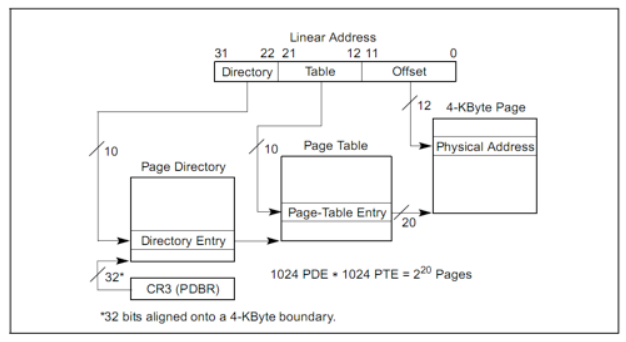

# lab2 实验报告 #

201908010502 林观田

## 练习 ##

### **练习零**

首先将lab1中需要补全的代码部分补充在lab2的代码当中。

------

### 练习一：**实现 first-fit 连续物理内存分配算法**

> 在实现first fit 内存分配算法的回收函数时，要考虑地址连续的空闲块之间的合并操作。提示:在建立空闲页块链表时，需要按照空闲页块起始地址来排序，形成一个有序的链表。可能会修改default_pmm.c中的default_init，default_init_memmap，default_alloc_pages， default_free_pages等相关函数。请仔细查看和理解default_pmm.c中的注释。
>
> 请在实验报告中简要说明你的设计实现过程。请回答如下问题：
>
> - 你的first fit算法是否有进一步的改进空间

在实验之前首先根据default_pmm.c文件中的工作做好准备工作，阅读mm/memlayout.h中的代码。

#### （1）明确用于记录空闲页的数据结构free_area_t的含义。

在初始情况下，也许物理内存的空闲物理页都是连续的，这样就形成了一个大的连续内存空闲块。但随着物理页的分配与释放，这个大的连续内存空闲块会分裂为一系列地址不连续的多个小连续内存空闲块，且每个连续内存空闲块内部的物理页是连续的。为了有效地管理这些小连续内存空闲块。**所有的连续内存空闲块可用一个双向链表管理起来，便于分配和释放，为此定义了一个free_area_t数据结构，包含了一个list_entry结构的双向链表指针和记录当前空闲页的个数的无符号整型变量nr_free。**其中的链表指针指向了空闲的物理页。

```c
/* free_area_t - maintains a doubly linked list to record free (unused) pages */
typedef struct {
    list_entry_t free_list;         // the list header -> 双向链表表头指针
    unsigned int nr_free;           // # of free pages in this free list -> 当前空闲页的数量
} free_area_t;
```

#### （2）明确描述物理页的数据结构的含义。

```c
/*struct Page - Page descriptor structures. Each Page describes one physical page.*/ 
struct Page {
    int ref;                        // page frame's reference counter -> 被页表引用的次数/映射到此物理页的虚拟页数
    uint32_t flags;                 // array of flags that describe the status of the page frame -> 物理页的状态标志/描述物理页属性
    unsigned int property;          // the num of free block, used in first fit pm manager -> 用于记录连续空闲内存块的大小，在first fit算法的物理内存管理器中会用到
    list_entry_t page_link;         // free list link -> 双向链接各个Page结构的page_link双向链表
};
```

1）ref：如果这个页被页表引用了，即在某页表中有一个页表项设置了一个虚拟页到这个Page管理的物理页的映射关系，就会把Page的ref加一；反之，若页表项取消，即映射关系解除，就会把Page的ref减一。

2）flags：flags表示此物理页的状态标记，如下。

```c
#define PG_reserved                 0       // if this bit=1: the Page is reserved for kernel, cannot be used in alloc/free_pages; otherwise, this bit=0 
#define PG_property                 1       // if this bit=1: the Page is the head page of a free memory block(contains some continuous_addrress pages), and can be used in alloc_pages; if this bit=0: if the Page is the the head page of a free memory block, then this Page and the memory block is alloced. Or this Page isn't the head page.
```

这表示flags目前用到了两个bit表示页目前具有的两种属性，bit 0（PG_reserved）表示此页是否被保留（reserved），如果是被保留的页，则bit 0会设置为1，且不能放到空闲页链表中，即这样的页不是空闲页，不能动态分配与释放。bit 1（PG_property）表示此页是否是free的，如果设置为1，表示这页是free的，可以被分配；如果设置为0，表示这页已经被分配出去了，不能被再二次分配，或者该页不是空闲页链表的首页。

3）property：用来记录某连续内存空闲块的大小（即地址连续的空闲页的个数）。

4）page_link:把多个连续内存空闲块链接在一起的双向链表指针.

5）关于PG_reserved和PG_property的设置的一些定义的含义：

```c
//set the bit `PG_reserved` of `p->flags`
#define SetPageReserved(page)       set_bit(PG_reserved, &((page)->flags))
//clear the bit `PG_reserved` of `p->flags`
#define ClearPageReserved(page)     clear_bit(PG_reserved, &((page)->flags))
//test the bit `PG_reserved` of `p->flags`
#define PageReserved(page)          test_bit(PG_reserved, &((page)->flags))
//set the bit `PG_property` of `p->flags`
#define SetPageProperty(page)       set_bit(PG_property, &((page)->flags))
//clear the bit `PG_property` of `p->flags`
#define ClearPageProperty(page)     clear_bit(PG_property, &((page)->flags))
//test the bit `PG_property` of `p->flags`
#define PageProperty(page)          test_bit(PG_property, &((page)->flags))
// convert list entry to page
#define le2page(le, member)         to_struct((le), struct Page, member)
```

阅读libs/list.h中关于链表的实现，包括链表的初始化、不同位置结点的增删等。

#### （3）default_init

然后查看default_pmm.c文件中的代码，首先是已经定义好的default_init函数：

```c
static void default_init(void) {
    list_init(&free_list);	//初始化用于记录空闲内存块的链表
    nr_free = 0;	//the total number of the free memory blocks，空闲内存块的总数
}
```

#### （4）default_init_memmap

其次是default_init_memmap函数，该函数的功能主要是建立空闲页链表，然后计算空闲页块中页的总数。根据文件中注释部分关于该函数的功能实现修改default_init_memmap函数如下：

```c
static void default_init_memmap(struct Page *base, size_t n) {
    assert(n > 0);
    struct Page *p = base;
    for (; p != base + n; p ++) {
        assert(PageReserved(p));	//确认本页是否为保留页
        p->flags = p->property = 0; 	//设置标志位和每一空闲页的大小
        set_page_ref(p, 0);	//现阶段没有引用，引用置0
    }
    base->property = n;	//表示该连续空闲内存块大小为n
    SetPageProperty(base);	//base为首页，对该空闲页块设置标志位，表示该页块有效，可以被分配
    nr_free += n;	//更新空闲内存块的总数
    list_add_before(&free_list, &(base->page_link)); //将该空闲页块插入到free_list中
}
```

#### （5）default_alloc_pages

接下来是default_alloc_pages函数，该函数的功能主要是在空闲链表中找到一个符合当前申请内存块大小的空闲块，然后分配出来，把它从空闲页链表中除去，然后如果有多余的，把分完剩下的部分再次加入会空闲页链表中。

实现流程如下：①首先判断请求的内存空间大小是否大于当前空闲内存块链表大，如果大于则直接返回；②first fit需要从空闲链表头开始查找最小的地址，通过list_next找到下一个空闲块元素，通过le2page宏可以根据链表元素获得对应的Page指针p，通过p->property获取此空闲块的大小。如果>=n，这就找到了！如果<n，则list_next，继续查找。直到list_next== &free_list，这表示找完了一遍了。③找到后，就要重新新组织空闲块，然后把找到的page返回。

根据以上流程和文件中注释部分关于该函数的功能实现描述修改default_alloc_pages函数如下：

```c
static struct Page *default_alloc_pages(size_t n) {
    assert(n > 0);
    if (n > nr_free) {	//如果请求的内存空间大小比当前空闲内存块链表大，则直接返回
        return NULL;	//If we can not find a free block with its size >=n, then return NULL.
    }
    struct Page *page = NULL;
    list_entry_t *le = &free_list; //获取空闲内存块链表入口
    while ((le = list_next(le)) != &free_list) {	//依次往下寻找直到回到头指针处,即遍历一次
        struct Page *p = le2page(le, page_link);	//将list入口转化为page
        if (p->property >= n) {		//找到适合内存大小的空闲块，find the first `n` pages that can be malloced
            page = p;
            break;
        }
    }
    if (page != NULL) {
        if (page->property > n) {
            struct Page *p = page + n;	//已经将page为首地址的大小为n的内存块分配
            SetPageProperty(p);		//page+n地址处变为第一页的首地址
            p->property = page->property - n;	//更新该连续空闲内存块的大小
            list_add_after(&(page->page_link), &(p->page_link));	//将该块重新加入到空闲内存块链表中
   		 }
        list_del(&(page->page_link));	//unlink the pages from `free_list`，删除已被分配的内存块与空闲链表的“连接”
        nr_free -= n;	//Re-caluclate number of the the rest of all free block，更新空闲内存块链表大小
        ClearPageProperty(page);	//对已被分配的内存块设置PG_property标志位，表示该块已无效
    }
    return page;
}
```

其中le2page的定义如下：

```c
// convert list entry to page
#define le2page(le, member)                 \
    to_struct((le), struct Page, member)
```

#### （6）default_free_pages

最后是default_free_pages函数，default_free_pages函数的实现是default_alloc_pages的逆过程，该函数的主要功能是重新将连续空闲页块插入到空闲链表当中，并且有可能将小的空闲内存页块变成大的，同时在与相邻的内存页块合并的过程可能是向高地址合并或向低地址合并。根据文件中注释部分关于该函数的功能实现描述修改default_free_pages函数如下：

```c
static void default_free_pages(struct Page *base, size_t n) {
    assert(n > 0);
    //Re-init free pages
    struct Page *p = base;
    for (; p != base + n; p ++) {		//遍历整个物理内存空间
        assert(!PageReserved(p) && !PageProperty(p));//检查是否为保留页，且该页是否可被分配
        p->flags = 0;	//设置flags标志
        set_page_ref(p, 0);	//清空引用标志
    }
    base->property = n;	//连续空闲页块的大小为n
    SetPageProperty(base);	//设置head页为保留页
    
    list_entry_t *le = list_next(&free_list);	//从空闲链表头的子节点开始
    //找到与page相邻的空闲页块，合并成一个大的块
    while (le != &free_list) {	//依次往下寻找直到回到头指针处,即遍历一次
        p = le2page(le, page_link);	//获取当前指针指向的page的指针
        le = list_next(le);		//取下一个结点(下一个连续空闲块)
        //向高地址合并
        //base指针加上它的大小到达base指向空闲页块的尾部地址，如果等于p，说明base在p前面
        if (base + base->property == p) {//以base为head页，合并
            base->property += p->property;	//增加base指向的连续空闲页块的大小
            ClearPageProperty(p);	//将p指向的空闲页块的大小数值清0
            list_del(&(p->page_link));	//删除p与相邻块的连接
        }
        //向低地址合并
        //p指针加上它的大小到达p指向空闲页块尾部地址，如果等于base，说明p在base前面
        else if (p + p->property == base) { //以p为head页，合并
            p->property += base->property;
            ClearPageProperty(base);
            base = p;
            list_del(&(p->page_link));
        }
    }
    nr_free += n;	//空闲页数量增加
    le = list_next(&free_list);
    //检查合并是否发生错误
    while (le != &free_list) {
        p = le2page(le, page_link);
        if (base + base->property <= p) {
            assert(base + base->property != p);
            break;
        }
        le = list_next(le);
    }
    list_add_before(le, &(base->page_link));	//将以base为head页的空闲页块插入到双向空闲内存块链表中
}
```

#### （7）思考题

**first fit算法是否有进一步的改进空间？**

答：first fit算法还有提升的空间，无论是为请求分配一块新的空闲内存空间还是释放内存，都需要依赖遍历访问链表来实现，故时间复杂度为O(n)。因此通过改进算法，使得能通过更少的时间去找到要被分配或释放的内存，从而减少时间开销。网上的一种普遍的思路是，用二叉搜索树来对内存进行管理，用二叉搜索树主要是通过对地址排序，使得在使用free时候可以在O(logn)时间内完成链表项位置的查找，从而实现时间上的优化。按照地址排序，也就是保证二叉树的任意节点的左节点的地址值小于自身地址值，右节点的地址值大于自身地址值，通过此方法优化，我们可以实现O(n)的复杂度进行内存的分配，但是可以O(logn)的复杂度进行内存的释放，因为判断合并的过程得到了优化。在这里，我们对LEN无要求，但必须保证X0<X1<X2<X3<X4<X5<X6,且地址之间无交集且不相邻。通过这个方法使得算法的复杂度得到了优化。


------

### 段页式管理基本原理

在保护模式中，x86 体系结构将内存地址分成三种：逻辑地址（也称虚地址）、线性地址和物理地址。逻辑地址即是程序指令中使用的地址，物理地址是实际访问内存的地址。逻辑地址通过段式管理的地址映射可以得到线性地址，线性地址通过页式管理的地址映射得到物理地址。段页式管理框架如下图：


------

### 练习二：实现寻找虚拟地址对应的页表项

> 通过设置页表和对应的页表项，可建立虚拟内存地址和物理内存地址的对应关系。其中的get_pte函数是设置页表项环节中的一个重要步骤。此函数找到一个虚地址对应的二级页表项的内核虚地址，如果此二级页表项不存在，则分配一个包含此项的二级页表。本练习需要补全get_pte函数 in kern/mm/pmm.c，实现其功能。请仔细查看和理解get_pte函数中的注释。
>
> 请在实验报告中简要说明你的设计实现过程。请回答如下问题：
>
> - 请描述页目录项（Pag Director Entry）和页表（Page Table Entry）中每个组成部分的含义和以及对ucore而言的潜在用处。
> - 如果ucore执行过程中访问内存，出现了页访问异常，请问硬件要做哪些事情？

get_pte函数的调用关系图如下所示：


#### （1）明确页管理器如何由线性地址映射到物理地址。

页式管理将线性地址分成三部分（图中的 Linear Address 的 Directory 部分、 Table 部分和 Offset 部分）。ucore 的页式管理通过一个二级的页表实现。一级页表的起始物理地址存放在 cr3 寄存器中。分页机制管理如下图：



#### （2）明确一些get_pte函数中会用到的函数或定义的含义。

```
> PDX(la) = the index of page directory entry of VIRTUAL ADDRESS la. 线性地址la在页目录中的位置的索引
>#define PDX(la) ((((uintptr_t)(la)) >> PDXSHIFT) & 0x3FF) 其中PDXSHIFT的值为22，右移22位，再与10个1与
> KADDR(pa) : takes a physical address and returns the corresponding kernel virtual address.	根据物理地址返回对应的虚拟地址（线性地址）
> set_page_ref(page,1) : means the page be referenced by one time	表示该页被引用一次
> page2pa(page): get the physical address of memory which this (struct Page *) page  manages 获得该页管理的内存的物理首地址
> struct Page * alloc_page() : allocation a page	分配一页
> memset(void *s, char c, size_t n) : sets the first n bytes of the memory area pointed by s to the specified value c.
>PTE_ADDR(*pdep)
#define PTE_ADDR(pte)   ((uintptr_t)(pte) & ~0xFFF)
> DEFINEs:
  > 表示物理内存页存在
  > PTE_P           0x001                   // page table/directory entry flags bit : Present
  > 表示物理内存页可写
  > PTE_W           0x002                   // page table/directory entry flags bit : Writeable
  > 表示用户态下的用户可以访问该物理内存页
  > PTE_U           0x004                   // page table/directory entry flags bit : User can access
```

关于`PTE_U` 、`PTE_W` 、 `PTE_P`：

设一个32bit线性地址la有一个对应的32bit物理地址pa，如果在以la的高10位为索引值的页目录项中的存在位（PTE_P）为0，表示缺少对应的页表空间，则可通过alloc_page获得一个空闲物理页给页表，页表起始物理地址是按4096字节对齐的，这样填写页目录项的内容为

```
页目录项内容 = (页表起始物理地址 &0x0FFF) | PTE_U | PTE_W | PTE_P
```

进一步对于页表中以线性地址la的中10位为索引值对应页表项的内容为

```
页表项内容 = (pa & ~0x0FFF) | PTE_P | PTE_W
```

#### （3）get_pte的功能描述和实现

get_pte()函数的功能是寻找虚拟地址对应的页表项，其描述如下：给定一个虚拟地址，找出这个虚拟地址在二级页表中对应的项，如果此二级页表项不存在，则分配一个包含此项的二级页表。

> //get pte - get pte and return the kernel virtual address of this pte for la if the PT contians this pte didn't exist, alloc a page for PT
> //  pgdir:  the kernel virtual base address of PDT
> //  la:     the linear address need to map
>
> //  create: a logical value to decide if alloc a page for PT
> // return vaule: the kernel virtual address of this pte

函数流程如下：pgdir给出一级页表起始地址。通过查找这个页表，我们需要给出二级页表中对应项的地址。如果在查找二级页表项时，发现对应的二级页表不存在，则需要根据create参数的值来处理是否创建新的二级页表。如果create参数为0，则get_pte返回NULL；如果create参数不为0，则get_pte需要申请一个新的物理页（通过alloc_page来实现），再在一级页表中添加页目录项指向表示二级页表的新物理页。新申请的页必须全部设定为零，因为这个页所代表的虚拟地址都没有被映射。最后，当建立从一级页表到二级页表的映射时，需要注意设置控制位。

根据函数中的注释实现get_pte函数如下：

```c
pte_t *get_pte(pde_t *pgdir, uintptr_t la, bool create) {
     pde_t *pdep = &pgdir[PDX(la)];   // (1) find page directory entry，用页目录索引PDX(la)查找页目录pgdir
    if (!(*pdep&PTE_P)) {	// (2) check if entry is not present，检查项是否不存在二级页表的入口
        struct Page* page;         //不存在则构建新页    
        // (3) check if creating is needed, then alloc page for page table
        //检查是否没有构建成功或分配失败
        if (!create || (page = alloc_page()) == NULL) {
            return NULL;
        }						// CAUTION: this page is used for page table, not for common data page
        set_page_ref(page, 1);    // (4) set page reference，设置该页的引用标志，被映射到一级页表
        uintptr_t pa = page2pa(page); // (5) get linear address of page，获取页的物理首地址
        memset(KADDR(pa), 0, PGSIZE); // (6) clear page content using memset，清除页的内容
        *pdep = pa | PTE_U | PTE_W | PTE_P; // (7) set page directory entry's permission，设置页目录条目的权限
    }
    return &((pte_t *)KADDR(PDE_ADDR(*pdep)))[PTX(la)];   // (8) return page table entry，返回二级页表所对应的线性地址
}
```

#### (4)思考题

1）描述页目录项（Pag Director Entry）和页表（Page Table Entry）中每个组成部分的含义和以及对ucore而言的潜在用处。

页目录项的组成：


| 地址  |              名称              |                  组成部分的含义                  |
| :---: | :----------------------------: | :----------------------------------------------: |
| 31-12 | Page Table 4KB Aligned Address | 页目录项对应页表的起始物理地址，用于定位页表位置 |
| 11-9  |             Avail              |      PTE_AVAIL，未被CPU使用，可保留给OS使用      |
|   8   |          G - ignored           |                    （可忽略）                    |
|   7   |         S - Page Size          |               PTE_PS，设置页的大小               |
|   6   |               0                |                  PTE_MBZ，恒为0                  |
|   5   |          A - Accessed          |               表示该页是否被使用过               |
|   4   |       D - Cache Disabled       |      PTE_PCD，设置为1则表示不对该页进行缓存      |
|   3   |       W - Write Through        |   PTE_PWT，设置是否使用write through缓存写策略   |
|   2   |      U - User/Supervisor       |        PTE_U，表示该页的访问需要的特权级         |
|   1   |         R - Read/Write         |             PTE_W，表示是否允许读写              |
|   0   |          P - Present           |        PTE_P，用于确定对应的页表是否存在         |

页表项的组成：


| 地址  |         名称          |                  组成部分的含义                  |
| :---: | :-------------------: | :----------------------------------------------: |
| 31-12 | Physical Page Address | 页目录项对应页表的起始物理地址，用于定位页表位置 |
| 11-9  |         Avail         |      PTE_AVAIL，未被CPU使用，可保留给OS使用      |
|   8   |           0           |                                                  |
|   7   |           0           |                                                  |
|   6   |       D - Dirty       |         是否需要在swap out的时候写回外存         |
|   5   |     A - Accessed      |               表示该页是否被使用过               |
|   4   |           0           |                                                  |
|   3   |           0           |                                                  |
|   2   |  U - User/Supervisor  |        PTE_U，表示该页的访问需要的特权级         |
|   1   |    R - Read/Write     |             PTE_W，表示是否允许读写              |
|   0   |      P - Present      |         PTE_P，用于确定对应的页是否存在          |

- 对ucore的潜在用处

  由以上的表格来看，无论是PTE还是PDE，都具有着一些保留的位供操作系统使用，也就是说ucore可以利用这些位来完成一些内存管理相关的算法，同时还有一些其他位比如用于标志对应的页表/页是否存在、是否被使用过等，这些都是操作系统实现分页机制的重要组成部分。

2）如果ucore执行过程中访问内存，出现了页访问异常，请问硬件要做哪些事情？

① 产生页访问异常后，CPU把引起页访问异常的线性地址装到寄存器CR2中。ucore OS会把这个值保存在struct trapframe 中tf_err成员变量中。而中断服务例程会具体处理。
② 当ucore执行过程中出现了页访问异常，硬件需要完成的事情分别如下：
③ 将发生错误的线性地址保存在cr2寄存器中, 并给出了出错码errorCode，说明了页访问异常的类型.
④ 在中断栈中依次压入EFLAGS，CS, EIP，给出页访问异常码error code，如pagefault发生在用户态，则还需先压入ss和esp，切换到内核栈；(中断处理)
⑤ 根据中断描述符表查询到对应page fault的ISR，跳转到对应的ISR处执行，接下来将由软件(如页访问异常处理函数do_pgfault)进行page fault处理；

------

### 练习三：释放某虚地址所在的页并取消对应二级页表项的映射

> 当释放一个包含某虚地址的物理内存页时，需要让对应此物理内存页的管理数据结构Page做相关的清除处理，使得此物理内存页成为空闲；另外还需把表示虚地址与物理地址对应关系的二级页表项清除。请仔细查看和理解page_remove_pte函数中的注释。为此，需要补全在 kern/mm/pmm.c中的page_remove_pte函数。
>
> 请在实验报告中简要说明你的设计实现过程。请回答如下问题：
>
> - 数据结构Page的全局变量（其实是一个数组）的每一项与页表中的页目录项和页表项有无对应关系？如果有，其对应关系是啥？
> - 如果希望虚拟地址与物理地址相等，则需要如何修改lab2，完成此事？ 

page_remove_pte函数的调用关系图如下所示：


#### （1）page_remove_pte的功能描述和实现

page_remove_pte函数的功能是在释放一个包含某虚地址的物理内存页时，对对应此物理内存页的管理数据结构Page做相关的清除处理，使得此物理内存页成为空闲，然后把表示虚地址与物理地址对应关系的二级页表项清除。

> //page_remove_pte - free an Page sturct which is related linear address la
> //                - and clean(invalidate) pte which is related linear address la
> //note: PT is changed, so the TLB need to be invalidate 

首先明确一些函数中会用到的函数或定义的含义：

```
> struct Page *page pte2page(*ptep): get the according page from the value of a ptep
> free_page : free a page
> page_ref_dec(page) : decrease page->ref. NOTICE: ff page->ref == 0 , then this page should be free.
> tlb_invalidate(pde_t *pgdir, uintptr_t la) : Invalidate a TLB entry, but only if the page tables being
edited are the ones currently in use by the processor.
> PTE_P           0x001                   // page table/directory entry flags bit : Present
```

根据函数中的注释实现page_remove_pte函数如下：

```c
static inline void page_remove_pte(pde_t *pgdir, uintptr_t la, pte_t *ptep) {
    if (*ptep & PTE_P) {	//(1) check if this page table entry is present，检查当前页表是否存在
        struct Page *page = pte2page(*ptep);	//(2) find corresponding page to pte，找到页表项对应的页
        if (page_ref_dec(page) == 0) {	//(3) decrease page reference，如果当前页面被引用0次则直接释放该页
            free_page(page);	//(4) free this page when page reference reachs 0
        }
        *ptep = 0;	//(5) clear second page table entry，清除对应二级页表项的映射
        tlb_invalidate(pgdir, la);	//(6) flush tlb，刷新TLB, 使TLB条目无效
    }
}
```

#### （2）思考题

（1）数据结构Page的全局变量（其实是一个数组）的每一项与页表中的页目录项和页表项有无对应关系？如果有，其对应关系是啥？

答：存在对应关系：由于页表项中存放着对应的物理页的物理地址，因此可以通过这个物理地址来获取到对应到的Page数组的对应项，具体做法为将物理地址除以一个页的大小，然后乘上一个Page结构的大小获得偏移量，使用偏移量加上Page数组的基地址皆可以或得到对应Page项的地址。页目录项保存的物理页面地址（即某个页表）以及页表项保存的物理页面地址都对应于Page数组中的某一页。

（2）如果希望虚拟地址与物理地址相等，则需要如何修改lab2，完成此事？ 

> 本实验中，bootloader与ucore OS协同工作，通过在运行时对地址映射的一系列“腾挪转移”，从计算机加电，启动段式管理机制，启动段页式管理机制，在段页式管理机制下运行这整个过程中，虚地址到物理地址的映射产生了多次变化，实现了最终的段页式映射关系： virt addr = linear addr = phy addr + 0xC0000000

我们知道lab1中虚拟地址和物理地址便是相等的，而lab2我们通过多个步骤建立了虚拟地址到物理地址的映 射，故如果取消该映射即可完成目标：(根据"系统执行中地址映射的四个阶段"内容进行反向完成)

- 首先将链接脚本改为 0x100000，只需要将tools/kernel.ld中的代码进行很小的修改即可：

```
ENTRY(kern_init)

SECTIONS {
            /* Load the kernel at this address: "." means the current address */
            . = 0x100000;         //修改这里为0x100000即可

            .text : {
                       *(.text .stub .text.* .gnu.linkonce.t.*)
            }

```

- 并且将偏移量改为0：

```
//在memlayout.h中将KERNBASE 0Xc0000000改为 0x0即可
#define KERNBASE   0x00000000         //将“0xC0000000”改为“0x00000000”
//修改虚拟地址基址 减去一个 0xC0000000 就等于物理地址
```

需要注意的是，需要把开启页表关闭，否则会报错，因为页表开启时认为偏移量不为0，故会报错。此时虚拟地址等于物理地址，任务完成。

------

### 实验运行结果

执行`make qemu`：


执行`make grade`:


------

### 扩展练习

**buddy system（伙伴系统）分配算法**

Buddy System算法把系统中的可用存储空间划分为存储块(Block)来进行管理, 每个存储块的大小必须是2的n次幂(Pow(2, n)), 即1, 2, 4, 8, 16, 32, 64, 128...

答：参考自https://coolshell.cn/articles/10427.html

伙伴分配的实质就是一种特殊的**“分离适配”**，即将内存按2的幂进行划分，相当于分离出若干个块大小一致的空闲链表，搜索该链表并给出同需求最佳匹配的大小。其优点是快速搜索合并（O(logN)时间复杂度）以及低外部碎片（最佳适配best-fit）；其缺点是内部碎片，因为按2的幂划分块，如果碰上66单位大小，那么必须划分128单位大小的块。

**内存管理思想如下：**

**分配内存：**

寻找大小合适的内存块（大于等于所需大小并且最接近2的幂）。如果找到了，分配给应用程序。如果没找到，按以下步骤分出合适的内存块。

1.对半分离出高于所需大小的空闲内存块
2.如果分到最低限度，分配这个大小。
3.回溯到步骤1
4.重复该步骤直到一个合适的块

**释放内存：**

首先释放该内存块，然后寻找相邻的块，看其是否释放了。如果相邻块也释放了，**并且满足相邻两块大小相同且第一块的首地址为每一块大小的偶数次幂**，则合并这两个块，重复上述步骤直到遇上未释放的相邻块，或者达到最高上限（即所有内存都释放了）。过程如下图。


**实现算法思想：**

通过一个数组形式的完全二叉树来监控管理内存，二叉树的节点用于标记相应内存块的使用状态，高层节点对应大的块，低层节点对应小的块，在分配和释放中我们就通过这些节点的标记属性来进行块的分离合并。


如图所示，假设总大小为16单位的内存，我们就建立一个深度为5的满二叉树，根节点从数组下标[0]开始，监控大小16的块；它的左右孩子节点下标[1~2]，监控大小8的块；第三层节点下标[3~6]监控大小4的块……依此类推。

实现如下：

```c
static void buddy_init_memmap(struct Page *base, size_t n) {
	int i=0;
    assert(n > 0);
    // calc buddy alloc page number
    max_pages = 1;
    for (i = 1; i < BUDDY_MAX_DEPTH; ++i, max_pages <<= 1)
        if (max_pages + (max_pages >> 9) >= n)
            break;
    max_pages >>= 1;
    buddy_page_num = (max_pages >> 9) + 1;
    cprintf("buddy init: total %d, use %d, free %d\n", n, buddy_page_num, max_pages);
    // set these pages to reserved
    for (i = 0; i < buddy_page_num; ++i)
        SetPageReserved(base + i);
    // set non-buddy page to be allocatable
    buddy_allocatable_base = base + buddy_page_num;
	struct Page* p;
    for (p = buddy_allocatable_base; p != base + n; ++p) {
        ClearPageReserved(p);
        SetPageProperty(p);
        set_page_ref(p, 0);
    }
    // init buddy page
    buddy_page = (unsigned int*)KADDR(page2pa(base));
    for (i = max_pages; i < max_pages << 1; ++i)
        buddy_page[i] = 1;
    for (i = max_pages - 1; i > 0; --i)
        buddy_page[i] = buddy_page[i << 1] << 1;
}

static struct Page* buddy_alloc_pages(size_t n) {
    assert(n > 0);
    if (n > buddy_page[1]) return NULL;
    unsigned int index = 1, size = max_pages;
    for (; size >= n; size >>= 1) {
        if (buddy_page[index << 1] >= n) index <<= 1;
        else if (buddy_page[index << 1 | 1] >= n) index = index << 1 | 1;
        else break;
    }
    buddy_page[index] = 0;
    // allocate all pages under node[index]
    struct Page* new_page = buddy_allocatable_base + index * size - max_pages;
	struct Page* p;
    for (p = new_page; p != new_page + size; ++p)
        set_page_ref(p, 0), ClearPageProperty(p);
    for (; (index >>= 1) > 0; ) // since destory continuous, use MAX instead of SUM
        buddy_page[index] = max(buddy_page[index << 1], buddy_page[index << 1 | 1]);
    return new_page;
}

static void buddy_free_pages(struct Page *base, size_t n) {
    assert(n > 0);
    unsigned int index = (unsigned int)(base - buddy_allocatable_base) + max_pages, size = 1;
    // find first buddy node which has buddy_page[index] == 0
    for (; buddy_page[index] > 0; index >>= 1, size <<= 1);
    // free all pages
	struct Page* p;
    for (p = base; p != base + n; ++p) {
        assert(!PageReserved(p) && !PageProperty(p));
        SetPageProperty(p), set_page_ref(p, 0);
    }
    // modify buddy_page
    for (buddy_page[index] = size; size <<= 1, (index >>= 1) > 0;)
        buddy_page[index] = (buddy_page[index << 1] + buddy_page[index << 1 | 1] == size) ? size : max(buddy_page[index << 1], buddy_page[index << 1 | 1]);

}
```


------

### 完成实验后，请分析ucore_lab中提供的参考答案，并请在实验报告中说明你的实现与参考答案的区别。

本次实验由于比较难，主要是通过参考练习的相应视频、阅读资料、相关代码及其提示以及所给的参考答案来完成的，因此借助外界的力量比较多，我的实现和参考答案区别不大。

------

### 列出本实验中重要的知识点，以及与对应的OS原理中的知识点，并简要说明你对二者的含义，关系，差异等方面的理解。

#### 系统执行中地址映射的四个阶段

**（1）第一阶段**

bootloader阶段，即从bootloader的start函数（在boot/bootasm.S中）到执行ucore kernel的kern_\entry函数之前，其虚拟地址，线性地址以及物理地址之间的映射关系与lab1的一样，即：

```
lab2 stage 1： virt addr = linear addr = phy addr
```

**（2）第二阶段**

从kern_entry函数开始，到执行enable_page函数（在kern/mm/pmm.c中）之前再次更新了段映射，**还没有启动页映射机制**。由于gcc编译出的虚拟起始地址从0xC0100000开始，ucore被bootloader放置在从物理地址0x100000处开始的物理内存中。所以当kern_entry函数完成新的段映射关系后，且ucore在没有建立好页映射机制前，CPU按照ucore中的虚拟地址执行，能够被分段机制映射到正确的物理地址上，确保ucore运行正确。这时的虚拟地址，线性地址以及物理地址之间的映射关系为：

```
lab2 stage 2： virt addr - 0xC0000000 = linear addr = phy addr
```

**注意此时CPU在寻址时还是只采用了分段机制。**最后使能分页映射机制（lab2/kern/mm/pmm.c中的enable_paging函数），一旦执行完enable_paging函数中的加载cr0指令（即让CPU使能分页机制），则接下来的访问是基于段页式的映射关系了。

**（3）第三阶段**

从enable_page函数开始，到执行gdt_init函数（在kern/mm/pmm.c中）之前，启动了页映射机制，但没有第三次更新段映射。这时的虚拟地址，线性地址以及物理地址之间的映射关系如下：

```
lab2 stage 3:  virt addr - 0xC0000000 = linear addr  = phy addr + 0xC0000000 # 物理地址在0~4MB之外的三者映射关系
                virt addr - 0xC0000000 = linear addr  = phy addr # 物理地址在0~4MB之内的三者映射关系
```

注意到`pmm_init`函数中的一条语句：

```
 boot_pgdir[0] = boot_pgdir[PDX(KERNBASE)];
```

就是用来建立物理地址在0~4MB之内的三个地址间的临时映射关系`virt addr - 0xC0000000 = linear addr = phy addr`。

**（4）第四阶段**

从gdt_init函数开始，第三次更新了段映射，形成了新的段页式映射机制，并且取消了临时映射关系，即执行语句“boot_pgdir**[**0**]** **=** 0**;**”把boot_pgdir[0]的第一个页目录表项（0~4MB）清零来取消临时的页映射关系。这时形成了我们期望的虚拟地址，线性地址以及物理地址之间的映射关系：

```
 lab2 stage 4： virt addr = linear addr = phy addr + 0xC0000000
```

