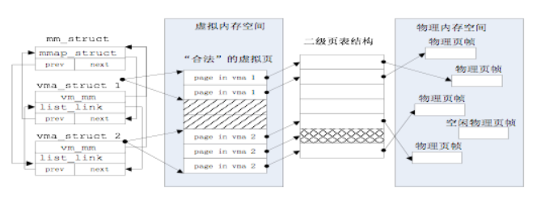
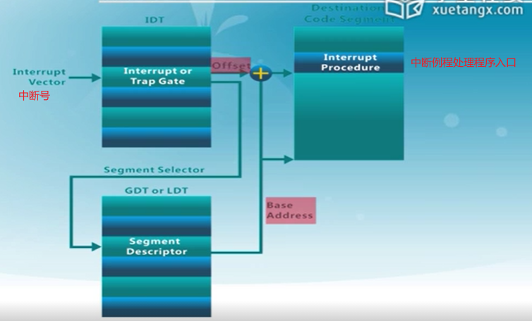
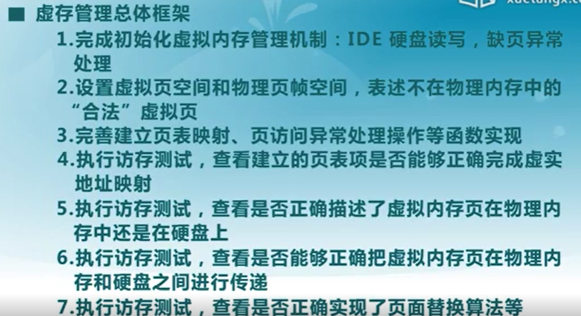
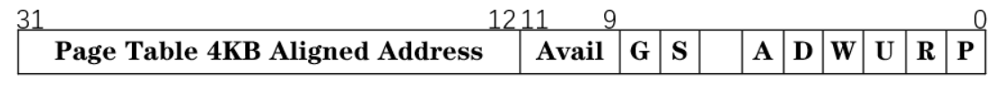
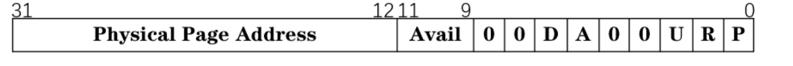
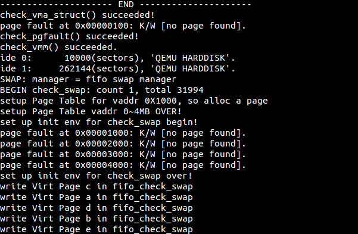
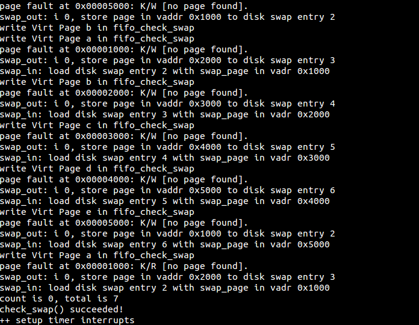
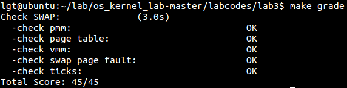

# lab3 实验报告 #

201908010502 林观田

## 实验目的

- 了解虚拟内存的Page Fault异常处理实现
- 了解页替换算法在操作系统中的实现

## 实验内容

本次实验是在实验二的基础上，借助于页表机制和实验一中涉及的中断异常处理机制，完成Page Fault异常处理和FIFO页替换算法的实现，结合磁盘提供的缓存空间，从而能够支持虚存管理，提供一个比实际物理内存空间“更大”的虚拟内存空间给系统使用。这个实验与实际操作系统中的实现比较起来要简单，不过需要了解实验一和实验二的具体实现。实际操作系统系统中的虚拟内存管理设计与实现是相当复杂的，涉及到与进程管理系统、文件系统等的交叉访问。如果大家有余力，可以尝试完成扩展练习，实现extended　clock页替换算法。

## 预备知识

### **一、虚拟内存管理的作用**

通过内存地址虚拟化，可以使得软件在没有访问某虚拟内存地址时不分配具体的物理内存，而只有在实际访问某虚拟内存地址时，操作系统再动态地分配物理内存，建立虚拟内存到物理内存的页映射关系，这种技术称为按需分页（demand paging）。把不经常访问的数据所占的内存空间临时写到硬盘上，这样可以腾出更多的空闲内存空间给经常访问的数据；当CPU访问到不经常访问的数据时，再把这些数据从硬盘读入到内存中，这种技术称为页换入换出（page　swap in/out）。这种内存管理技术给了程序员更大的内存“空间”，从而可以让更多的程序在内存中并发运行。

### 二、关键的数据结构和相关函数

一般应用程序的对虚拟内存的“需求”与物理内存空间的“供给”没有直接的对应关系，ucore是通过page fault异常处理来间接完成这二者之间的衔接。page_fault函数不知道哪些是“合法”的虚拟页，原因是ucore还缺少一定的数据结构来描述这种不在物理内存中的“合法”虚拟页。为此ucore通过建立mm_struct和vma_struct数据结构，描述了ucore模拟应用程序运行所需的合法内存空间。当访问内存产生page fault异常时，可获得访问的内存的方式（读或写）以及具体的虚拟内存地址，这样ucore就可以查询此地址，看是否属于vma_struct数据结构中描述的合法地址范围中，如果在，则可根据具体情况进行请求调页/页换入换出处理（这就是练习2涉及的部分）；如果不在，则报错。mm_struct和vma_struct数据结构结合页表表示虚拟地址空间和物理地址空间的示意图如下所示：



#### （1）vma_struct

vma，virtual memory area，描述一个一个合法内存块的空间，在ucore中描述应用程序对虚拟内存“需求”的数据结构是vma_struct（定义在vmm.h中），以及针对vma_struct的函数操作。vma_struct的定义如下：

```c
struct vma_struct {
    // the set of vma using the same PDT
    struct mm_struct *vm_mm;	//如存储用户进程包含的页映射等的总信息
    uintptr_t vm_start; // start addr of vma
    uintptr_t vm_end; // end addr of vma
    uint32_t vm_flags; // flags of vma
    //linear list link which sorted by start addr of vma
    list_entry_t list_link;	//用于管理离散的合法的虚拟内存空间
};
```

vm_mm是一个指针，指向一个比vma_struct更高的抽象层次的数据结构mm_struct。**vm_start和vm_end描述了一个连续地址的虚拟内存空间的起始位置和结束位置，这两个值都应该是PGSIZE 对齐的**，而且描述的是一个合理的地址空间范围（即严格确保 vm_start < vm_end的关系）；list_link是一个双向链表指针，**按照从小到大的顺序把一系列用vma_struct表示的虚拟内存空间链接起来**，并且还要求这些链起来的vma_struct应该是不相交的，即vma之间的地址空间无交集；vm_flags表示了这个虚拟内存空间的属性，目前的属性包括：

```c
#define VM_READ 0x00000001 //只读
#define VM_WRITE 0x00000002 //可读写
#define VM_EXEC 0x00000004 //可执行
```

#### （2）mm_struct

mm_struct结构表示了包含所有虚拟内存空间的共同属性，具体定义如下：

```c
struct mm_struct {
    // linear list link which sorted by start addr of vma
    list_entry_t mmap_list;
    // current accessed vma, used for speed purpose
    struct vma_struct *mmap_cache;
    pde_t *pgdir; // the PDT of these vma
    int map_count; // the count of these vma
    void *sm_priv; // the private data for swap manager
};
```

mmap_list是双向链表头，**链接了所有属于同一页目录表的虚拟内存空间**，mmap_cache是**指向当前正在使用的虚拟内存空间**，由于操作系统执行的“局部性”原理，当前正在用到的虚拟内存空间在接下来的操作中可能还会用到，这时就不需要查链表，而是直接使用此指针就可找到下一次要用到的虚拟内存空间。由于mmap_cache 的引入，可使得 mm_struct 数据结构的查询加速 30% 以上。pgdir 所指向的就是 **mm_struct数据结构所维护的页表**。**通过访问pgdir可以查找某虚拟地址对应的页表项是否存在以及页表项的属性等。**map_count**记录mmap_list 里面链接的 vma_struct的个数**。sm_priv指向**用来链接记录页访问情况的链表头**，这建立了mm_struct和swap_manager之间的联系。

#### （3）相关函数

涉及vma_struct的操作函数也比较简单，主要包括三个：

- vma_create--创建vma，根据输入参数vm_start、vm_end、vm_flags来创建并初始化描述一个虚拟内存空间的vma_struct结构变量。
- insert_vma_struct--插入一个vma，把一个vma变量按照其空间位置[vma->vm_start,vma->vm_end]从小到大的顺序插入到所属的mm变量中的mmap_list双向链表中。
- find_vma--查询vma，根据输入参数addr和mm变量，查找在mm变量中的mmap_list双向链表中某个vma包含此addr，即vma->vm_start<=addr end。

涉及mm_struct的操作的函数有mm_create和mm_destroy两个函数。对应完成mm_struct结构的变量创建和删除。在ucore运行过程中，会产生描述虚拟内存空间的vma_struct结构，所以在mm_destroy中也要进对这些mmap_list中的vma进行释放。

### 三、中断发生后如何找到中断例程处理程序入口？



### 四、虚拟内存管理的总体框架



## 练习 ##

### **练习零**

首先将lab1、lab2中需要补全的代码部分补充在lab3的代码当中。lab1实验内容的作用是已经初始化好中断描述符表以及对应的中断门，并建立好中断机制，lab3实验的缺页异常处理就是建立在中断处理机制的基础之上的。而lab2实验的内容则是完成了动态内存分配与释放、页映射机制的建立。

------

### 练习一：给未被映射的地址映射上物理页

> 完成do_pgfault（mm/vmm.c）函数，给未被映射的地址映射上物理页。设置访问权限的时候需要参考页面所在 VMA 的权限，同时需要注意映射物理页时需要操作内存控制结构所指定的页表，而不是内核的页表。注意：在LAB2 EXERCISE 1处填写代码。执行`make qemu`后，如果通过check_pgfault函数的测试后，会有“check_pgfault() succeeded!”的输出，表示练习1基本正确。
>
> 请在实验报告中简要说明你的设计实现过程。请回答如下问题：
>
> - 请描述页目录项（Pag Director Entry）和页表（Page Table Entry）中组成部分对ucore实现页替换算法的潜在用处。
> - 如果ucore的缺页服务例程在执行过程中访问内存，出现了页访问异常，请问硬件要做哪些事情？

#### （1）do_pgfault函数的作用

ucore中do_pgfault函数是完成页访问异常处理的主要函数，它**根据从CPU的控制寄存器CR2中获取的页访问异常的物理地址以及根据errorCode的错误类型来查找此地址是否在某个vma的地址范围内以及是否满足正确的读写权限**，**如果在此范围内并且权限也正确，这认为这是一次合法访问，但没有建立虚实对应关系。**所以需要分配一个空闲的内存页，并修改页表完成虚地址到物理地址的映射，刷新TLB，然后调用iret中断，返回到产生页访问异常的指令处重新执行此指令。如果该虚地址不在某VMA范围内，则认为是一次非法访问。

#### （2）do_pgfault函数的实现流程

```c
int do_pgfault(struct mm_struct *mm, uint32_t error_code, uintptr_t addr)
```

该函数有三个参数，第一个是一个mm_struct变量，该变量保存了所使用的PDT，合法的虚拟地址空间（使用链表组织），以及与后文的swap机制相关的数据；第二个参数是产生page fault的时候硬件产生的error code，用于帮助判断发生page fault的原因；第三个参数则是出现page fault的线性地址（保存在cr2寄存器中的线性地址）。

该函数实现时，先查询mm_struct中的合法的虚拟地址链表，用于**确定当前出现page fault的线性地址是否合法**，如果合法则继续执行调出物理页，否则直接返回；

```c
	int ret = -E_INVAL;
    //try to find a vma which include addr，查询包含该出现page fault的线性地址的虚拟内存地址
    struct vma_struct *vma = find_vma(mm, addr);
    pgfault_num++;//产生缺页异常的次数 
    //If the addr is in the range of a mm's vma?如果虚拟地址合法则执行调出物理页,否则返回失败
    if (vma == NULL || vma->vm_start > addr) {
        cprintf("not valid addr %x, and  can not find it in vma\n", addr);
        goto failed;
    }
```

接下来根据error code判断是否出现了越权行为(包括：读取没有读权限的内存、写没有写权限的内存、所读内容在内存中却读失败等)；

```c
    //check the error_code
    switch (error_code & 3) {
    default:
            /* error code flag : default is 3 ( W/R=1, P=1): write, present *//*允许写，存在*/
    case 2: /* error code flag : (W/R=1, P=0): write, not present *//*写，不存在（写不存在页）*/
        if (!(vma->vm_flags & VM_WRITE)) {//如果地址不允许写，goto failed（写访问异常，写不允许写）
            cprintf("do_pgfault failed: error code flag = write AND not present, but the addr's vma cannot write\n");
            goto failed;
        }
        break;
    case 1: /* error code flag : (W/R=0, P=1): read, present *//*读，存在（读不可读页）*/
        cprintf("do_pgfault failed: error code flag = read AND present\n");
        goto failed;
    case 0: /* error code flag : (W/R=0, P=0): read, not present *//*读，不存在（读不存在页）*/
        if (!(vma->vm_flags & (VM_READ | VM_EXEC))) {//如果地址不允许读或执行,goto failed
            cprintf("do_pgfault failed: error code flag = read AND not present, but the addr's vma cannot read or exec\n");
            goto failed;
        }
    }
```

然后根据合法虚拟地址产生对应物理页权限；

```c
    uint32_t perm = PTE_U;
    if (vma->vm_flags & VM_WRITE) {
        perm |= PTE_W;
    }
    addr = ROUNDDOWN(addr, PGSIZE);
    ret = -E_NO_MEM;
```

最后是练习需要完成的部分，实现功能如下：

会调用的两个函数：

```
> get_pte : get an pte and return the kernel virtual address of this pte for la if the PT contians this pte didn't exist, alloc a page for PT (notice the 3th parameter '1')
> pgdir_alloc_page : call alloc_page & page_insert functions to allocate a page size memory & setup an addr map pa<--->la with linear address la and the PDT pgdir
```

通过函数get_pte来获取出错的线性地址对应的虚拟页起始地址对应到的页表项，如果所需物理页没有被分配，则利用pgdir_alloc_page函数分配物理页。

```c
    pte_t *ptep=NULL;
	//其中get_pte的参数pde_t *pgdir可以从结构mm_struct中的成员pgdir获取
    ptep = get_pte(mm->pgdir, addr, 1);  //(1) try to find a pte, if pte's PT(Page Table) isn't existed, then create a PTE.
	 //(2) if the phy addr isn't exist, then alloc a page & map the phy addr with logical addr
	// ptep=0说明物理地址不存在，这时要分配物理页并建立好映射关系
    if (*ptep == 0) {
       if (pgdir_alloc_page(mm->pgdir, addr, perm) == NULL) {
            cprintf("pgdir_alloc_page in do_pgfault failed\n");
            goto failed;
        }                     
    }
    else {
    /*LAB3 EXERCISE 2*/
    }
```

#### （3）思考题

1）请描述页目录项（Pag Director Entry）和页表（Page Table Entry）中组成部分对ucore实现页替换算法的潜在用处。

页目录项的组成：



| 地址  |              名称              |                  组成部分的含义                  |
| :---: | :----------------------------: | :----------------------------------------------: |
| 31-12 | Page Table 4KB Aligned Address | 页目录项对应页表的起始物理地址，用于定位页表位置 |
| 11-9  |             Avail              |      PTE_AVAIL，未被CPU使用，可保留给OS使用      |
|   8   |          G - ignored           |                    （可忽略）                    |
|   7   |         S - Page Size          |               PTE_PS，设置页的大小               |
|   6   |               0                |                  PTE_MBZ，恒为0                  |
|   5   |          A - Accessed          |               表示该页是否被使用过               |
|   4   |       D - Cache Disabled       |      PTE_PCD，设置为1则表示不对该页进行缓存      |
|   3   |       W - Write Through        |   PTE_PWT，设置是否使用write through缓存写策略   |
|   2   |      U - User/Supervisor       |        PTE_U，表示该页的访问需要的特权级         |
|   1   |         R - Read/Write         |             PTE_W，表示是否允许读写              |
|   0   |          P - Present           |        PTE_P，用于确定对应的页表是否存在         |

页表项的组成：



| 地址  |         名称          |                  组成部分的含义                  |
| :---: | :-------------------: | :----------------------------------------------: |
| 31-12 | Physical Page Address | 页目录项对应页表的起始物理地址，用于定位页表位置 |
| 11-9  |         Avail         |      PTE_AVAIL，未被CPU使用，可保留给OS使用      |
|   8   |           0           |                                                  |
|   7   |           0           |                                                  |
|   6   |       D - Dirty       |         是否需要在swap out的时候写回外存         |
|   5   |     A - Accessed      |               表示该页是否被使用过               |
|   4   |           0           |                                                  |
|   3   |           0           |                                                  |
|   2   |  U - User/Supervisor  |        PTE_U，表示该页的访问需要的特权级         |
|   1   |    R - Read/Write     |             PTE_W，表示是否允许读写              |
|   0   |      P - Present      |         PTE_P，用于确定对应的页是否存在          |

对ucore实现页替换算法的潜在用处：

由以上的表格来看，无论是PTE还是PDE，都具有着一些保留的位供操作系统使用，也就是说ucore可以利用这些位来完成一些内存管理相关的算法，同时还有一些其他位比如用于标志对应的页表/页是否存在、是否被使用过等，这些都是操作系统实现分页机制的重要组成部分。

对于实现页替换的过程，一方面，通过查找虚拟地址是否存在于一二级页表中可知发现该地址是否是合法的；同时可以通过修改映射关系实现页替换操作。另一方面，在实现页替换时涉及到换入换出，换入时需要将某个虚拟地址对应的磁盘的一页内容读入到内存中，换出时需要将某个虚拟页的内容写到磁盘中的某个位置。而页表项可以记录该虚拟页在磁盘中的位置，为换入换出提供磁盘位置信息，页目录项则是用来索引对应的页表，当PTE的P位为0时，PTE的含义是虚拟页与磁盘扇区的对应关系。

此外PTE中还有dirty位，用于表示当前的页是否经过修改，这就使得OS可以使用这个位来判断是否可以省去某些已经在外存中存在着，内存中的数据与外存相一致的物理页面换出到外存这种多余的操作。

2）如果ucore的缺页服务例程在执行过程中访问内存，出现了页访问异常，请问硬件要做哪些事情？

如果缺页ISR在执行过程中遇到页访问异常，则最终硬件需要完成的处理与正常出现页访问异常的处理相一致，均为：

- 将发生错误的线性地址保存在cr2寄存器中;
- 在中断栈中依次压入EFLAGS，CS, EIP，以及页访问异常码error code，由于ISR一定是运行在内核态下的，因此不需要压入ss和esp以及进行栈的切换；
- 根据中断描述符表查询到对应页访问异常的ISR，跳转到对应的ISR处执行，接下来将由软件进行处理；

------

### 练习二：补充完成基于FIFO的页面替换算法

> 完成vmm.c中的do_pgfault函数，并且在实现FIFO算法的swap_fifo.c中完成map_swappable和swap_out_vistim函数。通过对swap的测试。注意：在LAB2 EXERCISE 2处填写代码。执行`make qemu`后，如果通过check_swap函数的测试后，会有“check_swap() succeeded!”的输出，表示练习2基本正确。
>
> 请在实验报告中简要说明你的设计实现过程。
>
> 请在实验报告中回答如下问题：
>
> - 如果要在ucore上实现"extended clock页替换算法"请给你的设计方案，现有的swap_manager框架是否足以支持在ucore中实现此算法？如果是，请给你的设计方案。如果不是，请给出你的新的扩展和基此扩展的设计方案。并需要回答如下问题
>   - 需要被换出的页的特征是什么？
>   - 在ucore中如何判断具有这样特征的页？
>   - 何时进行换入和换出操作？

#### （1）补全do_pgfault函数

首先明确该函数会调用到的一些函数的作用：

```
>swap_in(mm, addr, &page) : alloc a memory page, then according to the swap entry in PTE for addr, find the addr of disk page, read the content of disk page into this memory page 选择一个物理页，根据虚拟地址在页表项中的交换入口，从外存找到相应的物理页（这里可以看出PTE中保存着线性地址对应物理页在内存或外存中的信息），换入
>具体过程：swap_in()会把访问异常的地址转换成一个页号，进一步把这个页号映射到对应磁盘扇区号，把磁盘扇区对应的这个页的内容找到，通过read操作把数据读到内存当中，然后重新建立好映射关系（虚页和物理页的映射，分配页表项等）
>page_insert ： build the map of phy addr of an Page with the linear addr la，构建物理页中的地址和虚拟地址的映射关系
>swap_map_swappable ： set the page swappable，设置该页可交换
```

lab3中为了表示物理页可被换出或已被换出的情况，对Page数据结构进行了扩展：

```c
struct Page {
    int ref;                        // page frame's reference counter
    uint32_t flags;                 // array of flags that describe the status of the page frame
    unsigned int property;          // the num of free block, used in first fit pm manager
    list_entry_t page_link;         // free list link
    list_entry_t pra_page_link;     // used for pra (page replace algorithm)
    uintptr_t pra_vaddr;            // used for pra (page replace algorithm)
};
```

pra_page_link可用来构造按页的第一次访问时间进行排序的一个链表，这个链表的开始表示第一次访问时间最近的页，链表结尾表示第一次访问时间最远的页。当然链表头可以就可设置为pra_list_head（定义在swap_fifo.c中），构造的时机是在page fault发生后，进行do_pgfault函数时。pra_vaddr可以用来记录此物理页对应的虚拟页起始地址。

承接练习1的else分支, 如果查询到的PTE不为0，则表示对应的物理页可能在内存中或者在外存中，则需要将其换入内存，之后中断返回之后便可以进行正常的访问处理。因此需要在do_pgfault函数的else分支实现对页的换入操作，本实验采用的替换策略算法为FIFO。

根据需要补充之处的注释补全do_pgfault函数：

实现的流程如下：

- 判断当前是否对交换机制进行了正确的初始化；
- 将虚拟页对应的物理页从外存中换入内存；
- 给换入的物理页和虚拟页建立映射关系；
- 将换入的物理页设置为允许被换出；

```c
else{// if this pte is a swap entry, then load data from disk to a page with phy addr
     // and call page_insert to map the phy addr with logical addr
	if(swap_init_ok) {//判断当前是否对交换机制进行了正确的初始化
       	struct Page *page=NULL;
        //(1）According to the mm AND addr, try to load the content of right disk page into the memory which page managed.
        //根据虚拟地址，把对应的物理页从外存换入内存
        if ((ret = swap_in(mm, addr, &page)) != 0) {
            cprintf("swap_in in do_pgfault failed\n");
            goto failed;
        }
        //(2) According to the mm, addr AND page, setup the map of phy addr <---> logical addr
        //将物理页与虚拟页建立映射关系
        page_insert(mm->pgdir, page, addr, perm);
        swap_map_swappable(mm, addr, page, 1);//(3) make the page swappable.设置当前的物理页为可交换的
        page->pra_vaddr = addr;        //记录此物理页对应的虚拟页起始地址addr                     
     }
     else {
         cprintf("no swap_init_ok but ptep is %x, failed\n",*ptep);
         goto failed;
     }
}
```

#### （2）map_swappable

函数功能: 将当前的物理页面插入到FIFO算法中维护的可被交换出去的物理页面链表中的末尾，从而保证该链表中越接近链表头的物理页面在内存中的驻留时间越长。

根据注释实现如下：

```c
/* (3)_fifo_map_swappable: According FIFO PRA, we should link the most recent arrival page at the back of pra_list_head qeueue*/
static int _fifo_map_swappable(struct mm_struct *mm, uintptr_t addr, struct Page *page, int swap_in)
{
    list_entry_t *head=(list_entry_t*) mm->sm_priv;//sm_priv指向用来链接记录页访问情况的链表头
    list_entry_t *entry=&(page->pra_page_link);
    assert(entry != NULL && head != NULL);
    //record the page access situlation
    /*LAB3 EXERCISE 2: YOUR CODE*/ 
    //(1)link the most recent arrival page at the back of the pra_list_head qeueue.
    // 将当前指定的物理页插入到链表的末尾
    list_add(head, entry);
    return 0;
}
```

#### （3）swap_out_victim

当调用swap_in函数的时候，会继续调用alloc_page函数分配物理页，一旦没有足够的物理页，则会使用swap_out函数将当前物理空间的某一页换出到外存，该函数会进一步调用sm（swap manager）中封装的swap_out_victim函数来选择需要换出的物理页，该函数是一个函数指针进行调用的，具体对应到了`_fifo_swap_out_victim`函数

- 函数功能 : `_fifo_swap_out_victim`函数用FIFO先进先出的顺序替换地一个牺牲页
- 实现方法: 在FIFO算法中，按照物理页面换入到内存中的顺序建立了一个链表，链表头处便指向了最早进入的物理页面，也就在在本算法中需要被换出的页面，因此只需要将链表头的物理页面取出，然后删掉对应的链表项。

```c
/*(4)_fifo_swap_out_victim: According FIFO PRA, we should unlink the  earliest arrival page in front of pra_list_head qeueue,then assign the value of *ptr_page to the addr of this page.*/
static int _fifo_swap_out_victim(struct mm_struct *mm, struct Page ** ptr_page, int in_tick)
{
     list_entry_t *head=(list_entry_t*) mm->sm_priv;
         assert(head != NULL);
     assert(in_tick==0);
     /* Select the victim */
     /*LAB3 EXERCISE 2: YOUR CODE*/ 
     //(1)  unlink the  earliest arrival page in front of pra_list_head qeueue
     list_entry_t *le = head->prev;		 // 取出链表头，即最早进入的物理页面
     assert(head!=le);		// 确保链表非空
     struct Page *p = le2page(le, pra_page_link);		// 找到对应的物理页面的Page结构
     list_del(le);	 // 从链表上删除取出的即将被换出的物理页面
     assert(p !=NULL);
     // 从链表上删除取出的即将被换出的物理页面
     *ptr_page = p;//(2)  assign the value of *ptr_page to the addr of this page
     return 0;
}
```

#### （4）思考题

如果要在ucore上实现"extended clock页替换算法"，请给你的设计方案，现有的swap_manager框架是否足以支持在ucore中实现此算法？如果是，请给你的设计方案。如果不是，请给出你的新的扩展和基此扩展的设计方案。

首先明确时钟页替换算法的思想：

> 时钟（Clock）页替换算法是LRU算法的一种近似实现。时钟页替换算法把各个页面组织成环形链表的形式，类似于一个钟的表面。然后把一个指针（简称当前指针）指向最老的那个页面，即最先进来的那个页面。另外，时钟算法需要在页表项（PTE）中设置了一位访问位来表示此页表项对应的页当前是否被访问过。当该页被访问时，CPU中的MMU硬件将把访问位置“1”。当操作系统需要淘汰页时，对当前指针指向的页所对应的页表项进行查询，如果访问位为“0”，则淘汰该页，如果该页被写过，则还要把它换出到硬盘上；如果访问位为“1”，则将该页表项的此位置“0”，继续访问下一个页。该算法近似地体现了LRU的思想，且易于实现，开销少，需要硬件支持来设置访问位。时钟页替换算法在本质上与FIFO算法是类似的，不同之处是在时钟页替换算法中跳过了访问位为1的页。

swap_manager的框架如下：

```c
struct swap_manager swap_manager_fifo =
{
     .name            = "fifo swap manager",
     .init            = &_fifo_init,
     .init_mm         = &_fifo_init_mm,
     .tick_event      = &_fifo_tick_event,
     .map_swappable   = &_fifo_map_swappable,
     .set_unswappable = &_fifo_set_unswappable,
     .swap_out_victim = &_fifo_swap_out_victim,
     .check_swap      = &_fifo_check_swap,
};
```

现有的swap_manager框架足以支持在ucore中实现此算法。PTE组成中包括了access位和dirty位，因此我们可以根据这两位知道虚拟页是否被访问过以及是否被写过，之后将FIFO的队列式链表改造成环形循环列表，原来的初始化函数不需要改，维护链表的函数_fifo_map_swappable函数需要进行小修改，令每次加入新结点后不仅将其加在最后一个链表项后面，而且要将其指针指向head，形成环形循环链表。然后修改swap_out_victim函数如下：

从当前指针开始，对环形链表进行扫描，根据指针指向的物理页的状态（表示为(access, dirty)）来确定应当进行何种修改：

- 如果状态是(0, 0)，则将该物理页面从链表上换出，该物理页面记为换出页面，但是由于这个时候这个页面不是dirty的，因此事实上不需要将其写入swap分区；
- 如果状态是(0, 1)，则将该物理页对应的虚拟页的PTE中的dirty位都改成0，并且将该物理页写入到外存中，然后指针跳转到下一个物理页；
- 如果状态是(1, 0)，将该物理页对应的虚拟页的PTE中的访问位都置成0，然后指针跳转到下一个物理页面；
- 如果状态是(1, 1)，则该物理页的所有对应虚拟页的PTE中的访问位置成0，然后指针跳转到下一个物理页面。

1）需要被换出的页的特征是什么？

只有映射到用户空间且被用户程序直接访问的页面才能被交换，而被内核直接使用的内核空间的页面不能被换出。而对于FIFO算法，则是最早被访问的页（链表头页）被换出，不同的替换算法，换出的页的特征有所不同。

2）在ucore中如何判断具有这样特征的页？

假如某物理页对应的所有虚拟页中存在一个dirty的页，则认为这个物理页为dirty，否则不是；假如某物理页对应的所有虚拟页中存在一个被访问过的页，则认为这个物理页为被访问过的，否则不是。

3）何时进行换入和换出操作？

换入：check_mm_struct变量这个数据结构表示了目前 ucore认为合法的所有虚拟内存空间集合，而mm中的每个vma表示了一段地址连续的合法虚拟空间。当ucore或应用程序访问地址所在的页不在内存时，就会产生page fault异常，通过中断处理调用do_pgfault函数，此函数会判断产生访问异常的地址属于check_mm_struct某个vma表示的合法虚拟地址空间，且保存在硬盘swap文件中（即对应的PTE的高24位不为0，而最低位为0），则是执行页换入的时机，将调用swap_in函数完成页面换入。

换出：当ucore或应用程序访问地址所在的页不在内存而引起缺页异常，如果通过do_pgfault函数判断该需要访问的页存在外存并需要将某个页面换入时，如果物理内存空间已满，则需要根据应用的替换策略换出相应的页。当然执行换出的时机不仅仅发生在这个时候，操作系统为了内存管理的高效性以一定地策略周期性地（或在系统不忙时）换出一些页。

------

## 运行结果

执行`make qemu`





执行`make grade`



------

### 扩展练习：实现识别dirty bit的 extended clock页替换算法

时钟页替换算法把各个页面组织成环形链表的形式，类似于一个钟的表面。然后把一个指针（简称当前指针）指向最老的那个页面，即最先进来的那个页面。另外，时钟算法需要在页表项（PTE）中设置了一位访问位来表示此页表项对应的页当前是否被访问过。当该页被访问时，CPU中的MMU硬件将把访问位置“1”。当操作系统需要淘汰页时，对当前指针指向的页所对应的页表项进行查询，如果访问位为“0”，则淘汰该页，如果该页被写过，则还要把它换出到硬盘上；如果访问位为“1”，则将该页表项的此位置“0”，继续访问下一个页。

- 问题分析：

  算法根据页面近期是否被修改从而决定该页面是否应当被换出。所以在查询空闲页时，需要加上对 dirty bit 的判断。

- 实现思路：

  当操作系统需要淘汰页时，对当前指针指向的页所对应的页表项进行查询，如果访问位为“0”，则淘汰该页，如果该页被写过，则还要把它换出到硬盘上；如果访问位为“1”，则将该页表项的此位置“0”，继续访问下一个页。

- 实现过程：

已知dirty位和access位的定义如下：

```c
#define PTE_A 0x020 // Accessed
#define PTE_D 0x040 // Dirty
```

其中 PTE_A 和 PTE_D 分别是表示访问和修改的标识位，因此与 *ptep 求与即可判断页是否被访问或修改过。首先根据基础的 extended clock 算法，未被访问的页应优先考虑换出；在此基础上，由于被修改的也需要被写会硬盘，因此未被修改的页应该有限换出。因此采用多轮循环。按照以上思路，即被换出的页的状态(Accessed，Dirty)的优先级是(0,0)>(0,1)>(1,0)>(1,1)，需要修改 kern/mm/vmm.h 中的 _fifo_swap_out_victim() 函数，修改_fifo_swap_out_victim()函数如下:

```c
static int _fifo_swap_out_victim(struct mm_struct *mm, struct Page ** ptr_page, int in_tick)
{
    list_entry_t *head = (list_entry_t*) mm->sm_priv;//获取用来链接记录页访问情况的链表的表头指针
    assert(head != NULL);
    assert(in_tick == 0);
    list_entry_t *le = head->next;	//将 head 指针指向最先进入的页面
    assert(head != le);
    // 查找最先进入并且未被修改的页面
    while(le != head) {
        struct Page *p = le2page(le, pra_page_link);
        // 获取页表项
        pte_t *ptep = get_pte(mm->pgdir, p->pra_vaddr, 0);  
        // 判断获得的页表项是否正确  
        if(!(*ptep & PTE_A) && !(*ptep & PTE_D)) {  // （0,0），未被访问过，未被修改过，可被换出
            list_del(le);	// 将页面从队列中删除
            assert(p != NULL);
            *ptr_page = p;	// 将这一页的地址存储在 prt_page 中
            return 0;
        }
        le = le->next;
    }
    le = le->next;
    while(le != head) {
        struct Page *p = le2page(le, pra_page_link);
        pte_t *ptep = get_pte(mm->pgdir, p->pra_vaddr, 0);    
        if(!(*ptep & PTE_A) && (*ptep & PTE_D)) {  // （0,1），未被访问过，已被修改过
            list_del(le);
            assert(p != NULL);
            *ptr_page = p;
            return 0;
        }
        *ptep ^= PTE_A;                            // 页被访问过则将 PTE_A 位置 0
        le = le->next;
    }
    le = le->next;
    while(le != head) {
    struct Page *p = le2page(le, pra_page_link);
    pte_t *ptep = get_pte(mm->pgdir, p->pra_vaddr, 0);    
        if(!(*ptep & PTE_D)) {          // 未被修改，此时所有页均被访问过，即 PTE_A 位为 0
            list_del(le);
            assert(p != NULL);
            *ptr_page = p;
            return 0;
        }
    	le = le->next;
    }
    // 如果这行到这里证明找完一圈，所有页面都不符合换出条件
    // 那么强行换出最先进入的页面
    le = le->next;
    while(le != head) {
        struct Page *p = le2page(le, pra_page_link);
        pte_t *ptep = get_pte(mm->pgdir, p->pra_vaddr, 0);    
        if(*ptep & PTE_D) {                                 // 已被修改
            list_del(le);
            assert(p != NULL);
            *ptr_page = p;
            return 0;
        }
        le = le->next;
    }
}
```

改进的时钟算法：

```c
static int _fifo_swap_out_victim(struct mm_struct *mm, struct Page ** ptr_page, int in_tick)
{
    list_entry_t *head = (list_entry_t*) mm->sm_priv;//获取用来链接记录页访问情况的链表的表头指针
    assert(head != NULL);
    assert(in_tick == 0);
    list_entry_t *le = head->next;	//将 head 指针指向最先进入的页面
    assert(head != le);
    // 查找最先进入并且未被修改的页面
    while(le != head) {
        struct Page *p = le2page(le, pra_page_link);
        // 获取页表项
        pte_t *ptep = get_pte(mm->pgdir, p->pra_vaddr, 0);  
        // 判断获得的页表项是否正确  
        if(!(*ptep & PTE_A) && !(*ptep & PTE_D)) {  // （0,0），未被访问过，未被修改过，可被换出
            list_del(le);	// 将页面从队列中删除
            assert(p != NULL);
            *ptr_page = p;	// 将这一页的地址存储在 ptr_page 中
            return 0;
        }
        else if(!(*ptep & PTE_A) && (*ptep & PTE_D)){ //(0,1)
            *ptep ^= PTE_D;
        }
        else if((*ptep & PTE_A) && !(*ptep & PTE_D)){  //(1,0)
            *ptep ^= PTE_A;
        }
        else{	//(1,1)
            *ptep ^= PTE_A;
        }
        le = le->next;
        if(le == head) le = le->next;
    }
}
```

------

### 列出本实验中重要的知识点，以及与对应的OS原理中的知识点，并简要说明你对二者的含义，关系，差异等方面的理解。

1.虚拟内存管理机制

2.页映射机制

3.物理内存管理机制

4.页替换算法

### 回答完成该实验三个关键的问题

> 1. 当程序运行中访问内存产生page fault异常时，如何判定这个引起异常的虚拟地址内存访问是越界、写只读页的“非法地址”访问还是由于数据被临时换出到磁盘上或还没有分配内存的“合法地址”访问？
> 2. 何时进行请求调页/页换入换出处理？
> 3. 如何在现有ucore的基础上实现页替换算法？

答：1、当程序运行中访问内存产生page fault异常时，CPU会把产生异常的线性地址存储在CR2中，并且把表示页访问异常类型的值（简称页访问异常错误码，errorCode）保存在中断栈中。而引起异常的原因信息正是由errorCode来标识，errorCode有32位，位0为１表示对应物理页不存在，位１为１表示写异常（比如写了只读页），位２为１表示访问权限异常（比如用户态程序访问内核空间的数据）等。

2、check_mm_struct变量这个数据结构表示了目前 ucore认为合法的所有虚拟内存空间集合，而mm中的每个vma表示了一段地址连续的合法虚拟空间。当ucore或应用程序访问地址所在的页不在内存时，就会产生page fault异常，引起调用do_pgfault函数，此函数会判断产生访问异常的地址属于check_mm_struct某个vma表示的合法虚拟地址空间，且保存在硬盘swap文件中（即对应的PTE的高24位不为0，而最低位为0），则是执行页换入的时机，将调用swap_in函数完成页面换入。

3、通过现有的页映射机制建立起虚拟页和物理页、磁盘扇区的映射关系，通过page结构管理每个物理页的信息，通过vma、vmm等数据结构管理虚拟内存及可被换入换出的页的信息等，通过swap_manager来管理页换入换出的策略和时机等。