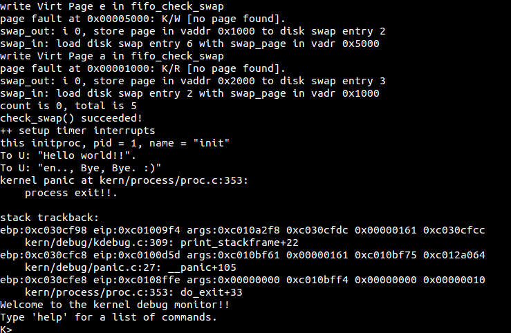

# lab4 实验报告 #

201908010502 林观田

## 实验目的

- 了解内核线程创建/执行的管理过程
- 了解内核线程的切换和基本调度过程

## 实验内容

实验2/3完成了物理和虚拟内存管理，这给创建内核线程（内核线程是一种特殊的进程）打下了提供内存管理的基础。当一个程序加载到内存中运行时，首先通过ucore OS的内存管理子系统分配合适的空间，然后就需要考虑如何分时使用CPU来“并发”执行多个程序，让每个运行的程序（这里用线程或进程表示）“感到”它们各自拥有“自己”的CPU。

本次实验将首先接触的是内核线程的管理。内核线程是一种特殊的进程，内核线程与用户进程的区别有两个：

- 内核线程只运行在内核态
- 用户进程会在在用户态和内核态交替运行
- 所有内核线程共用ucore内核内存空间，不需为每个内核线程维护单独的内存空间
- 而用户进程需要维护各自的用户内存空间

## 预备知识

### 一、内核线程与用户进程的区别

内核线程是一种特殊的进程，内核线程与用户进程的区别有两个：内核线程只运行在内核态而用户进程会在在用户态和内核态交替运行；所有内核线程直接使用共同的ucore内核内存空间，不需为每个内核线程维护单独的内存空间而用户进程需要维护各自的用户内存空间。

### 二、管理线程的关键数据结构

为了实现内核线程，需要设计管理线程的数据结构，即**进程控制块**（在这里也可叫做线程控制块）。如果要让内核线程运行，我们首先要创建内核线程对应的进程控制块，还需把这些进程控制块通过链表连在一起，便于随时进行插入，删除和查找操作等进程管理事务。这个链表就是进程控制块链表。然后在通过调度器（scheduler）来让不同的内核线程在不同的时间段占用CPU执行，实现对CPU的分时共享。

#### 进程控制块

进程管理信息用struct proc_struct表示，在*kern/process/proc.h*中定义如下：

```c
struct proc_struct {
    enum proc_state state; // Process state，进程状态
    int pid; // Process ID，进程ID
    int runs; // the running times of Process，进程的运行时间
    uintptr_t kstack; // Process kernel stack，进程内核栈
    volatile bool need_resched; // need to be rescheduled to release CPU?，是否需要被调度
    struct proc_struct *parent; // the parent process，父进程
    struct mm_struct *mm; // Process's memory management field，进程内存管理区域，用于管理进程/线程的内存空间
    struct context context; // Switch here to run process，在这里切换进程去运行，上下文，保存寄存器等信息
    struct trapframe *tf; // Trap frame for current interrupt，当前中断的陷阱框架，保存被打断进程的信息
    uintptr_t cr3; // the base addr of Page Directroy Table(PDT)，页目录基地址
    uint32_t flags; // Process flag，进程标志
    char name[PROC_NAME_LEN + 1]; // Process name，进程名称
    list_entry_t list_link; // Process link list，进程链表链接，进程/线程控制块链表
    list_entry_t hash_link; // Process hash list，进程哈希链表，同上，但可提高效率
};
```

mm：内存管理的信息，包括内存映射列表、页表指针等。state：进程所处的状态。 parent：用户进程的父进程（创建它的进程）。context：进程的上下文，用于进程切换（参见switch.S）。cr3: cr3 保存页表的物理地址，目的就是进程切换的时候方便直接使用 lcr3实现页表切换，避免每次都根据 mm 来计算 cr3。kstack: 每个线程都有一个内核栈，并且位于内核地址空间的不同位置。static struct proc *current：当前占用CPU且处于“运行”状态进程控制块指针。static struct proc *initproc：本实验中，指向一个内核线程，本实验以后，此指针将指向第一个用户态进程。 static list_entry_t hash_list[HASH_LIST_SIZE]：所有进程控制块的哈希表，proc_struct中的成员变量hash_link将基于pid链接入这个哈希表中。list_entry_t proc_list：所有进程控制块的双向线性列表，proc_struct中的成员变量list_link将链接入这个链表中。

### 三、实验执行流程

在kern_init函数中，当完成虚拟内存的初始化工作后，就调用了proc_init函数，这个函数完成了idleproc内核线程和initproc内核线程的创建或复制工作。**idleproc内核线程的工作就是不停地查询，看是否有其他内核线程可以执行了，如果有，马上让调度器选择那个内核线程执行**（cpu_idle函数的实现）。所以idleproc内核线程是在ucore操作系统没有其他内核线程可执行的情况下才会被调用。接着就是调用kernel_thread函数来创建initproc内核线程。initproc内核线程的工作就是显示“Hello World”，表明自己存在且能正常工作了。

调度器会在特定的调度点上执行调度，完成进程切换。在lab4中，这个调度点就一处，即在cpu_idle函数中，此函数如果发现当前进程（idleproc）的need_resched置为1（在初始化idleproc的进程控制块时就置为1了），则调用schedule函数，完成进程调度和进程切换。进程调度的过程就是在进程控制块链表中查找到一个“合适”的内核线程，所谓“合适”就是指内核线程处于“PROC_RUNNABLE”状态。在接下来的switch_to函数完成具体的进程切换过程。一旦切换成功，那么initproc内核线程就可以通过显示字符串来表明本次实验成功。

#### （1）创建第0个线程——idleproc

在init.c::kern_init函数调用了proc.c::proc_init函数。proc_init函数启动了创建内核线程的步骤。首先当前的执行上下文就可以看成是uCore内核（可看做是内核进程）中的一个内核线程的上下文。为此，uCore通过给当前执行的上下文分配一个进程控制块以及对它进行相应初始化，将其打造成第0个内核线程 -- idleproc。过程如下：

- 调用alloc_proc函数来通过kmalloc函数获得proc_struct结构的一块内存块并初始化（alloc_proc），作为第0个进程控制块。
- proc_init函数对idleproc内核线程进行进一步初始化。

```c
idleproc->pid = 0;//第0个线程
idleproc->state = PROC_RUNNABLE;//设置为就绪状态
idleproc->kstack = (uintptr_t)bootstack;//设置了idleproc所使用的内核栈的起始地址
idleproc->need_resched = 1;//需要调度
set_proc_name(idleproc, "idle");
```

#### （2）创建第1个线程——initproc

第0个内核线程主要工作是完成内核中各个子系统的初始化，然后就通过执行cpu_idle函数开始过退休生活了。于是就通过调用kernel_thread函数创建了一个内核线程init_main（输出一些字符串）。

```c
static int init_main(void *arg) {
    cprintf("this initproc, pid = %d, name = \"%s\"\n", current->pid, get_proc_name(current));
    cprintf("To U: \"%s\".\n", (const char *)arg);
    cprintf("To U: \"en.., Bye, Bye. :)\"\n");
    return 0;
}
/*kernel_thread函数采用了局部变量tf来放置保存内核线程的临时中断帧，并把中断帧的指针传递给do_fork函数，而do_fork函数会调用copy_thread函数来在新创建的进程内核栈上专门给进程的中断帧分配一块空间。*/
kernel_thread(int (*fn)(void *), void *arg, uint32_t clone_flags)
{
    struct trapframe tf;
    memset(&tf, 0, sizeof(struct trapframe));//tf清零初始化
    tf.tf_cs = KERNEL_CS;//设置中断帧的代码段
    tf.tf_ds = tf_struct.tf_es = tf_struct.tf_ss = KERNEL_DS;//设置中断帧的数据段
    //KERNEL_CS、KERNEL_DS说明了initproc在内核空间中运行
    tf.tf_regs.reg_ebx = (uint32_t)fn;//获取新线程的主体函数fn的地址
    tf.tf_regs.reg_edx = (uint32_t)arg;//函数fn的参数
    tf.tf_eip = (uint32_t)kernel_thread_entry;//指明内核线程入口地址并执行新线程
    return do_fork(clone_flags | CLONE_VM, 0, &tf);//创建线程
}

kernel_thread_entry: # void kernel_thread(void)
pushl %edx # push arg
call *%ebx # call fn
pushl %eax # save the return value of fn(arg)
call do_exit # call do_exit to terminate current thread
```

do_fork是创建线程的主要函数。kernel_thread函数通过调用do_fork函数最终完成了内核线程的创建工作。do_fork函数主要做了以下6件事情：

1. 分配并初始化进程控制块（alloc_proc函数）；
2. 分配并初始化内核栈（setup_stack函数）；
3. 根据clone_flag标志复制或共享进程内存管理结构（copy_mm函数）；
4. 设置进程在内核（将来也包括用户态）正常运行和调度所需的中断帧和执行上下文（copy_thread函数）；
5. 把设置好的进程控制块放入hash_list和proc_list两个全局进程链表中；
6. 自此，进程已经准备好执行了，把进程状态设置为“就绪”态；
7. 设置返回码为子进程的id号。

其中copy_thread函数首先在内核堆栈的顶部设置中断帧大小的一块栈空间，并在此空间中拷贝在kernel_thread函数建立的临时中断帧的初始值，并进一步设置中断帧中的栈指针esp和标志寄存器eflags，特别是eflags设置了FL_IF标志，这表示此内核线程在执行过程中，能响应中断，打断当前的执行。

```c
static void copy_thread(struct proc_struct *proc, uintptr_t esp, struct trapframe *tf) {
    //在内核堆栈的顶部设置中断帧大小的一块栈空间
    proc->tf = (struct trapframe *)(proc->kstack + KSTACKSIZE) - 1;
    *(proc->tf) = *tf; //拷贝在kernel_thread函数建立的临时中断帧的初始值
    proc->tf->tf_regs.reg_eax = 0;
    //设置子进程/线程执行完do_fork后的返回值
    proc->tf->tf_esp = esp; //设置中断帧中的栈指针esp
    proc->tf->tf_eflags |= FL_IF; //使能中断
    proc->context.eip = (uintptr_t)forkret;//initproc实际开始执行的地方在forkret函数
    proc->context.esp = (uintptr_t)(proc->tf);
}
```

copy_thread函数建立好initproc的中断帧如下：

```c
//所在地址位置
initproc->tf= (proc->kstack+KSTACKSIZE) – sizeof (struct trapframe);
//具体内容
initproc->tf.tf_cs = KERNEL_CS;
initproc->tf.tf_ds = initproc->tf.tf_es = initproc->tf.tf_ss = KERNEL_DS;
initproc->tf.tf_regs.reg_ebx = (uint32_t)init_main;
initproc->tf.tf_regs.reg_edx = (uint32_t) ADDRESS of "Helloworld!!";
initproc->tf.tf_eip = (uint32_t)kernel_thread_entry;
initproc->tf.tf_regs.reg_eax = 0;
initproc->tf.tf_esp = esp;
initproc->tf.tf_eflags |= FL_IF;
```

设置好中断帧后，最后就是设置initproc的进程上下文。这里设置了initproc的执行现场中主要的两个信息：上次停止执行时的下一条指令地址context.eip和上次停止执行时的堆栈地址context.esp。可以看出，由于initproc的中断帧占用了实际给initproc分配的栈空间的顶部，所以initproc就只能把栈顶指针context.esp设置在initproc的中断帧的起始位置。

------

## 练习 ##

### **练习零**

首先将lab1、lab2、lab3中需要补全的代码部分补充在lab4的代码当中，首先回顾前面三个实验的内容，lab1实现了计算机加电后操作系统的加载、启动和初始化，lab2完成为物理内存管理初始化，包含空闲内存的管理及分配、页映射机制的建立等，而lab3则完成了虚拟内存的管理初始化，包含页替换算法的实现等。以上三个实验为lab4的线程创建打下了基础。

------

### 练习一：分配并初始化一个进程控制块

> alloc_proc函数（位于kern/process/proc.c中）负责分配并返回一个新的struct proc_struct结构，用于存储新建立的内核线程的管理信息。ucore需要对这个结构进行最基本的初始化，你需要完成这个初始化过程。
>
> > 【提示】在alloc_proc函数的实现中，需要初始化的proc_struct结构中的成员变量至少包括：state/pid/runs/kstack/need_resched/parent/mm/context/tf/cr3/flags/name。
>
> 请在实验报告中简要说明你的设计实现过程。请回答如下问题：
>
> - 请说明proc_struct中`struct context context`和`struct trapframe *tf`成员变量含义和在本实验中的作用是啥？（提示通过看代码和编程调试可以判断出来）

#### （1）实现

从预备知识我们了解了进程控制块的结构，通过查看kern/process/proc.h文件可知`enum proc_state state`进程包含以下几种状态：

```c
// process's state in his life cycle
enum proc_state {
    PROC_UNINIT = 0,  // uninitialized，未初始状态
    PROC_SLEEPING,    // sleeping，睡眠/等待/阻塞
    PROC_RUNNABLE,    // runnable(maybe running)，运行
    PROC_ZOMBIE,      // almost dead, and wait parent proc to reclaim his resource，“僵尸”状态
};
```

alloc_proc函数的主要功能是创建一个新的进程控制块，并且对控制块中的所有成员变量进行初始化。根据实验指导书的提示及代码的注释，对每个一个成员变量初始化即可，对于包含较多变量的成员变量或占据空间较大的变量，可以使用memset进行初始化。实现如下：

```c
// alloc_proc - alloc a proc_struct and init all fields of proc_struct
static struct proc_struct *alloc_proc(void) {
    struct proc_struct *proc = kmalloc(sizeof(struct proc_struct));
    if (proc != NULL) {
        proc->state = PROC_UNINIT;	//设置进程为未初始化状态
        proc->pid = -1;		//设置进程pid的未初始化值
        proc->runs = 0;		//初始化运行时间
        proc->kstack = 0;	//内核栈的地址
        proc->need_resched = 0;		//是否需要调度设为不需要
        proc->parent = NULL;	//父节点设为空
        proc->mm = NULL;		//虚拟内存设为空
        memset(&(proc->context), 0, sizeof(struct context));	//上下文的初始化
        proc->tf = NULL;	//中断帧指针置为空
        proc->cr3 = boot_cr3;	//页目录设为内核页目录表的基址
        proc->flags = 0;	//设置标志位
        memset(proc->name, 0, PROC_NAME_LEN);	//进程名称
    }
    return proc;
}
```

#### （2）思考题

请说明proc_struct中`struct context context`和`struct trapframe *tf`成员变量含义和在本实验中的作用是啥？

答：查看`context`进程上下文包含的信息（kern/process/proc.h），

```c
struct context {
    uint32_t eip;	//存储CPU要读取指令的地址
    uint32_t esp;	//栈指针寄存器，指向栈顶
    uint32_t ebx;	//数据寄存器
    uint32_t ecx;	//计数寄存器
    uint32_t edx;	//数据寄存器
    uint32_t esi;	//变址寄存器，主要用于存放存储单元在段内的偏移量
    uint32_t edi;	//变址寄存器，主要用于存放存储单元在段内的偏移量
    uint32_t ebp;	//基址指针寄存器，指向栈底
};
```

查看中断帧trap_frame（kern/trap/trap.h）。

```c
struct trapframe {
    struct pushregs tf_regs;
    uint16_t tf_gs;
    uint16_t tf_padding0;
    uint16_t tf_fs;
    uint16_t tf_padding1;
    uint16_t tf_es;
    uint16_t tf_padding2;
    uint16_t tf_ds;
    uint16_t tf_padding3;
    uint32_t tf_trapno;
    /* below here defined by x86 hardware */
    uint32_t tf_err;
    uintptr_t tf_eip;
    uint16_t tf_cs;
    uint16_t tf_padding4;
    uint32_t tf_eflags;
    /* below here only when crossing rings, such as from user to kernel */
    uintptr_t tf_esp;
    uint16_t tf_ss;
    uint16_t tf_padding5;
} __attribute__((packed));
```

context主要包含了进程执行时各寄存器的取值。context是与上下文切换相关的，用于进程切换。在 uCore中，所有的进程在内核中也是相对独立的（例如独立的内核堆栈以及上下文等）。使用 context 保存寄存器的目的就在于在内核态中能够进行上下文之间的切换。

而trap_frame是当前中断帧的指针，主要用于发生中断或异常时保存进程状态。trap_frame除了包含了context的一些信息外，还保存有段寄存器、中断号、错误码err和状态寄存器eflags等信息，当中断产生时内核可以根据这些信息去调用相应的处理程序。

当进程从用户空间跳到内核空间时，中断帧记录了进程在被中断前的状态。当内核需要跳回用户空间时，需要调整中断帧以恢复让进程继续执行的各寄存器值。trap_frame变量的作用在于在构造出了新的线程的时候，如果要将控制权交给这个线程，是使用中断返回的方式进行的，因此需要构造出一个伪造的中断返回现场，使得可以正确地将控制权转交给新的线程。

可见，trap_frame与context共同用于进程的状态保存与恢复。

------

### 练习二：为新创建的内核线程分配资源

> 创建一个内核线程需要分配和设置好很多资源。kernel_thread函数通过调用**do_fork**函数完成具体内核线程的创建工作。do_kernel函数会调用alloc_proc函数来分配并初始化一个进程控制块，但alloc_proc只是找到了一小块内存用以记录进程的必要信息，并没有实际分配这些资源。ucore一般通过do_fork实际创建新的内核线程。do_fork的作用是，创建当前内核线程的一个副本，它们的执行上下文、代码、数据都一样，但是存储位置不同。在这个过程中，需要给新内核线程分配资源，并且复制原进程的状态。你需要完成在kern/process/proc.c中的do_fork函数中的处理过程。它的大致执行步骤包括：
>
> - 调用alloc_proc，首先获得一块用户信息块。
> - 为进程分配一个内核栈。
> - 复制原进程的内存管理信息到新进程（但内核线程不必做此事）
> - 复制原进程上下文到新进程
> - 将新进程添加到进程列表
> - 唤醒新进程
> - 返回新进程号
>
> 请在实验报告中简要说明你的设计实现过程。请回答如下问题：
>
> - 请说明ucore是否做到给每个新fork的线程一个唯一的id？请说明你的分析和理由。

#### （1）实现

首先明确函数会调用的一些函数或变量：

```
* MACROs or Functions:
*   alloc_proc:   create a proc struct and init fields ，创建一个进程控制块并初始化
*   setup_kstack: alloc pages with size KSTACKPAGE as process kernel stack，分配一个KSTACKPAGE大小的页作为进程内核栈
*   copy_mm:      process "proc" duplicate OR share process "current"'s mm according clone_flags
*                 if clone_flags & CLONE_VM, then "share" ; else "duplicate"
*                 根据标志位拷贝或共享内存管理结构
*   copy_thread:  setup the trapframe on the  process's kernel stack top and
*                 setup the kernel entry point and stack of process
*                 设置好新线程的中断帧
*   此函数首先在内核堆栈的顶部设置中断帧大小的一块栈空间，并在此空间中拷贝在kernel_thread函数建立的临时中断帧的初始值，并进一步设置中断帧中的栈指针esp和标志寄存器eflags，特别是eflags设置了FL_IF标志，这表示此内核线程在执行过程中，能响应中断，打断当前的执行。
*   hash_proc:    add proc into proc hash_list，将线程放入使用 hash 组织的链表中
*   get_pid:      alloc a unique pid for process，将线程加入到所有线程的链表
*   wakeup_proc:  set proc->state = PROC_RUNNABLE，唤醒线程并设置为可运行状态
* VARIABLES:
*   proc_list:    the process set's list，线程链表
*   nr_process:   the number of process set，线程数量
```

do_fork函数的功能是为内核线程创建新的线程控制块，并且对控制块中的每个成员变量进行正确的设置，使得之后可以正确切换到对应的线程中执行。可根据注释的提示一步一步完成内核线程的创建工作，实现代码如下：

```c
int do_fork(uint32_t clone_flags, uintptr_t stack, struct trapframe *tf) {
    int ret = -E_NO_FREE_PROC;
    struct proc_struct *proc;
    if (nr_process >= MAX_PROCESS) {
        goto fork_out;
    }
    ret = -E_NO_MEM;
    //    1. call alloc_proc to allocate a proc_struct
	if((proc=alloc_proc())==NULL){//创建一个进程控制块
		goto fork_out;
	}
	proc->parent = current;//将新创建的线程的父进程指针指向当前线程
	//    2. call setup_kstack to allocate a kernel stack for child process
    if (setup_kstack(proc) != 0) {//为子线程创建一个内核栈
        goto bad_fork_cleanup_proc;
    }
    //    3. call copy_mm to dup OR share mm according clone_flag
    if (copy_mm(clone_flags, proc) != 0) {//根据clone_flag拷贝或共享虚拟内存空间
        goto bad_fork_cleanup_kstack;
    }
    //    4. call copy_thread to setup tf & context in proc_struct
    //	设置进程在内核正常运行和调度所需的中断帧和执行上下文
    copy_thread(proc, stack, tf);//在新创建的内核线程的栈上面设置中断帧
    bool intr_flag;
    local_intr_save(intr_flag);//屏蔽中断
    {
        //    5. insert proc_struct into hash_list && proc_list
        proc->pid = get_pid();//为新的线程创建 pid
        hash_proc(proc);// 将线程放入使用 hash 组织的链表中，便于加速后续对某个指定的线程的查找
        list_add(&proc_list, &(proc->list_link));// 将线程加入到所有线程的链表中，便于调度
        nr_process ++;// 将全局线程的数目加 1
    }
    local_intr_restore(intr_flag);//允许中断
	//    6. call wakeup_proc to make the new child process RUNNABLE
    wakeup_proc(proc);// 唤醒该线程，即将该线程的状态设置为可以运行（就绪）
	//    7. set ret vaule using child proc's pid
    ret = proc->pid;// 返回新线程的pid
fork_out:
    return ret;
bad_fork_cleanup_kstack:
    put_kstack(proc);
bad_fork_cleanup_proc:
    kfree(proc);
    goto fork_out;
}
```

#### （2）思考题

请说明ucore是否做到给每个新fork的线程一个唯一的id？

由上面完成的代码可知道，当创建一个新的线程的进程控制块时，会通过调用get_pid()函数为新线程产生一个pid。get_pid()函数的代码如下：

```c
static int get_pid(void) {
    static_assert(MAX_PID > MAX_PROCESS);
    struct proc_struct *proc;
    list_entry_t *list = &proc_list, *le;
    static int next_safe = MAX_PID, last_pid = MAX_PID;
    //++last_pid>-MAX_PID,说明pid以及分到尽头，需要从头再来
    if (++ last_pid >= MAX_PID) {
        last_pid = 1;
        goto inside;
    }
    if (last_pid >= next_safe) {
    inside:
        next_safe = MAX_PID;
    repeat:
        le = list;
        //遍历一遍链表
        //循环扫描每一个当前进程：当一个现有的进程号和last_pid相等时，则将last_pid+1；
        //当现有的进程号大于last_pid时，这意味着在已经扫描的进程中
        while ((le = list_next(le)) != list) {
            proc = le2proc(le, list_link);
            //如果proc的pid与last_pid相等，则将last_pid加1；如果last_pid>=MAX_PID,则将其变为1
            //确保了没有一个进程的pid与last_pid重合
            if (proc->pid == last_pid) {
                if (++ last_pid >= next_safe) {
                    if (last_pid >= MAX_PID) {
                        last_pid = 1;
                    }
                    next_safe = MAX_PID;
                    goto repeat;
                }
            }
            //last_pid<pid<next_safe，确保最后能够找到这么一个满足条件的区间，获得合法的pid
            else if (proc->pid > last_pid && next_safe > proc->pid) {
                next_safe = proc->pid;
            }
        }
    }
    return last_pid;
}
```

由以上代码分析可知，该函数中包含了两个静态全局变量 last_pid以及 next_safe。last_pid变量保存上一次分配的 PID，而 next_safe 和 last_pid 一起表示一段可以使用的 PID 取值范围（last_pid,next_safe）, last_pid 和 next_safe被初始化为 MAX_PID。每次调用 get_pid时，除了确定一个可以分配的 PID 外，还需要确定 next_safe 来实现均摊以此优化时间复杂度，PID 的确定过程中会检查所有进程的 PID，来确保 PID 是唯一的。

------

### 练习三：阅读代码，理解 proc_run 函数和它调用的函数如何完成进程切换的。

> 请在实验报告中简要说明你对proc_run函数的分析。并回答如下问题：
>
> - 在本实验的执行过程中，创建且运行了几个内核线程？
> - 语句`local_intr_save(intr_flag);....local_intr_restore(intr_flag);`在这里有何作用?请说明理由
>
> 完成代码编写后，编译并运行代码：make qemu
>
> 如果可以得到如 附录A所示的显示内容（仅供参考，不是标准答案输出），则基本正确。

#### （1）分析

要理解proc_run函数，首先了解调用它的函数：schedule函数（kern/schedule/sched.c）。schedule函数的功能是通过FIFO算法实现进程的调度。schedule函数通过查找 proc_list 进程队列，找到一个处于就绪态的 initproc 内核线程。于是通过 proc_run 和进一步的 switch_to 函数完成两个执行线程的切换。schedule函数的执行流程如下：

- 1、调度开始时，先屏蔽中断，设置当前内核线程 current->need_resched 为 0。
- 2、在进程链表中，查找第一个可以被调度的程序，即在 proc_list 队列中查找下一个处于就绪态的线程或进程 next。
- 3、找到这样的进程后，就调用 proc_run 函数，保存当前进程 current 的执行现场(进程上下文)，恢复新进程的执行现场，运行新进程，允许中断，完成进程切换。

具体代码如下：

```c
void schedule(void) {
    bool intr_flag;//定义中断变量
    list_entry_t *le, *last;//当前list和下一个list
    struct proc_struct *next = NULL;//下一个进程设置为null
    //关闭中断
    local_intr_save(intr_flag);
    {
        current->need_resched = 0;//设置当前进程不需要调度
        //last是否时idle进程（第一个创建的进程），如果是，则从表头开始搜索，否则获取下一个链表
        last = (current == idleproc) ? &proc_list : &(current->list_link);
        le = last;
        do {//一直循环直到找到可调度的进程
            if ((le = list_next(le)) != &proc_list) {
                next = le2proc(le, list_link);//获取下一个进程
                if (next->state == PROC_RUNNABLE) {//找到一个可调度进程，break
                    break;
                }
            }
        } while (le != last);//循环查找整个链表
        if (next == NULL || next->state != PROC_RUNNABLE) {//未找到可调度的进程
            next = idleproc;
        }
        next->runs ++;//运行次数加1
        if (next != current) {//运行新进程，调用proc_run函数
            proc_run(next);
        }
    }
    local_intr_restore(intr_flag);//允许中断
}
```

再来看proc_run函数，proc_run函数实现的功能是使得一个就绪的线程运行在CPU上，在调用switch_to之前需要加载新线程对应的页目录表的基地址。proc_run函数的实现流程如下：

1. 首先判断要切换到的进程是不是当前进程。
2. 如果不是，则调用local_intr_save和local_intr_restore函数去使能中断，避免在进程切换过程中出现中断。
3. 更新current进程为需要调度的proc。
4. 更新任务状态段的esp0的值。
5. 重新加载cr3寄存器，使页目录表更新为新进程的页目录表。
6. 调用switch_to函数，当前进程切换到新进程。

proc_run函数的具体代码：

```c
// proc_run - make process "proc" running on cpu
// NOTE: before call switch_to, should load  base addr of "proc"'s new PDT
void proc_run(struct proc_struct *proc) {
    if (proc != current) {//判断需要调度的进程是不是当前运行的程序
        bool intr_flag;
        struct proc_struct *prev = current, *next = proc;
        local_intr_save(intr_flag);//关闭中断
        {
            current = proc;//将需要调度的新进程设置为当前进程
            //设置任务状态段tss中特权态0下的栈顶指针esp0为next内核线程initproc的内核栈的栈顶，即next->kstack + KSTACKSIZE ；
            load_esp0(next->kstack + KSTACKSIZE);
            lcr3(next->cr3);//加载新进程对应的页目录表，保存在cr3寄存器中，实现进程间的页表切换
            //调用switch_to进行上下文切换，切换到新进程
            switch_to(&(prev->context), &(next->context));
        }
        local_intr_restore(intr_flag);//允许中断
    }
}
```

其中switch_to函数的功能是实现进程上下文切换，保存前一个进程的相关寄存器值，恢复将要切换到的进程的相关寄存器的值。switch_to函数的汇编代码如下：（kern/process/switch.S）

```assembly
.text
.globl switch_to
switch_to:                      # switch_to(from, to)
    # save from's registers		#保存前一个进程的寄存器信息
    movl 4(%esp), %eax          # eax points to from
    popl 0(%eax)                # save eip !popl
    movl %esp, 4(%eax)
    movl %ebx, 8(%eax)
    movl %ecx, 12(%eax)
    movl %edx, 16(%eax)
    movl %esi, 20(%eax)
    movl %edi, 24(%eax)
    movl %ebp, 28(%eax)
    # restore to's registers	#恢复将要切换到的进程的寄存器信息
    movl 4(%esp), %eax          # not 8(%esp): popped return address already
                                # eax now points to to
    movl 28(%eax), %ebp
    movl 24(%eax), %edi
    movl 20(%eax), %esi
    movl 16(%eax), %edx
    movl 12(%eax), %ecx
    movl 8(%eax), %ebx
    movl 4(%eax), %esp
	#把 context 中保存的下一个进程要执行的指令地址 context.eip 放到了堆栈顶，接下来执行最后一条指令 “ret” 时,会把栈顶的内容赋值给 EIP 寄存器，这样就切换到下一个进程执行了，即当前进程已经是下一个进程了，从而完成了进程的切换。
    pushl 0(%eax)               # push eip
    ret
```

#### （2）思考题

a、在本实验的执行过程中，创建且运行了几个内核线程？

答：通过kernel_thread函数、proc_init函数以及具体的实现结果可知，本次实验共建立了两个内核线程。首先是idleproc内核线程，该线程是最初的内核线程，完成内核中各个子线程的创建以及初始化。之后循环执行调度，执行其他进程。还有一个是initproc内核线程，该线程主要是为了显示实验的完成而打印出字符串"hello world"的内核线程。

b、语句`local_intr_save(intr_flag);....local_intr_restore(intr_flag);`在这里有何作用?请说明理由。

该语句的功能是关闭中断以及恢复中断，使得在这个语句块内的内容不会被中断打断，是一个原子操作。在进行进程切换的时候，需要避免出现中断干扰这个过程，所以需要在上下文切换期间清除intr_flag 位屏蔽中断，并且在进程恢复执行后恢复intr_flag 位。这就使得某些关键的代码不会被打断，从而不会一起不必要的错误。

------

### 运行结果

执行`make qemu`




------

### 列出本实验中重要的知识点，以及与对应的OS原理中的知识点，并简要说明你对二者的含义，关系，差异等方面的理解。

1.进程控制块，进程与线程

2.线程的创建和执行

3.线程的切换