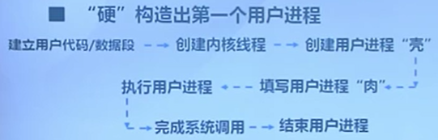
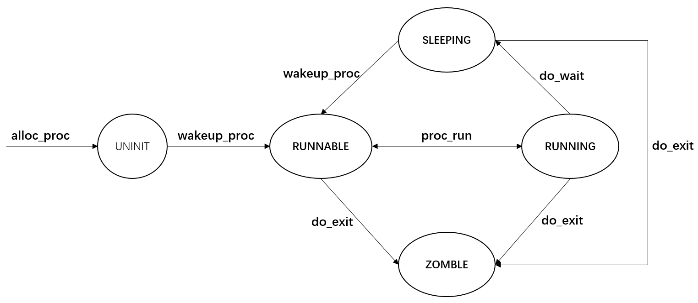
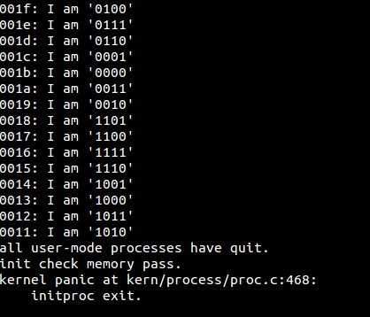
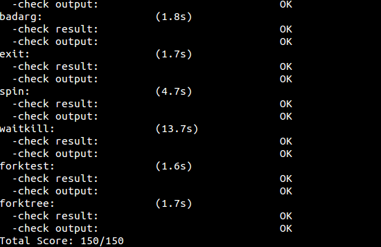

# lab5 实验报告 #

201908010502 林观田

## 实验目的

- 了解第一个用户进程创建过程
- 了解系统调用框架的实现机制
- 了解ucore如何实现系统调用sys_fork/sys_exec/sys_exit/sys_wait来进行进程管理

## 实验内容

实验4完成了内核线程，但到目前为止，所有的运行都在内核态执行。实验5将创建用户进程，让用户进程在用户态执行，且在需要ucore支持时，可通过系统调用来让ucore提供服务。为此需要构造出第一个用户进程，并通过系统调用sys_fork/sys_exec/sys_exit/sys_wait来支持运行不同的应用程序，完成对用户进程的执行过程的基本管理。

## 预备知识

### （1）第一个用户进程的创建过程



首先，“硬”构造出第一个进程（lab4中已有描述），它是后续所有进程的祖先；然后，在proc_init函数中，通过alloc把当前ucore的执行环境转变成idle内核线程的执行现场；然后调用kernl_thread来创建第二个内核线程init_main，而init_main内核线程有创建了user_main内核线程.。到此，内核线程创建完毕，应该开始用户进程的创建过程，这第一步实际上是通过user_main函数调用kernel_tread创建子进程，通过kernel_execve调用来把某一具体程序的执行内容放入内存。具体的放置方式是根据ld在此文件上的地址分配为基本原则，把程序的不同部分放到某进程的用户空间中，从而通过此进程来完成程序描述的任务。一旦执行了这一程序对应的进程，就会从内核态切换到用户态继续执行。

### （2）用户进程的虚拟空间

ucore把用户进程的虚拟地址空间分了两块，一块与内核线程一样，**是所有用户进程都共享的内核虚拟地址空间，映射到同样的物理内存空间中**，这样在物理内存中只需放置一份内核代码，使得用户进程从用户态进入核心态时，内核代码可以统一应对不同的内核程序；另外一块是用户虚拟地址空间，虽然虚拟地址范围一样，但映射到不同且没有交集的物理内存空间中。

## 练习

### 练习零：填写已有实验

本实验依赖实验1/2/3/4。请把你做的实验1/2/3/4的代码填入本实验中代码中有“LAB1”/“LAB2”/“LAB3”/“LAB4”的注释相应部分。为了能够正确执行lab5的测试应用程序，可能需对已完成的实验1/2/3/4的代码进行进一步改进。根据lab5中给的update提示，改进部分如下：

#### （1）alloc_proc函数

相比于lab4，进程控制块新增了5个成员变量`exit_code, wait_state ,proc->cptr , proc->optr , proc->yptr` 。

因此在lab4的基础上，需要对 `wait_state ,proc->cptr , proc->optr , proc->yptr` 四个变量初始化，实际上只需要将wait_state初始化为0，三个指针初始化为NULL即可。避免之后由于未定义或未初始化导致管理用户进程时出现错误。

```c
static struct proc_struct *alloc_proc(void) {
    struct proc_struct *proc = kmalloc(sizeof(struct proc_struct));
    if (proc != NULL) {
        proc->state = PROC_UNINIT;	//设置进程为未初始化状态
        proc->pid = -1;		//设置进程pid的未初始化值
        proc->runs = 0;		//初始化运行时间
        proc->kstack = 0;	//内存栈的地址
        proc->need_resched = 0;		//是否需要调度设为不需要
        proc->parent = NULL;	//父节点设为空
        proc->mm = NULL;		//虚拟内存设为空
        memset(&(proc->context), 0, sizeof(struct context));	//上下文的初始化
        proc->tf = NULL;	//中断帧指针置为空
        proc->cr3 = boot_cr3;	//页目录设为内核页目录表的基址
        proc->flags = 0;	//设置标志位
        memset(proc->name, 0, PROC_NAME_LEN);	//进程名称
     //LAB5 YOUR CODE : (update LAB4 steps)
    /* below fields(add in LAB5) in proc_struct need to be initialized	
     *       uint32_t wait_state;                        // waiting state
     *       struct proc_struct *cptr, *yptr, *optr;     // relations between processes
	 */
		proc->wait_state = 0;//等待状态
        proc->cptr = proc->optr = proc->yptr = NULL;//进程之间的关系
    }
    return proc;
}
```

#### （2）do_fork函数

do_fork函数修改部分恰好对应了进程控制块新增的相关成员变量的初始化，需要将子进程的父进程设置为 current process ，并且确保current process 的 wait_state 为0，用一个assert()实现该功能。同时在插入新进程到进程哈希表和进程链表时，设置好相关进程的链接。设置链接的函数为 set_links ，而set_links函数中已经实现了将进程插入链表并将进程总数加1，因此需要删掉lab4中这两句代码。

```c
	if((proc=alloc_proc())==NULL){
		goto fork_out;
	}
	proc->parent = current;
	assert(current->wait_state == 0);//确保当前进程正在等待
    if (setup_kstack(proc) != 0) {
        goto bad_fork_cleanup_proc;
    }
    if (copy_mm(clone_flags, proc) != 0) {
        goto bad_fork_cleanup_kstack;
    }
    copy_thread(proc, stack, tf);

    bool intr_flag;
    local_intr_save(intr_flag);
    {
        proc->pid = get_pid();
        hash_proc(proc);
        //list_add(&proc_list, &(proc->list_link));//删除此两句
        //nr_process ++;
		set_links(proc);//执行set_links函数，实现设置相关进程链接
    }
    local_intr_restore(intr_flag);
    wakeup_proc(proc);
    ret = proc->pid;
```

#### （3）trap_dispatch函数

主要修改地方在于 **当分配给进程的时间片用完时，设置进程为需要被调度**。

```
case IRQ_OFFSET + IRQ_TIMER:
	ticks++;
	if(ticks % TICK_NUM == 0){
		//print_ticks();	
        assert(current != NULL);
        current->need_resched = 1;
	}
```

#### （4）idt_init函数

增添功能为：设置一个特定中断号的中断门，专门用于用户进程访问系统调用。

> 设置一个特殊的中断描述符idt[T_SYSCALL]，它的特权级设置为DPL_USER，中断向量处理地址在vectors[T_SYSCALL]处。这样建立好这个中断描述符后，一旦用户进程执行“INTT_SYSCALL”后，由于此中断允许用户态进程产生（注意它的特权级设置为DPL_USER），所以CPU就会从用户态切换到内核态，保存相关寄存器，并跳转到vectors[T_SYSCALL]处开始执行。

```c
/* LAB5 YOUR CODE */ 
     //you should update your lab1 code (just add ONE or TWO lines of code), let user app to use syscall to get the service of ucore
     //so you should setup the syscall interrupt gate in here
    extern uintptr_t __vectors[];
    int i;
    for (i = 0; i < sizeof(idt) / sizeof(struct gatedesc); i ++) {
        SETGATE(idt[i], 0, GD_KTEXT, __vectors[i], DPL_KERNEL);
    }
	// 设置给用户态用的中断门 让用户态能够进行系统调用
    SETGATE(idt[T_SYSCALL], 1, GD_KTEXT, __vectors[T_SYSCALL], DPL_USER);
    lidt(&idt_pd);
```

------

### 练习一：加载应用程序并执行

> **do_execv**函数调用load_icode（位于kern/process/proc.c中）来加载并解析一个处于内存中的ELF执行文件格式的应用程序，建立相应的用户内存空间来放置应用程序的代码段、数据段等，且要设置好proc_struct结构中的成员变量trapframe中的内容，确保在执行此进程后，能够从应用程序设定的起始执行地址开始执行。需设置正确的trapframe内容。
>
> 请在实验报告中简要说明你的设计实现过程。
>
> 请在实验报告中描述当创建一个用户态进程并加载了应用程序后，CPU是如何让这个应用程序最终在用户态执行起来的。即这个用户态进程被ucore选择占用CPU执行（RUNNING态）到具体执行应用程序第一条指令的整个经过。

#### （1）分析与实现

do_execv函数主要功能是完成用户进程的创建工作。此函数的主要工作流程如下：

- 首先为加载新的执行码做好用户态内存空间清空准备。如果mm不为NULL，则设置页表为内核空间页表，且进一步判断mm的引用计数减1后是否为0，如果为0，则表明没有进程再需要此进程所占用的内存空间，为此将根据mm中的记录，释放进程所占用户空间内存和进程页表本身所占空间。最后把当前进程的mm内存管理指针为空。由于此处的initproc是内核线程，所以mm为NULL，整个处理都不会做。
- 接下来的一步是**加载应用程序执行码到当前进程的新创建的用户态虚拟空间中**。这里涉及到读ELF格式的文件，申请内存空间，建立用户态虚存空间，加载应用程序执行码等。load_icode函数完成了整个复杂的工作。

```c
// do_execve - call exit_mmap(mm)&put_pgdir(mm) to reclaim memory space of current process
//           - call load_icode to setup new memory space accroding binary prog.
int do_execve(const char *name, size_t len, unsigned char *binary, size_t size) {
    struct mm_struct *mm = current->mm;
    if (!user_mem_check(mm, (uintptr_t)name, len, 0)) {
        return -E_INVAL;
    }
    if (len > PROC_NAME_LEN) {
        len = PROC_NAME_LEN;
    }

    char local_name[PROC_NAME_LEN + 1];
    memset(local_name, 0, sizeof(local_name));
    memcpy(local_name, name, len);

    if (mm != NULL) {
        lcr3(boot_cr3);//将cr3页表基址指向boot_cr3,即内核页表
        if (mm_count_dec(mm) == 0) {//下面三步实现将进程的内存管理区域清空
            exit_mmap(mm);
            put_pgdir(mm);
            mm_destroy(mm);
        }
        current->mm = NULL;
    }
    int ret;
    //填入新的内容，load_icode会将执行程序加载，建立新的内存映射关系，从而完成新的执行
    if ((ret = load_icode(binary, size)) != 0) {
        goto execve_exit;
    }
    set_proc_name(current, local_name);//给进程新的名字
    return 0;

execve_exit:
    do_exit(ret);
    panic("already exit: %e.\n", ret);
}
```

load_icode函数的主要工作就是给用户进程建立一个能够让用户进程正常运行的用户环境。此函数有一百多行，完成了如下重要工作：

- 调用mm_create函数来申请进程的内存管理数据结构mm所需内存空间，并对mm进行初始化；

  ```c
      //(1) create a new mm for current process，重新创建内存管理区域
  	if ((mm = mm_create()) == NULL) {
          goto bad_mm;
      }
  ```

- 调用setup_pgdir来申请一个页目录表所需的一个页大小的内存空间，并把描述ucore内核虚空间映射的内核页表（boot_pgdir所指）的内容拷贝到此新目录表中，最后让mm->pgdir指向此页目录表，这就是进程新的页目录表了，且能够正确映射内核虚空间；

  ```c
  //(2) create a new PDT, and mm->pgdir= kernel virtual addr of PDT
      if (setup_pgdir(mm) != 0) {
          goto bad_pgdir_cleanup_mm;
      }
  ```

- 根据应用程序执行码的起始位置来解析此ELF格式的执行程序，并调用mm_map函数根据ELF格式的执行程序说明的各个段（代码段、数据段、BSS段等）的起始位置和大小建立对应的vma结构，并把vma插入到mm结构中，从而表明了用户进程的合法用户态虚拟地址空间；

- 调用根据执行程序各个段的大小分配物理内存空间，并根据执行程序各个段的起始位置确定虚拟地址，并在页表中建立好物理地址和虚拟地址的映射关系，然后把执行程序各个段的内容拷贝到相应的内核虚拟地址中，至此应用程序执行码和数据已经根据编译时设定地址放置到虚拟内存中了；此两步主要包括以下步骤：

  ```
  //建立合法的虚拟空间并建立好映射关系
  (3) copy TEXT/DATA section, build BSS parts in binary to memory space of process
  	(3.1) get the file header of the bianry program (ELF format)
  	(3.2) get the entry of the program section headers of the bianry program (ELF format)
  	(3.3) This program is valid?
  	(3.4) find every program section headers
  	(3.5) call mm_map fun to setup the new vma ( ph->p_va, ph->p_memsz)
  	(3.6) alloc memory, and  copy the contents of every program section (from, from+end) to process's memory (la, la+end)
  		(3.6.1) copy TEXT/DATA section of bianry program
  		(3.6.2) build BSS section of binary program
  ```

- 需要**给用户进程设置用户栈**，为此调用mm_mmap函数建立用户栈的vma结构，明确用户栈的位置在用户虚空间的顶端，大小为256个页，即1MB，并分配一定数量的物理内存且建立好栈的虚地址<-->物理地址映射关系；

  ```c
  //(4) build user stack memory
      vm_flags = VM_READ | VM_WRITE | VM_STACK;
      if ((ret = mm_map(mm, USTACKTOP - USTACKSIZE, USTACKSIZE, vm_flags, NULL)) != 0) {
          goto bad_cleanup_mmap;
      }
      assert(pgdir_alloc_page(mm->pgdir, USTACKTOP-PGSIZE , PTE_USER) != NULL);
      assert(pgdir_alloc_page(mm->pgdir, USTACKTOP-2*PGSIZE , PTE_USER) != NULL);
      assert(pgdir_alloc_page(mm->pgdir, USTACKTOP-3*PGSIZE , PTE_USER) != NULL);
      assert(pgdir_alloc_page(mm->pgdir, USTACKTOP-4*PGSIZE , PTE_USER) != NULL);
  ```

- 至此,进程内的内存管理vma和mm数据结构已经建立完成，于是把mm->pgdir赋值到cr3寄存器中，即**更新了用户进程的虚拟内存空间**，此时的initproc已经被hello的代码和数据覆盖，成为了第一个用户进程，但此时这个用户进程的执行现场还没建立好；

  ```c
  //(5) set current process's mm, sr3, and set CR3 reg = physical addr of Page Directory
  //页表地址由原来指向ucore内核的起始地址改为新建立好的页表地址
      mm_count_inc(mm);
      current->mm = mm;
      current->cr3 = PADDR(mm->pgdir);
      lcr3(PADDR(mm->pgdir));
  ```

- 先清空进程的中断帧，再重新设置进程的中断帧，使得在执行中断返回指令“iret”后，能够让CPU转到用户态特权级，并回到用户态内存空间，使用用户态的代码段、数据段和堆栈，且能够跳转到用户进程的第一条指令执行，并确保在用户态能够响应中断。（练习需要完成的部分）

至此，用户进程的用户环境已经搭建完毕。此时initproc将按产生系统调用的函数调用路径原路返回，执行中断返回指令“iret”（位于trapentry.S的最后一句）后，将切换到用户进程hello的第一条语句位置_start处（位于user/libs/initcode.S的第三句）开始执行。

有了以上的分析，接下来结合注释将load_icode函数补充完整，补充部分为建立好用户态的中断帧：

```c
//(6) setup trapframe for user environment
    struct trapframe *tf = current->tf;
    memset(tf, 0, sizeof(struct trapframe));   
	//将段寄存器初始化为用户态的代码段、数据段、堆栈段
	tf->tf_cs = USER_CS;
    tf->tf_ds = tf->tf_es = tf->tf_ss = USER_DS;
    tf->tf_esp = USTACKTOP;//esp指向先前的步骤中创建的用户栈的栈顶
    tf->tf_eip = elf->e_entry;//eip指向ELF可执行文件加载到内存之后的入口处
    tf->tf_eflags = FL_IF;//eflags中应当初始化为中断使能，表示允许中断
	ret = 0;
```

#### （2）思考题

请在实验报告中描述当创建一个用户态进程并加载了应用程序后，CPU是如何让这个应用程序最终在用户态执行起来的。即这个用户态进程被ucore选择占用CPU执行（RUNNING态）到具体执行应用程序第一条指令的整个经过。

答：1. 在经过调度器占用了 CPU 的资源之后，用户态进程调用了 exec 系统调用，从而转入到了系统调用的处理例程；

2. 在经过了正常的中断处理例程之后，最终控制权转移到了 syscall.c 中的 syscall 函数，然后根据系统调用号转移给了 sys_exec 函数，在该函数中调用了上文中提及的 do_execve 函数来完成指定应用程序的加载；

3. 在do_execve中进行了若干设置，包括退出当前进程的页表，切换成 kernel 的 PDT 之后，使用 load_icode 函数，完成了对整个用户线程内存空间的初始化，包括堆栈的设置以及将 ELF 可执行文件的加载，之后通过 current->tf 指针修改了当前系统调用的 trapframe，使得最终中断返回的时候能够切换到用户态，并且同时可以正确地将控制权转移到应用程序的入口处；

4. 在完成了 do_exec 函数之后，进行正常的中断返回的流程，由于中断处理例程的栈上面的 eip 已经被修改成了应用程序的入口处，而 CS 上的 CPL 是用户态，因此 iret 进行中断返回的时候会将堆栈切换到用户的栈，并且完成特权级的切换，并且跳转到要求的应用程序的入口处；

5. 接下来开始具体执行应用程序的第一条指令。

------

### 练习二：父进程复制自己的内存空间给子进程

> 创建子进程的函数do_fork在执行中将拷贝当前进程（即父进程）的用户内存地址空间中的合法内容到新进程中（子进程），完成内存资源的复制。具体是通过copy_range函数（位于kern/mm/pmm.c中）实现的，请补充copy_range的实现，确保能够正确执行。
>
> 请在实验报告中简要说明如何设计实现”Copy on Write 机制“，给出概要设计，鼓励给出详细设计。
>
> > Copy-on-write（简称COW）的基本概念是指如果有多个使用者对一个资源A（比如内存块）进行读操作，则每个使用者只需获得一个指向同一个资源A的指针，就可以该资源了。若某使用者需要对这个资源A进行写操作，系统会对该资源进行拷贝操作，从而使得该“写操作”使用者获得一个该资源A的“私有”拷贝—资源B，可对资源B进行写操作。该“写操作”使用者对资源B的改变对于其他的使用者而言是不可见的，因为其他使用者看到的还是资源A。

#### （1）分析与实现

do_fork是一个内核函数，用于子进程的创建，其中包括将拷贝当前进程（即父进程）的用户内存地址空间中的合法内容到新进程中（子进程），完成内存资源的复制。实现内存资源的复制主要是通过以下调用关系`do_fork()---->copy_mm()---->dup_mmap()---->copy_range()`最终由copy_range函数完成。

do_fork函数首先分配并初始化进程控制块，为进程分配并初始化内核栈，根据 clone_flag 标志复制或共享进程内存管理空间，**这里它会调用copy_mm()完成内核资源的复制，其中包括调用copy_range()函数拷贝父进程的内存到新进程**，然后设置中断帧和执行上下文、分配pid并将新创建好的子进程放到进程队列中去，使其可以等待执行。

 copy_range 函数的具体执行流程是**遍历父进程指定的某一段内存空间中的每一个虚拟页，如果这个虚拟页是存在的话，为子进程对应的同一个地址也申请分配一个物理页，然后将前者中的所有内容复制到后者中去，然后为子进程的这个物理页和对应的虚拟地址建立映射关系；**在本练习中需要完成的内容就是内存的复制和映射的建立，具体流程如下：

1. 找到父进程指定的某一物理页对应的内核虚拟地址；
2. 找到需要拷贝过去的子进程的对应物理页对应的内核虚拟地址；
3. 将前者的内容拷贝到后者中去；
4. 为子进程当前分配这一物理页映射上对应的在子进程虚拟地址空间里的一个虚拟页；

```c
/* copy_range - copy content of memory (start, end) of one process A to another process B
 * @to:    the addr of process B's Page Directory
 * @from:  the addr of process A's Page Directory
 * @share: flags to indicate to dup OR share. We just use dup method, so it didn't be used.
 * CALL GRAPH: copy_mm-->dup_mmap-->copy_range
 */
int copy_range(pde_t *to, pde_t *from, uintptr_t start, uintptr_t end, bool share) {
    assert(start % PGSIZE == 0 && end % PGSIZE == 0);
    assert(USER_ACCESS(start, end));
    // copy content by page unit.以页为单元复制内容
    do {
        //call get_pte to find process A's pte according to the addr start
        pte_t *ptep = get_pte(from, start, 0), *nptep;
        if (ptep == NULL) {
            start = ROUNDDOWN(start + PTSIZE, PTSIZE);
            continue ;
        }
        //call get_pte to find process B's pte according to the addr start. If pte is NULL, just alloc a PT
        if (*ptep & PTE_P) {
            if ((nptep = get_pte(to, start, 1)) == NULL) {
                return -E_NO_MEM;
            }
            uint32_t perm = (*ptep & PTE_USER);
            //get page from ptep
            struct Page *page = pte2page(*ptep);
            // alloc a page for process B
            struct Page *npage=alloc_page();
            assert(page!=NULL);
            assert(npage!=NULL);
            int ret=0;
            /* LAB5:EXERCISE2 YOUR CODE*/
            // (1) find src_kvaddr: the kernel virtual address of page
            //找到父进程需要复制的物理页在内核地址空间中的虚拟地址
            void * kva_src = page2kva(page);
            //(2) find dst_kvaddr: the kernel virtual address of npage
            //找到子进程需要被填充的物理页的内核虚拟地址
            void * kva_dst = page2kva(npage);
            //(3) memory copy from src_kvaddr to dst_kvaddr, size is PGSIZE
            memcpy(kva_dst, kva_src, PGSIZE);
            //(4) build the map of phy addr of  nage with the linear addr start
            ret = page_insert(to, npage, start, perm);
            assert(ret == 0);
        }
        start += PGSIZE;
    } while (start != 0 && start < end);
    return 0;
}
```

#### （2）思考题

请在实验报告中简要说明如何设计实现”Copy on Write 机制“，给出概要设计，鼓励给出详细设计。

`Copy on Write` 机制的主要思想为使得进程执行 fork 系统调用进行复制的时候，父进程不会简单地将整个内存中的内容复制给子进程，而是暂时共享相同的物理内存页；而当其中一个进程需要对内存进行修改的时候，再额外创建一个自己私有的物理内存页，将共享的内容复制过去，然后在自己的内存页中进行修改。

设计实现思路是，在PTE或PDE上新增设置一个标记位，用来标记某块内存是否共享。在pmm.c中为copy_range添加对共享页的处理，进行 fork 操作的时候不直接复制内存，即通过copy_range函数的参数share来传递是否共享的信息，如果share为1，则将子进程和父进程的虚拟页映射上同一个物理页面，然后再分别在这两个进程的虚拟页对应的 PTE 部分将这个页置成是不可写的（只读），同时利用 PTE 中的保留位将这个页设置成共享的页面。当程序尝试修改只读的内存页面的时候，将触发Page Fault中断，这时候可以检测出是超出权限访问导致的中断，此时判断进程是否是访问了共享的页面且要进行修改，如果是则需要重新为进程分配页面、拷贝页面内容、建立映射关系。

------

### 练习三：阅读分析源代码，理解进程执行 fork/exec/wait/exit 的实现，以及系统调用的实现

> 请在实验报告中简要说明你对 fork/exec/wait/exit函数的分析。并回答如下问题：
>
> - 请分析fork/exec/wait/exit在实现中是如何影响进程的执行状态的？
> - 请给出ucore中一个用户态进程的执行状态生命周期图（包执行状态，执行状态之间的变换关系，以及产生变换的事件或函数调用）。（字符方式画即可）
>
> 执行：make grade。如果所显示的应用程序检测都输出ok，则基本正确。（使用的是qemu-1.0.1）

#### （1）分析

ucore实验中的系统调用主要包括以下几种：

| 系统调用名 | 含义                                      | 具体完成服务的函数                                           |
| ---------- | ----------------------------------------- | ------------------------------------------------------------ |
| SYS_exit   | process exit                              | do_exit                                                      |
| SYS_fork   | create child process, dup mm              | do_fork-->wakeup_proc                                        |
| SYS_wait   | wait child process                        | do_wait                                                      |
| SYS_exec   | after fork, process execute a new program | load a program and refresh the mm                            |
| SYS_yield  | process flag itself need resecheduling    | proc->need_sched=1, then scheduler will rescheule this process |
| SYS_kill   | kill process                              | do_kill-->proc->flags \|= PF_EXITING, -->wakeup_proc-->do_wait-->do_exit |
| SYS_getpid | get the process's pid                     |                                                              |

系统调用机制为用户进程提供一个获得操作系统服务的统一接口层，一来可简化用户进程的实现，把一些共性的、繁琐的、与硬件相关、与特权指令相关的任务放到操作系统层来实现，只提供一个简洁的接口给用户进程调用，如应用程序调用 fork/exec/wait/exit都是通过调用相应的系统调用来实现；二来这层接口事先可规定好，且严格检查用户进程传递进来的参数和操作系统要返回的数据，使得让操作系统给用户进程服务的同时，保护操作系统不会被用户进程破坏。

##### 1）fork

由上表可知fork主要是**完成进程/线程的创建**，它调用了系统调用 SYS_fork，而系统调用 SYS_fork 则主要是由 do_fork 和 wakeup_proc 来完成的。

do_fork函数主要完成以下工作：

1. 分配并初始化进程控制块（alloc_proc函数）；
2. 分配并初始化内核栈（setup_stack函数）；
3. 根据clone_flag标志复制或共享进程内存管理结构（copy_mm函数）；
4. 设置进程在内核（将来也包括用户态）正常运行和调度所需的中断帧和执行上下文（copy_thread函数）；
5. 把设置好的进程控制块放入hash_list和proc_list两个全局进程链表中；
6. 自此，进程已经准备好执行了，把进程状态设置为“就绪”态；
7. 设置返回码为子进程的id号。

wakeup_proc 函数主要是将进程的状态设置为等待，即 proc->wait_state = 0。

##### 2）exec

exec主要是完成**用户进程的创建工作**，同时使用户进程进入执行。当应用程序执行的时候，会调用 SYS_exec 系统调用，而此调用会通过do_execve() 函数来实现。

do_exercve函数主要完成的工作如下：

1. 检查进程名称的地址和长度是否合法，如果合法，那么将名称暂时保存在函数栈中，否则返回E_INVAL；
2. 将cr3页表基址指向内核页表，然后实现对进程的内存管理区域的释放；
3. 调用load_icode将代码加载进内存并建立新的内存映射关系，如果加载错误，那么调用panic报错；
4. 调用set_proc_name重新设置进程名称。

##### 3）wait

wait主要是**完成对子进程的内核栈和进程控制块所占内存空间的回收**。对应系统调用 SYS_wait，通过do_wait函数实现。

do_wait函数主要完成的工作如下：

1. 如果 pid!=0，表示只找一个进程 id 号为 pid 的退出状态的子进程，否则找任意一个处于退出状态的子进程;
2. 如果此子进程的执行状态不为 PROC_ZOMBIE，表明此子进程还没有退出，则当前进程设置执行状态为 PROC_SLEEPING（睡眠），睡眠原因为 WT_CHILD (即等待子进程退出)，调用 schedule() 函数选择新的进程执行，自己睡眠等待，如果被唤醒，则重复跳回步骤 1 处执行;
3. 如果此子进程的执行状态为 PROC_ZOMBIE，表明此子进程处于退出状态，需要当前进程(即子进程的父进程)完成对子进程的最终回收工作，即首先把子进程控制块从两个进程队列 proc_list 和 hash_list 中删除，并释放子进程的内核堆栈和进程控制块。自此，子进程才彻底地结束了它的执行过程，它所占用的所有资源均已释放。

##### 4）exit

exit主要是**完成当前进程执行退出过程中的大部分内存资源回收，并通知父进程完成最后的回收工作。**对应系统调用SYS_exit，通过do_exit函数实现。

do_exit函数主要完成的工作如下：

1. 先判断是否是用户进程，如果是，则开始回收此用户进程所占用的用户态虚拟内存空间;
1. 设置当前进程的状态为 PROC_ZOMBIE，然后设置当前进程的退出码为 error_code。表明此时这个进程已经无法再被调度了，只能等待父进程来完成最后的回收工作（主要是回收该子进程的内核栈、进程控制块）。
3. 如果当前父进程已经处于等待子进程的状态，即父进程的 wait_state 被置为 WT_CHILD，则此时就可以唤醒父进程，让父进程来帮子进程完成最后的资源回收工作。
4. 如果当前进程还有子进程,则需要把这些子进程的父进程指针设置为内核线程 init，且各个子进程指针需要插入到 init 的子进程链表中。如果某个子进程的执行状态是 PROC_ZOMBIE，则需要唤醒 init 来完成对此子进程的最后回收工作。
5. 执行 schedule() 调度函数，选择新的进程执行。

#### （2）思考题

> 请分析fork/exec/wait/exit在实现中是如何影响进程的执行状态的？

- fork将创建新的子线程，将子线程的状态由UNINIT态变为RUNNABLE态，不影响当前线程的状态
- exec完成用户进程的创建工作。首先加载新的执行码做好用户态内存空间清空准备。接下来的一步是加载应用程序执行码到当前进程的新创建的用户态虚拟空间中。exec 不会影响当前进程的执行状态，但是会修改当前进程中执行的程序。
- wait等待任意子进程的结束并完成子进程资源回收，如果有已经结束的子进程或者没有子进程，那么调用会立刻结束，不影响进程状态；否则，进程需要等待子进程结束，进程从RUNNIG态变为SLEEPING态。
- exit完成回收当前进程所占的大部分内存资源，并通知父进程完成最后的回收工作。进程从RUNNIG态变为ZOMBIE态，并且会将父进程唤醒。

> 请给出ucore中一个用户态进程的执行状态生命周期图（包执行状态，执行状态之间的变换关系，以及产生变换的事件或函数调用）。

在ucore中，进程共四种状态："初始"状态、睡眠状态、可运行状态、僵尸状态。根据此四种状态画出状态转移图如下：



------

### 运行结果

执行`make qemu`



执行`make grade`



------

### 扩展练习：实现 Copy on Write 机制

> 给出实现源码和设计报告。
>
> 这个扩展练习涉及到本实验和上一个实验“虚拟内存管理”。在ucore操作系统中，当一个用户父进程创建自己的子进程时，父进程会把其申请的用户空间设置为只读，子进程可共享父进程占用的用户内存空间中的页面（这就是一个共享的资源）。当其中任何一个进程修改此用户内存空间中的某页面时，ucore会通过page fault异常获知该操作，并完成拷贝内存页面，使得两个进程都有各自的内存页面。这样一个进程所做的修改不会被另外一个进程可见了。请在ucore中实现这样的COW机制。

基于练习二的问题的回答，为实现Copy on Write 机制（写时复制），在原来的代码基础上修改如下：

（1）通过共享标志启动共享机制

由练习二的分析可知，copy_range函数包含了一个bool类型的变量share，可用于判断是否需要共享父进程的内存空间。因此将vmm.c中的dup_mmap函数中队share变量的设置进行修改并初始化为1，当dup_mmap函数调用copy_range函数时将share作为参数进行传递，然后再在copy_range函数根据share的取值是否实现父子进程的内存共享。修改部分如下（kern/mm/vmm.c）：

```c
int dup_mmap(struct mm_struct *to, struct mm_struct *from) {
		...
        bool share = 1;//设置为1
		if (copy_range(to->pgdir, from->pgdir, vma->vm_start, vma->vm_end, share)!= 0) 			{
            return -E_NO_MEM;
         }
        ...
}
```

（2）在copy_range函数中实现对共享页的处理

在pmm.c中为copy_range添加对共享页的处理，如果share为1，那么将子进程的页面映射到父进程的页面即可。由于两个进程共享一个页面之后，无论任何一个进程修改页面，都会影响数据的可靠性，所以需要子进程和父进程对于这个共享页面都保持只读。

```c
int copy_range(pde_t *to, pde_t *from, uintptr_t start, uintptr_t end, bool share) {
    assert(start % PGSIZE == 0 && end % PGSIZE == 0);
    assert(USER_ACCESS(start, end));
    do {
        //call get_pte to find process A's pte according to the addr start
        pte_t *ptep = get_pte(from, start, 0), *nptep;
        if (ptep == NULL) {
            start = ROUNDDOWN(start + PTSIZE, PTSIZE);
            continue ;
        }
   		if (*ptep & PTE_P) {
            if ((nptep = get_pte(to, start, 1)) == NULL) {
                return -E_NO_MEM;
            }
            uint32_t perm = (*ptep & PTE_USER);
            //get page from ptep
            struct Page *page = pte2page(*ptep);
            assert(page!=NULL);
            int ret=0;
            if (share) {//实现页面共享，建立映射关系并设置为只读	
                page_insert(from, page, start, perm & (~PTE_W));
                ret = page_insert(to, page, start, perm & (~PTE_W));
            } else {//非共享，分配页面并进行资源的复制
                struct Page *npage=alloc_page();
                assert(npage!=NULL);
                uintptr_t src_kvaddr = page2kva(page);
                uintptr_t dst_kvaddr = page2kva(npage);
                memcpy(dst_kvaddr, src_kvaddr, PGSIZE);
                ret = page_insert(to, npage, start, perm);
            }
            assert(ret == 0);
        }
        start += PGSIZE;
    } while (start != 0 && start < end);
    return 0;
}
```

（3）接下来实现”写时复制“

当程序尝试修改只读的内存页面的时候，将触发Page Fault中断，这时候可以检测出是超出权限访问导致的中断，此时判断进程是否是访问了共享的页面且要进行修改，如果是则需要重新为进程分配页面、拷贝页面内容、建立映射关系。因此需要在do_pgfault函数中检测引起缺页中断的错误并进行相应处理，增加部分如下：

```c
  int do_pgfault(struct mm_struct *mm, uint32_t error_code, uintptr_t addr)
  {
     .....
   
    if (*ptep == 0)
 	{ //如果物理页不存在的话，分配物理页并建立好相关的映射关系
        if (pgdir_alloc_page(mm->pgdir, addr, perm) == NULL) 
        {
            cprintf("pgdir_alloc_page in do_pgfault failed\n");
            goto failed;
        }
    } 
     //通过*ptep & PTE_P == 1判断得到是COW导致的错误
    else if (*ptep & PTE_P == 1)
    {	
        //因此在这里就需要完成物理页的分配，并实现代码和数据的复制
        //实际上，我们将之前的copy_range过程放在了这里执行，只有必须执行时才执行该过程
        struct Page *page = pte2page(*ptep);
        struct Page *npage = pgdir_alloc_page(mm->pgdir, addr, perm);
        uintptr_t src_kvaddr = page2kva(page);
        uintptr_t dst_kvaddr = page2kva(npage);
        memcpy(dst_kvaddr, src_kvaddr, PGSIZE);
    } 
    else 
    {
		...
   	}
	...
} 
```


------

### 列出本实验中重要的知识点，以及与对应的OS原理中的知识点，并简要说明你对二者的含义，关系，差异等方面的理解。

本次实验中主要涉及到的知识点有：

- 从内核态切换到用户态的方法；
- ELF可执行文件的格式；
- 用户进程的创建和管理；
- 简单的进程调度；
- 系统调用的实现；

对应的操作系统中的知识点有：

- 创建、管理、切换到用户态进程的具体实现；
- 加载ELF可执行文件的具体实现；
- 对系统调用机制的具体实现；