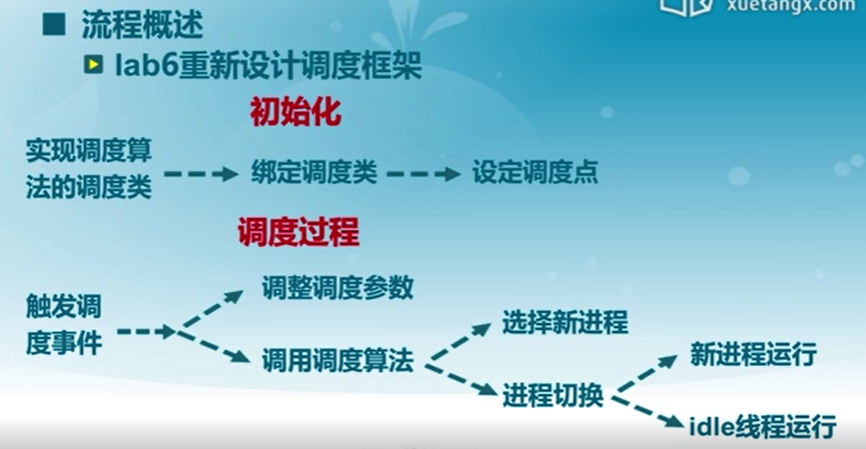
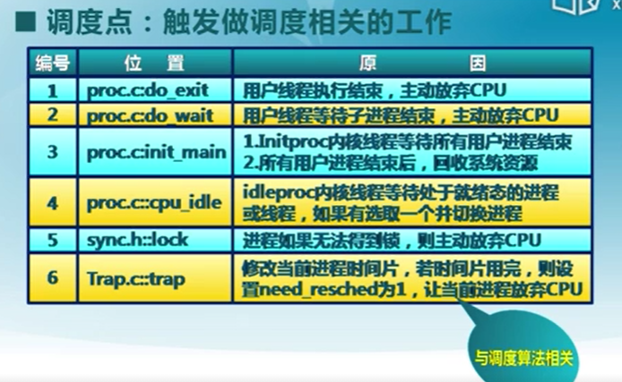
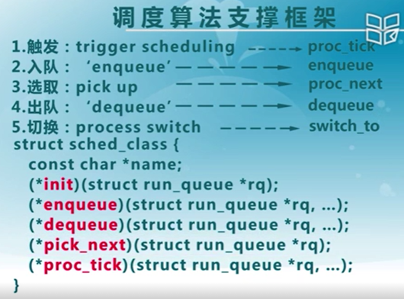
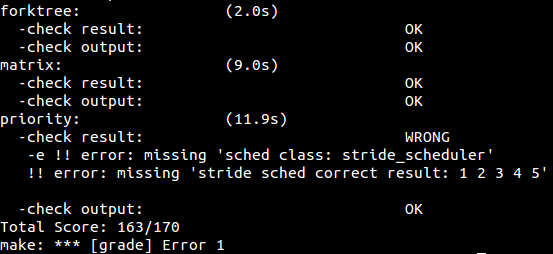
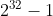
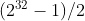
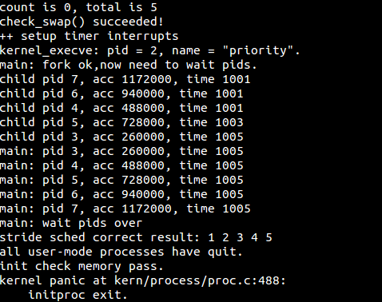
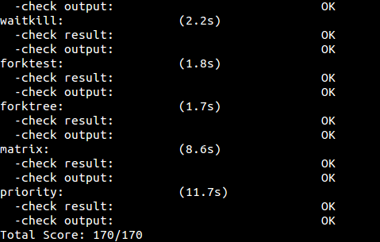

# lab6 实验报告 #

201908010502 林观田

## 实验目的

- 理解操作系统的调度管理机制
- 熟悉 ucore 的系统调度器框架，以及缺省的Round-Robin 调度算法
- 基于调度器框架实现一个(Stride Scheduling)调度算法来替换缺省的调度算法

## 实验内容

实验五完成了用户进程的管理，可在用户态运行多个进程。但到目前为止，采用的调度策略是很简单的FIFO调度策略。本次实验，主要是熟悉ucore的系统调度器框架，以及基于此框架的Round-Robin（RR） 调度算法。然后参考RR调度算法的实现，完成Stride Scheduling调度算法。

## 预备知识

### （1）实验执行流程概述



### （2）调度过程

1）调度点



2）调度算法支撑框架



### （3）进程的正常生命周期

ucore定义的进程控制块struct proc_struct包含了成员变量state,用于描述进程的运行状态，而running和runnable共享同一个状态(state)值(PROC_RUNNABLE)。不同之处在于处于running态的进程不会放在运行队列中。进程的正常生命周期如下：

- 进程首先在 cpu 初始化或者 sys_fork 的时候被创建，当为该进程分配了一个进程控制块之后，该进程进入 uninit态(在proc.c 中 alloc_proc)。
- 当进程完全完成初始化之后，该进程转为runnable态。
- 当到达调度点时，由调度器 sched_class 根据运行队列rq的内容来判断一个进程是否应该被运行，即把处于runnable态的进程转换成running状态，从而占用CPU执行。
- running态的进程通过wait等系统调用被阻塞，进入sleeping态。
- sleeping态的进程被wakeup变成runnable态的进程。
- running态的进程主动 exit 变成zombie态，然后由其父进程完成对其资源的最后释放，子进程的进程控制块成为unused。
- 所有从runnable态变成其他状态的进程都要出运行队列，反之，被放入某个运行队列中。

## 练习

### 练习零：填写已有实验

本实验依赖实验1/2/3/4/5。请把你做的实验2/3/4/5的代码填入本实验中代码中有“LAB1”/“LAB2”/“LAB3”/“LAB4”“LAB5”的注释相应部分。并确保编译通过。注意：为了能够正确执行lab6的测试应用程序，可能需对已完成的实验1/2/3/4/5的代码进行进一步改进。根据lab6中给的update提示，改进部分如下：

#### （1）alloc_proc函数

在PCT 进程控制块结构体中增加了三个与 stride 调度算法相关的成员变量，因此需要增加对应的初始化过程。在原有的基础上新增成员变量如下：

```c
    int exit_code; 	// exit code (be sent to parent proc)，退出码(发送到父进程)，lab5
    uint32_t wait_state;   // waiting state，等待状态，lab5
    struct proc_struct *cptr, *yptr, *optr;   // relations between processes，进程间的联系，lab5
    struct run_queue *rq;     // running queue contains Process，运行队列中包含的进程
    list_entry_t run_link;    // the entry linked in run queue，运行队列链表的链接结构
    int time_slice;           // time slice for occupying the CPU，该进程剩余的时间片
    skew_heap_entry_t lab6_run_pool;  // FOR LAB6 ONLY: the entry in the run pool，该进程的在运行队列中的节点
    uint32_t lab6_stride;   // FOR LAB6 ONLY: the current stride of the process ，该进程的调度步进值
    uint32_t lab6_priority;  // FOR LAB6 ONLY: the priority of process, set by lab6_set_priority(uint32_t)，该进程的优先级
```

因此对于alloc_proc函数，新增部分成员变量的初始化如下：

```c
proc->rq = NULL; //初始化运行队列为空
list_init(&(proc->run_link));//初始化运行队列的指针
proc->time_slice = 0; //初始化时间片
proc->lab6_run_pool.left = proc->lab6_run_pool.right = proc->lab6_run_pool.parent = NULL;//初始化各类指针为空，包括父进程等待
proc->lab6_stride = 0;//设置步长为0
proc->lab6_priority = 0;//设置优先级为0
```

#### （2）trap_dispatch函数

在时钟产生的地方需要对定时器做初始化，说明当前进程的时间片已经用完了，用于调度算法。

```c
static void trap_dispatch(struct trapframe *tf)
{
   .....
   case IRQ_OFFSET + IRQ_TIMER:	
 		ticks ++;
        assert(current != NULL);
      	sched_class_proc_tick(current);
        break;
   .....
}
```

------

### 练习一：使用 Round Robin 调度算法

> 完成练习0后，建议大家比较一下（可用kdiff3等文件比较软件）个人完成的lab5和练习0完成后的刚修改的lab6之间的区别，分析了解lab6采用RR调度算法后的执行过程。执行make grade，大部分测试用例应该通过。但执行priority.c应该过不去。
>
> 请在实验报告中完成：
>
> - 请理解并分析sched_calss中各个函数指针的用法，并接合Round Robin 调度算法描ucore的调度执行过程
> - 请在实验报告中简要说明如何设计实现”多级反馈队列调度算法“，给出概要设计，鼓励给出详细设计

#### （1）检测练习零是否通过

执行`make grade`，结果如下，只有最后一个测试没有通过。



#### （2）分析

- RR调度算法思想：`Round Robin` 调度算法的调度思想是让所有 runnable 态的进程分时轮流使用 CPU 时间。RR调度器维护当前 runnable 进程的有序运行队列。当前进程的时间片用完之后，调度器将当前进程放置到运行队列的尾部，再从其头部取出进程进行调度。

- RR调度算法的框架/接口：

  ```c
  //sched_class类似于之前对物理内存、虚拟内存管理时的结构体，是调度算法的总体框架
  struct sched_class default_sched_class = {
      .name = "RR_scheduler", 
      .init = RR_init,   //初始化进程
      .enqueue = RR_enqueue, //将进程p加入到运行队列q中
      .dequeue = RR_dequeue,  //将进程p从运行队列q中删除
      .pick_next = RR_pick_next,  //返回运行队列中下一个可执行的进程
      .proc_tick = RR_proc_tick,  //用于处理时间片
  };
  ```

- 该算法框架涉及了两个关键数据结构：`run_queue`和`skew_heap_entry`。`run_queue`运行队列存储的是当前可以调度的进程， 所以，只有状态为runnable的进程才能够进入运行队列。 当前正在运行的进程并不会在运行队列中。

  ```c
  struct run_queue {
      list_entry_t run_list;//就绪队列
      unsigned int proc_num;//内部进程总数
      int max_time_slice;//每个进程一轮占用的最多时间片
      // For LAB6 ONLY
      skew_heap_entry_t *lab6_run_pool;//优先队列形式的进程容器
  };
  
  struct skew_heap_entry {
       struct skew_heap_entry *parent, *left, *right;//树形结构的进程容器
  };
  typedef struct skew_heap_entry skew_heap_entry_t;
  ```

  Round Robin 调度算法的主要实现在 schedule/default_sched.c，RR算法框架的相关函数如下：

- RR_init函数

  该函数完成了对可被调度的进程队列的初始化。

  ```c
  static void RR_init(struct run_queue *rq) { //初始化进程队列
      list_init(&(rq->run_list));//初始化运行队列
      rq->proc_num = 0;//初始化进程数为 0
  }
  ```

- RR_enqueue函数

  实现功能：将可被调度的进程加入到就绪队列当中。

  实现流程：首先把进程的进程控制块指针放入到 rq 队列末尾，且如果进程控制块的时间片为 0，则需要把它重置为 `max_time_slice`。这表示如果进程在当前的执行时间片已经用完，需要等到下一次有机会运行时，才能再执行一个时间片。然后依次调整 rq 和 rq 的进程数目加一。

  ```c
  //将进程加入到就绪队列的最后，将进程的时间片时间重置为最大，更新队列中进程数目
  static void RR_enqueue(struct run_queue *rq, struct proc_struct *proc) 
  {
      //进程运行队列不能为空
      assert(list_empty(&(proc->run_link))); 
      //把进程控制块指针放到rq队列末尾
      list_add_before(&(rq->run_list), &(proc->run_link)); 
      //如果进程时间片用完，将其重置为max_time_slice
      if (proc->time_slice == 0 || proc->time_slice > rq->max_time_slice) {
          proc->time_slice = rq->max_time_slice;
      }
      proc->rq = rq;//加入进程池
      rq->proc_num ++;//就绪进程数加一
  }
  ```
  
- RR_dequeue函数

  实现功能：在就绪队列中取出一个进程并删除

  实现流程：把就绪进程队列 rq 的进程控制块指针的队列元素删除，然后使就绪进程个数的proc_num减一。

  ```c
  //将就绪进程队列rq的进程控制块指针的队列元素删除，并把表示就绪进程个数的proc_num减一。
  static void
  RR_dequeue(struct run_queue *rq, struct proc_struct *proc) {
      assert(!list_empty(&(proc->run_link)) && proc->rq == rq);
      list_del_init(&(proc->run_link)); //将进程控制块指针从就绪队列中删除
      rq->proc_num --;//进程数减一
  }
  ```

- RR_pick_next函数

  实现功能：选取下一个调度进程

  实现流程：选取就绪进程队列 rq 中的队头队列元素，并把队列元素转换成进程控制块指针，即置为当前占用 CPU 的程序。

  ```c
  //选择运行队列中的第一个进程交给schedule作为下一个要运行的进程，并把队列元素转换成进程控制块指针。
  static struct proc_struct *RR_pick_next(struct run_queue *rq) {//选择下一调度进程
      list_entry_t *le = list_next(&(rq->run_list));//选取就绪进程队列 rq 中的队头队列元素
      if (le != &(rq->run_list)) {//取得就绪进程
          return le2proc(le, run_link);//返回进程控制块指针
      }
      return NULL;
  }
  ```

- RR_proc_tick函数

  实现功能：时间片控制

  实现流程：每一次时间片用完时，当前执行进程的时间片 time_slice 便减一。如果 time_slice 降到零，则设置此进程成员变量 need_resched 标识为 1，这样在下一次中断来后执行 trap 函数时，会由于当前进程程成员变量 need_resched 标识为 1 而执行 schedule 函数，从而把当前执行进程放回就绪队列末尾，而从就绪队列头取出在就绪队列上等待时间最久的那个就绪进程执行。

  ```c
  //该函数表示每次时钟中断的时候应当调用的调度算法的功能，仅在进行时间中断的 ISR 中调用
  static void RR_proc_tick(struct run_queue *rq, struct proc_struct *proc) {//时间片
      if (proc->time_slice > 0) {//到达时间片
          proc->time_slice --;//执行进程的时间片 time_slice 减一
      }
      if (proc->time_slice == 0) {//时间片为 0
          proc->need_resched = 1;//设置此进程成员变量 need_resched 标识为 1，进程需要调度
      }
  }
  ```

#### （3）思考题

> 请理解并分析sched_calss中各个函数指针的用法，并接合Round Robin 调度算法描ucore的调度执行过程

答：`sched_class`实现了调度算法的一个框架，将具体的实现转换为具体的接口。

```c
struct sched_class {
  const char *name;// 调度器的名字
  void (*init) (struct run_queue *rq);// 初始化运行队列
  void (*enqueue) (struct run_queue *rq, struct proc_struct *p);// 将进程 p 插入队列 rq
  void (*dequeue) (struct run_queue *rq, struct proc_struct *p);// 将进程 p 从队列 rq 中删除
  struct proc_struct* (*pick_next) (struct run_queue *rq);// 返回运行队列中下一个可执行的进程
  void (*proc_tick)(struct run_queue* rq, struct proc_struct* p);// timetick 处理函数
};
```

结合schedule函数，可以分析ucore调度执行过程大致如下：在内核初始化时调用sched_init函数选择调度器并对调度器初始化。每当进程被唤醒或者时间片用完了（RR调度）则调用enqueue函数将其加入调度器等待调度的进程队列。每当发生进程切换时，首先调用enqueue将当前正在运行的进程加入等待调度的进程队列，然后调用pick_next函数获取接下来将执行的进程，并调用dequeue将被选中即将执行的进程从调度队列中移除。每当产生时钟中断时，需要调用proc_tick函数来更新调度器的时钟信息。

> 请在实验报告中简要说明如何设计实现”多级反馈队列调度算法“，给出概要设计，鼓励给出详细设计

设计思路：

- proc_struct：在 proc_struct 中添加总共 N 个多级反馈队列的入口，每个队列都有着各自的优先级，编号越大的队列优先级约低，并且优先级越低的队列上时间片的长度越大，为其上一个优先级队列的两倍；并且在 PCB 中记录当前进程所处的队列的优先级；
- init：处理调度算法初始化的时候需要同时对 N 个队列进行初始化；
- enqueue：在处理将进程加入到就绪进程集合的时候，观察这个进程的时间片有没有使用完，如果使用完了，就将所在队列的优先级调低，加入到优先级低 1 级的队列中去，如果没有使用完时间片，则加入到当前优先级的队列中去；
- 在同一个优先级的队列内使用时间片轮转算法；
- pick_next：在选择下一个执行的进程的时候，有限考虑高优先级的队列中是否存在任务，如果不存在才转而寻找较低优先级的队列；
- dequeue：从就绪进程集合中删除某一个进程就只需要在对应队列中删除即可；
- proc_tick：在原来的时间片控制基础上，规定一个时间段S，每过S将所有的进程放到最高优先级队列中执行，防止饥饿。

------

### 练习二：实现 Stride Scheduling 调度算法

> 首先需要换掉RR调度器的实现，即用default_sched_stride_c覆盖default_sched.c。然后根据此文件和后续文档对Stride度器的相关描述，完成Stride调度算法的实现。
>
> 后面的实验文档部分给出了Stride调度算法的大体描述。这里给出Stride调度算法的一些相关的资料（目前网上中文的资料比较欠缺）。
>
> - [strid-shed paper location1](http://wwwagss.informatik.uni-kl.de/Projekte/Squirrel/stride/node3.html)
> - [strid-shed paper location2](http://citeseerx.ist.psu.edu/viewdoc/summary?doi=10.1.1.138.3502&rank=1)
> - 也可GOOGLE “Stride Scheduling” 来查找相关资料
>
> 执行：make grade。如果所显示的应用程序检测都输出ok，则基本正确。如果只是priority.c过不去，可执行 make run-priority 命令来单独调试它。大致执行结果可看附录。（ 使用的是 qemu-1.0.1 ）。
>
> 请在实验报告中简要说明你的设计实现过程。

### （1）分析与实现

Stride Scheduling调度算法的算法思想如下：

1. 为每个runnable的进程设置一个当前状态stride，表示该进程当前的调度权。另外定义其对应的pass值，表示对应进程在调度后，stride 需要进行的累加值。

2. 每次需要调度时，从当前 runnable 态的进程中选择 stride最小的进程调度。

3. 对于获得调度的进程P，将对应的stride加上其对应的步长pass（只与进程的优先权有关系）。

4. 在一段固定的时间之后，回到 2.步骤，重新调度当前stride最小的进程。

   可以证明，如果令 P.pass =BigStride / P.priority 其中 P.priority 表示进程的优先权（大于 1），而 BigStride 表示一个预先定义的大常数，则该调度方案为每个进程分配的时间将与其优先级成正比。

由上面的算法思想可知，对于每一次pick_next函数，都需要完整地扫描来获得当前最小的stride及其进程。为降低该算法的复杂度，因此使用优化的优先队列数据结构实现该调度。本次实验提供了`libs/skew_heap.h` 作为优先队列的一个实现，对优先队列的实现如下：

```c
//初始化一个队列节点
static inline void skew_heap_init(skew_heap_entry_t *a)
{
     //将节点的子节点、父节点均初始化为null
     a->left = a->right = a->parent = NULL;
}
//将a与b两个堆进行合并
static inline skew_heap_entry_t *skew_heap_merge(skew_heap_entry_t *a, skew_heap_entry_t *b,
                compare_f comp)
{
     if (a == NULL) return b;
     else if (b == NULL) return a;
     
     skew_heap_entry_t *l, *r;
     //if a<b，说明a应当做堆顶元素
     if (comp(a, b) == -1)
     { 
          //令a为最终的堆顶元素，将b与a的子节点进行合并后的结果作为a的子节点即可
          r = a->left;
          l = skew_heap_merge(a->right, b, comp);    
          a->left = l;
          a->right = r;
          if (l) l->parent = a;
          return a;
     }
     else
     { //令b为最终的堆顶元素，将a与b的子节点进行合并后的结果作为b的子节点即可
          r = b->left;
          l = skew_heap_merge(a, b->right, comp);
          b->left = l;
          b->right = r;
          if (l) l->parent = b;
          return b;
     }
}
// 将节点 b 插入至以节点 a 为队首元素的队列中去，返回插入后的队列
static inline skew_heap_entry_t *skew_heap_insert(skew_heap_entry_t *a, skew_heap_entry_t *b,
                 compare_f comp)
{
     skew_heap_init(b);
     return skew_heap_merge(a, b, comp);
}
//将节点 b 从以节点 a 为队首元素的队列中删去，返回删除后的队列
static inline skew_heap_entry_t *skew_heap_remove(skew_heap_entry_t *a, skew_heap_entry_t *b,
                 compare_f comp)
{
     skew_heap_entry_t *p   = b->parent;
     //将b的左儿子和右儿子堆进行合并并插入到原来b的位置即可
     skew_heap_entry_t *rep = skew_heap_merge(b->left, b->right, comp);
     if (rep) rep->parent = p;
     //p不为空说明b不是根节点，因此将b子节点对应的堆合并起来并且插入，然后返回a即可
     if (p)
     {
          if (p->left == b)
               p->left = rep;
          else p->right = rep;
          return a;
     }
     //如果b是根节点，则将合并后的堆返回
     else return rep;
}
```

下面逐个函数实现：

##### 1）比较函数：proc_stride_comp_f

相比于 RR 调度，Stride Scheduling 函数定义了一个比较器 proc_stride_comp_f。优先队列的比较函数 `proc_stride_comp_f` 的实现，主要思路就是通过步数相减，然后根据其正负比较大小关系。

```c
//优先队列的比较函数，主要思路就是通过步数相减，然后根据其正负比较大小关系
static int proc_stride_comp_f(void *a, void *b)
{
     struct proc_struct *p = le2proc(a, lab6_run_pool);//通过进程控制块指针取得进程 a
     struct proc_struct *q = le2proc(b, lab6_run_pool);//通过进程控制块指针取得进程 b
     int32_t c = p->lab6_stride - q->lab6_stride;//步数相减，通过正负比较大小关系
     if (c > 0) return 1;
     else if (c == 0) return 0;
     else return -1;
}
```

##### 2） stride_init函数

`stride_init` 函数初始化运行队列，并初始化当前的运行队，然后设置当前运行队列内进程数目为0。根据代码注释如下：

```c
static void stride_init(struct run_queue *rq) 
{
      list_init(&rq->run_list); //init the ready process list: rq->run_list，初始化run_list
      rq->lab6_run_pool=NULL; //init the run pool: rq->lab6_run_pool，初始化运行堆，表示队列为空
      rq->proc_num=0;   //set number of process: rq->proc_num to 0，初始化当前队列运行进程数目为0
}
```

##### 3）stride_enqueue函数

stride_enqueue为入队函数，该函数初始化刚进入运行队列的进程 proc 的stride属性，然后比较队头元素与当前进程的步数大小，选择步数最小的运行，即将其插入放入运行队列中去，这里并未放置在队列头部。最后初始化时间片，然后将运行队列进程数目加一。

```c
static void stride_enqueue(struct run_queue *rq, struct proc_struct *proc) {
#if USE_SKEW_HEAP
    //insert the proc into rq correctly，将进程正确插入到运行队列当中
     rq->lab6_run_pool =
          skew_heap_insert(rq->lab6_run_pool, &(proc->lab6_run_pool), proc_stride_comp_f);
    //将proc->lab6_run_pool插入以rq->lab6_run_pool为堆顶元素的堆中，返回插入后的队列
#else
     assert(list_empty(&(proc->run_link)));
     list_add_before(&(rq->run_list), &(proc->run_link));
#endif
    //recalculate proc->time_slice，重新计算进程的时间片
     if (proc->time_slice == 0 || proc->time_slice > rq->max_time_slice) {
          proc->time_slice = rq->max_time_slice;
     }
     proc->rq = rq;//更新进程的就绪队列
     rq->proc_num ++;//就绪队列中进程数量加一
}
```

##### 4）stride_dequeue函数

stride_dequeue函数为出队函数，该函数实现将进程从运行队列移走时，需要将进程从斜堆中删除，并将运行队列的进程计数减一。

```c
static void stride_dequeue(struct run_queue *rq, struct proc_struct *proc) {
     /* LAB6: YOUR CODE */
#if USE_SKEW_HEAP
     rq->lab6_run_pool = skew_heap_remove(rq->lab6_run_pool, &(proc->lab6_run_pool), proc_stride_comp_f);
    //删除斜堆中的指定进程
#else
     assert(!list_empty(&(proc->run_link)) && proc->rq == rq);
     list_del_init(&(proc->run_link));
#endif
     rq->proc_num --;//就绪队列中的进程总数减一
}
```

##### 5）stride_pick_next函数

stride_pick_next函数用于进程的选择调度，实现流程是先扫描整个运行队列，返回其中 stride 值最小的对应进程，然后更新对应进程的 stride 值，将步长设置为优先级的倒数，如果为 0 则设置为最大的步长。

```c
static struct proc_struct *stride_pick_next(struct run_queue *rq) {
#if USE_SKEW_HEAP
     if (rq->lab6_run_pool == NULL) return NULL;
     struct proc_struct *p = le2proc(rq->lab6_run_pool, lab6_run_pool);//选择 stride 值最小的进程
#else
     list_entry_t *le = list_next(&(rq->run_list));

     if (le == &rq->run_list)
          return NULL;
     
     struct proc_struct *p = le2proc(le, run_link);
     le = list_next(le);
     while (le != &rq->run_list)
     {
          struct proc_struct *q = le2proc(le, run_link);
          if ((int32_t)(p->lab6_stride - q->lab6_stride) > 0)
               p = q;
          le = list_next(le);
     }
#endif
     if (p->lab6_priority == 0)//优先级为 0
          p->lab6_stride += BIG_STRIDE;//步长设置为最大值
     else p->lab6_stride += BIG_STRIDE / p->lab6_priority;//步长设置为优先级的倒数，更新该进程的 stride 值
     return p;
}
```

**问：如何确定`BIG_STRIDE`的取值？**

答：Stride 调度算法的思路是每次找 stride 步进值最小的进程，每个进程每次执行完以后，都要在 stride步进 += pass步长，其中步长是和优先级成反比的，所以步长可以反映出进程的优先级。但是随着每次调度，步长不断增加，有可能会有溢出的风险。因此，需要设置一个步长的最大值，使得他们哪怕溢出，还是能够进行比较。

在 ucore 中，BIG_STRIDE 的值是采用无符号 32 位整数表示，而 stride 也是无符号 32 位整数，最大值只能为[](https://camo.githubusercontent.com/06e649c8a0dae3c7d81c2079eb81749824030a950c001015da9e27739cddeac9/687474703a2f2f6c617465782e636f6465636f67732e636f6d2f6769662e6c617465783f3225354525374233322537442d31)。

首先步长和优先级成反比，可以得到：`pass = BIG_STRIDE / priority <= BIG_STRIDE`，进而得到：`pass_max <= BIG_STRIDE`

由于最大步长 - 最小步长一定小于等于调度进程中的最大步进值：`max_stride - min_stride <= pass_max`，所以得出：`max_stride - min_stride <= BIG_STRIDE`，有了该结论，在加上之前对优先级有Priority > 1限制，于是只要将`BIG_STRIDE`取在某个范围之内，即可保证对于任意两个 Stride 之差都会在机器整数表示的范围之内，然后可以通过其与0的比较结果，来得到两个Stride的大小关系。因此需要保证任意两个进程 stride 的差值在 32 位有符号数能够表示的范围之内，故 BIG_STRIDE 为[](https://camo.githubusercontent.com/fbce7c7ece2d0919008671a0f11350c545b14d695de74fb6cf1f637a50eec318/687474703a2f2f6c617465782e636f6465636f67732e636f6d2f6769662e6c617465783f283225354525374233322537442d31292f32)，十六进制表示为`0x7fffffff`。

##### 6）stride_proc_tick函数

stride_proc_tick函数为时间片函数，主要完成检测当前进程是否已用完分配的时间片。如果时间片用完，应该正确设置进程结构的相关标记来引起进程切换。这里和之前实现的 `Round Robin` 调度算法一样。

```c
static void stride_proc_tick(struct run_queue *rq, struct proc_struct *proc) {
     if (proc->time_slice > 0) {//到达时间片
          proc->time_slice --;//执行进程的时间片 time_slice 减一
     }
     if (proc->time_slice == 0) {//时间片为 0
          proc->need_resched = 1;//设置此进程成员变量 need_resched 标识为 1，进程需要调度
     }
}
```

##### 7）stride算法的调度框架/接口

```c
struct sched_class default_sched_class = {
     .name = "stride_scheduler",
     .init = stride_init,
     .enqueue = stride_enqueue,
     .dequeue = stride_dequeue,
     .pick_next = stride_pick_next,
     .proc_tick = stride_proc_tick,
};
```

------

### 运行结果

执行`make run-priority`/`make qemu`



执行`make grade`



------

### 扩展练习：实现 Linux 的 CFS 调度算法

> 在ucore的调度器框架下实现下Linux的CFS调度算法。可阅读相关Linux内核书籍或查询网上资料，可了解CFS的细节，然后大致实现在ucore中。

#### （1）算法思想

该调度算法是尽量使得每个进程的运行时间相同，因此需要记录每个进程已经运行的时间。

#### （2）设计与实现

因为要根据每个进程已经运行的时间来判断进程的调度，因此需要记录每个进程已经运行的时间，所以，可以参考本次实验需要实现的步长调度算法，在进程控制块PCB中增加3个成员变量如下，`fair_run_time`用于记录进程已经运行的时间，`fair_priority`用于记录进程的优先级，利用已经实现的`skew_heap_entry_t`斜堆来实现进程按优先级排序，用`fair_run_pool`表示运行进程池。新增完成后需要在`alloc_proc`函数中新增相应成员变量的初始化。并在run_queue中添加新的成员变量`fair_run_pool`。

```c
struct proc_struct {
    ....
      //用于CFS算法
    int fair_run_time;                          //运行时间
    int fair_priority;                          //优先级系数：从1开始，数值越大，时间过得越快
    skew_heap_entry_t fair_run_pool;            // 运行进程池
}
static struct proc_struct *alloc_proc(void) {
   	....
    proc->fair_run_time = 0;
	proc->fair_priority = 0;
	proc->fair_run_pool.left = proc->fair_run_pool.right = proc->fair_run_pool.parent = NULL;
}
```

首先需要修改优先队列的比较函数`proc_fair_comp_f`，用于比较两个任务的运行时间并返回结果：

```c
//类似于stride算法，这里需要比较的是两个进程的fair_run_time
static int proc_fair_comp_f(void *a, void *b)
{
     struct proc_struct *p = le2proc(a, fair_run_pool);
     struct proc_struct *q = le2proc(b, fair_run_pool);
     int c = p->fair_run_time - q->fair_run_time;
     if (c > 0) return 1;
     else if (c == 0) return 0;
     else return -1;
}
```

初始化函数`fair_init`：

```c
static void fair_init(struct run_queue *rq) {
    rq->fair_run_pool = NULL;//进程池为空
    rq->proc_num = 0;//进程数初始化为0
}
```

入队函数`fair_enqueue`：

```c
static void fair_enqueue(struct run_queue *rq, struct proc_struct *proc) {
#if USE_SKEW_HEAP
    //将proc->fair_run_pool插入以rq->fair_run_pool为堆顶元素的堆中，返回插入后的队列
    rq->fair_run_pool = skew_heap_insert(rq->fair_run_pool, &(proc->fair_run_pool), proc_fair_comp_f);
#else
     assert(list_empty(&(proc->run_link)));
     list_add_before(&(rq->run_list), &(proc->run_link));
#endif
    if (proc->time_slice == 0 || proc->time_slice > rq->max_time_slice)
        proc->time_slice = rq->max_time_slice;
    proc->rq = rq;		//更新进程的就绪队列
    rq->proc_num ++;	//维护就绪队列中进程的数量加一
}
```

出队函数`fair_dequeue`:

```c
static void fair_dequeue(struct run_queue *rq, struct proc_struct *proc) {
#if USE_SKEW_HEAP
     rq->fair_run_pool = skew_heap_remove(rq->fair_run_pool, &(proc->fair_run_pool), proc_fair_comp_f);
    //删除斜堆中的指定进程
#else
     assert(!list_empty(&(proc->run_link)) && proc->rq == rq);
     list_del_init(&(proc->run_link));
#endif
     rq->proc_num --;//就绪队列中的进程总数减一
}
```

选择调度函数`fair_pick_next`：

```c
static struct proc_struct *fair_pick_next(struct run_queue *rq) {
#if USE_SKEW_HEAP
     if (rq->fair_run_pool == NULL) return NULL;
     struct proc_struct *p = le2proc(rq->fair_run_pool, fair_run_pool);//选择 fair_run_time 值最小的进程
#else
     list_entry_t *le = list_next(&(rq->run_list));

     if (le == &rq->run_list)
          return NULL;
     
     struct proc_struct *p = le2proc(le, run_link);
     le = list_next(le);
     while (le != &rq->run_list)
     {
          struct proc_struct *q = le2proc(le, run_link);
          if ((int32_t)(p->fair_run_time - q->fair_run_time) > 0)
               p = q;
          le = list_next(le);
     }
#endif
     return p;
}
```

时间片函数`fair_proc_tick`，该函数与stride算法不同的地方是在更新虚拟运行时间片，需要更新进程已经运行的时间。

```c
static void
fair_proc_tick(struct run_queue *rq, struct proc_struct *proc) {
    if (proc->time_slice > 0) {			//到达时间片
        proc->time_slice --;			//执行进程的时间片 time_slice 减一
        proc->fair_run_time += proc->fair_priority;	//优先级系数：fair_priority，从 1 开始，数值越大，时间过得越快
    }
    if (proc->time_slice == 0) {		//时间片为 0，设置此进程成员变量 need_resched 标识为 1，进程需要调度
        proc->need_resched = 1;
    }
}
```

测试代码：

将 Stride Scheduling 的优先级对应到 CFS 的优先级：

```c
void lab6_set_priority(uint32_t priority)
{
    ...
    current->fair_priority = 60 / current->lab6_priority + 1;	
    if (current->fair_priority < 1)
        current->fair_priority = 1;		//设置此进程成员变量 need_resched 标识为 1，进程需要调度
}
```

------

### 列出本实验中重要的知识点，以及与对应的OS原理中的知识点，并简要说明你对二者的含义，关系，差异等方面的理解。

本次实验中主要涉及到的知识点有：

1. 进程的调度
2. RR调度算法
3. 步长调度算法

对应的操作系统中的知识点有：

进程的调度算法


