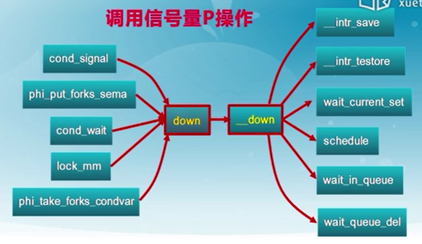
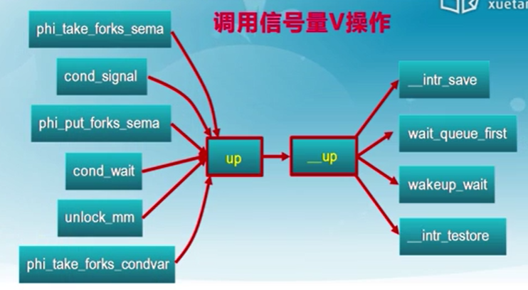
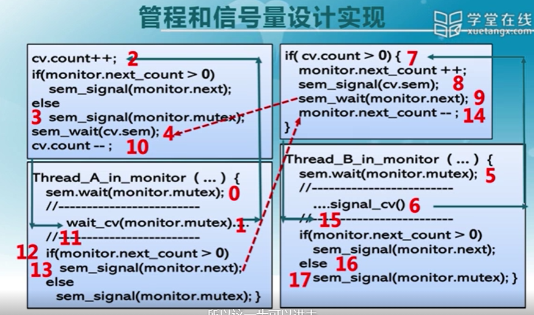
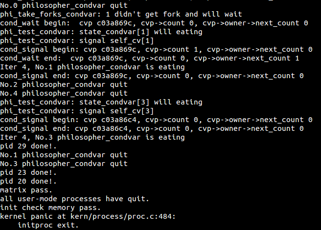
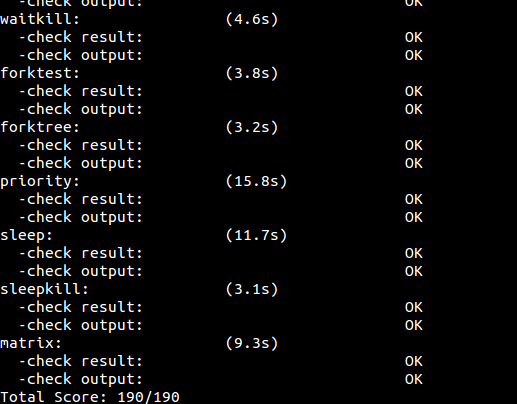

# lab7 实验报告 #

201908010502 林观田

## 实验目的

- 熟悉ucore中的进程同步机制，了解操作系统为进程同步提供的底层支持；
- 在ucore中理解信号量（semaphore）机制的具体实现；
- 理解管程机制，在ucore内核中增加基于管程（monitor）的条件变量（condition variable）的支持；
- 了解经典进程同步问题，并能使用同步机制解决进程同步问题。

## 实验内容

实验六完成了用户进程的调度框架和具体的调度算法，可调度运行多个进程。如果多个进程需要协同操作或访问共享资源，则存在如何同步和有序竞争的问题。本次实验，主要是熟悉ucore的进程同步机制—信号量（semaphore）机制，以及基于信号量的哲学家就餐问题解决方案。然后掌握管程的概念和原理，并参考信号量机制，实现基于管程的条件变量机制和基于条件变量来解决哲学家就餐问题。

在本次实验中，在kern/sync/check_sync.c中提供了一个基于信号量的哲学家就餐问题解法。同时还需完成练习，即实现基于管程（主要是灵活运用条件变量和互斥信号量）的哲学家就餐问题解法。哲学家就餐问题描述如下：有五个哲学家，他们的生活方式是交替地进行思考和进餐。哲学家们公用一张圆桌，周围放有五把椅子，每人坐一把。在圆桌上有五个碗和五根筷子，当一个哲学家思考时，他不与其他人交谈，饥饿时便试图取用其左、右最靠近他的筷子，但他可能一根都拿不到。只有在他拿到两根筷子时，方能进餐，进餐完后，放下筷子又继续思考。

## 练习

### 练习零：填写已有实验

本实验依赖实验1/2/3/4/5/6。请把你做的实验1/2/3/4/5/6的代码填入本实验中代码中有“LAB1”/“LAB2”/“LAB3”/“LAB4”/“LAB5”/“LAB6”的注释相应部分。并确保编译通过。注意：为了能够正确执行lab7的测试应用程序，可能需对已完成的实验1/2/3/4/5/6的代码进行进一步改进。在原来的基础上需要修改的地方只有trap/trap.c中的trap_dispatch函数：

```c
static void trap_dispatch(struct trapframe *tf) {
    ++ticks;
    // sched_class_proc_tick(current);
    run_timer_list();
}
```

------

### 练习一: 理解内核级信号量的实现和基于内核级信号量的哲学家就餐问题（不需要编码）

> 完成练习0后，建议大家比较一下（可用kdiff3等文件比较软件）个人完成的lab6和练习0完成后的刚修改的lab7之间的区别，分析了解lab7采用信号量的执行过程。执行make grade，大部分测试用例应该通过。
>
> 请在实验报告中给出内核级信号量的设计描述，并说其大致执行流流程。
>
> 请在实验报告中给出给用户态进程/线程提供信号量机制的设计方案，并比较说明给内核级提供信号量机制的异同。

> lab6和lab7的区别

分析lab6和lab7的区别可知，lab7主要多了sync文件夹，也就是sem.c , monitor.c , wait.c 等文件，增添了信号量等操作从而使得操作系统支持进程同步。在trap.c中，当发生时钟中断时，需要调用run_time_list函数。在lab6中，互斥通过lock实现，在lab7中则使用信号量实现互斥，此外增加了等待队列、计时器、禁用中断等。

### （1）信号量

信号量的实现伪代码如下：

```c
struct semaphore {
 int count;
 queueType queue;
 };
 void semWait(semaphore s)
 {
 s.count--;
 if (s.count < 0) {//将进程设置为睡眠状态并将它插入到s.queue中
 /* place this process in s.queue */;
 /* block this process */;
 }
 }
 void semSignal(semaphore s)
 {
 s.count++;
 if (s.count <= 0) {//唤醒在S.queue上等待的第一个进程
/* remove a process P from s.queue */;
 /* place process P on ready list */;
}
}
```

基于上诉信号量实现可以认为，当多个（>1）进程可以进行互斥或同步合作时，一个进程会由于无法满足信号量设置的某条件而在某一位置停止，直到它接收到一个特定的信号（表明条件满足了）。为了发信号，需要使用一个称作信号量的特殊变量。为通过信号量s传送信号，信号量的V操作采用进程可执行原语semSignal(s)；为通过信号量s接收信号，信号量的P操作采用进程可执行原语semWait(s)；如果相应的信号仍然没有发送，则进程被阻塞或睡眠，直到发送完为止。

ucore中信号量参照上述原理描述，建立在开关中断机制和wait queue的基础上进行了具体实现。相关的数据结构定义如下，包括了信号量、等待队列等。

```c
// 定义信号量的数据结构
typedef struct {
    int value;                    //信号量的当前值
    wait_queue_t wait_queue;     //信号量对应的等待队列
} semaphore_t;

// 用于等待队列，存放了当前等待的线程的PCB 和 唤醒原因 和 等待队列 和 用于还原结构体的等待队列标志
typedef  struct {
    struct proc_struct *proc;     //等待进程的指针
    uint32_t wakeup_flags;        //进程被放入等待队列的原因标记
    wait_queue_t *wait_queue;     //指向此wait结构所属于的wait_queue
    list_entry_t wait_link;       //用来组织wait_queue中wait节点的连接
} wait_t;
```

其中信号量的计数器value具有如下性质：

- value>0，表示共享资源的空闲数
- vlaue<0，表示该信号量的等待队列里的进程数
- value=0，表示等待队列为空

### （2）使用信号量解决哲学家就餐问题

哲学家就餐问题，即有五个哲学家，他们的生活方式是交替地进行思考和进餐。哲学家们公用一张圆桌，周围放有五把椅子，每人坐一把。在圆桌上有五个碗和五根筷子，当一个哲学家思考时，他不与其他人交谈，饥饿时便试图取用其左、右最靠近他的筷子，但他可能一根都拿不到。只有在他拿到两根筷子时，方能进餐，进餐完后，放下筷子又继续思考。

lab7和之前的lab6的总体步骤基本没有多大的变化，开始的执行流程都与实验六相同，而二者的差异主要是从创建第二个内核线程init_main时开始，我们可以看到，init_main的内容有一定的修改，函数在开始执行调度之前多执行了一个check_sync函数，check_sync函数如下：

```c
void check_sync(void)
{
    int i;
    //check semaphore
    sem_init(&mutex, 1);
    for(i=0;i<N;i++) {            //N是哲学家的数量
        sem_init(&s[i], 0);       //初始化信号量
        int pid = kernel_thread(philosopher_using_semaphore, (void *)i, 0);//线程需要执行的函数名、哲学家编号、0表示共享内存
        //创建哲学家就餐问题的内核线程
        if (pid <= 0) {		//创建失败的报错
            panic("create No.%d philosopher_using_semaphore failed.\n");
        }
        philosopher_proc_sema[i] = find_proc(pid);
        set_proc_name(philosopher_proc_sema[i], "philosopher_sema_proc");
    }
    //check condition variable
    monitor_init(&mt, N);
    for(i=0;i<N;i++){
        state_condvar[i]=THINKING;
        int pid = kernel_thread(philosopher_using_condvar, (void *)i, 0);
        if (pid <= 0) {
            panic("create No.%d philosopher_using_condvar failed.\n");
        }
        philosopher_proc_condvar[i] = find_proc(pid);
        set_proc_name(philosopher_proc_condvar[i], "philosopher_condvar_proc");
    }
}
```

通过观察函数的注释，我们发现，这个 check_sync 函数被分为了两个部分，第一部分使用了信号量来解决哲学家就餐问题，第二部分则是使用管程的方法。因此，练习 1 中我们只需要关注前半段。

通过分析可知，check_sync会通过kernel_thread函数创建的内核线程去执行的目标函数 philosopher_using_semaphore，该函数就是用信号量实现哲学家就餐问题的主体函数，分析如下：

```c
int philosopher_using_semaphore(void * arg)/* i：哲学家号码，从0到N-1 */
{
    int i, iter=0;
    i=(int)arg;	//传入的参数转为 int 型，代表哲学家的编号
    cprintf("I am No.%d philosopher_sema\n",i);
    while(iter++<TIMES)	/* 无限循环 在这里我们取了 TIMES=4*/
    {
        cprintf("Iter %d, No.%d philosopher_sema is thinking\n",iter,i);// 哲学家正在思考
        do_sleep(SLEEP_TIME);//等待
        phi_take_forks_sema(i);// 需要两只叉子，尝试获取左右两把叉子，如果拿不到，则等待
        cprintf("Iter %d, No.%d philosopher_sema is eating\n",iter,i);// 进餐
        do_sleep(SLEEP_TIME);
        phi_put_forks_sema(i);// 把两把叉子同时放回桌子
    }		//哲学家思考一段时间，吃一段时间饭
    cprintf("No.%d philosopher_sema quit\n",i);
    return 0;
}
```

其中传入的参数 *arg，代表在上一个函数中“参数”部分定义的 (void *)i，是哲学家的编号。iter++<TIMES，表示循环 4 次，目的在于模拟多次试验情况。

该函数中，又包含了两个和实现哲学家就餐问题的关键函数phi_take_forks_sema 和 phi_put_forks_sema，对这两个函数的分析如下：

```c
void phi_take_forks_sema(int i)            /* i：哲学家号码从 0 到 N-1 */
{
        down(&mutex);                      /* 进入临界区 */
        state_sema[i]=HUNGRY;              /* 记录下哲学家 i 饥饿的事实 */
        phi_test_sema(i);                  /* 试图得到两只叉子 */
        up(&mutex);                        /* 离开临界区 */
        down(&s[i]);                       /* 如果得不到叉子就阻塞 */
}
 
void phi_put_forks_sema(int i)             /* i：哲学家号码从 0 到 N-1 */
{
        down(&mutex);                      /* 进入临界区 */
        state_sema[i]=THINKING;            /* 哲学家进餐结束 */
        phi_test_sema(LEFT);               /* 看一下左邻居现在是否能进餐 */
        phi_test_sema(RIGHT);              /* 看一下右邻居现在是否能进餐 */
        up(&mutex);                        /* 离开临界区 */
}
```

其中传入参数 i：当前哲学家的编号；mutex、state_sema：分别为每个哲学家记录当前的状态。其中调用的phi_test_sema函数是用于检测相邻的左右边的哲学家是否能进餐，分析如下：

```c
void phi_test_sema(i)
{
    //如果当前哲学家处于饥饿状态，并且左右两边的哲学家不在进餐，则当前哲学家可以进餐 
   if(state_sema[i]==HUNGRY&&state_sema[LEFT]!=EATING&&state_sema[RIGHT]!=EATING)
   {
       state_sema[i]=EATING;
       up(&s[i]);
   }
}
```

另外涉及的up和down操作则是接下来要描述的内核级信号量的设计和实现。

### （3）问题与分析

> 1.请在实验报告中给出内核级信号量的设计描述，并说其大致执行流流程。

实现了内核级信号量机制的函数均定义在 sem.c 中，因此对相关函数分析总结如下：

- `sem_init`：对信号量进行初始化的函数，根据在原理课上学习到的内容，信号量包括了等待队列和一个整型数值变量，该函数只需要将该变量设置为指定的初始值，并且将等待队列初始化即可；

  ```c
  // 对信号量进行初始化的函数
  void sem_init(semaphore_t *sem, int value) 
  {
      //将value设为特定值，初始值与资源数目一致
      sem->value = value;
      //将等待队列初始化
      wait_queue_init(&(sem->wait_queue));
  }
  ```

- `__down`：具体实现信号量的P操作，表示请求一个该信号量对应的资源，同样采用了禁用中断的方式来保证原子性，具体流程为：

  - 首先关掉中断，然后判断当前信号量的value是否大于0；
  - 如果是>0，则表明存在多余的可分配的资源，可以获得信号量，故让value减一，并打开中断返回即可；
  - 如果是<=0，则表明当前进程的资源需求得不到满足，无法获得信号量，故需要将当前的进程加入到等待队列中，并打开中断，然后运行调度器选择另外一个进程执行；
  - 如果在等待队列中被V操作唤醒，则把自身关联的wait从等待队列中删除（此过程需要先关中断，完成后开中断）。

  ```c
  //表示请求一个该信号量对应的资源
  static __noinline uint32_t __down(semaphore_t *sem, uint32_t wait_state) {
      bool intr_flag;
      local_intr_save(intr_flag);//关闭中断
      //查询整型变量来了解是否存在多余的可分配的资源，即判断value的值
      //如果value>0，则有多余可分配资源，取出资源（value减1）
      if (sem->value > 0) {
          sem->value --;
          local_intr_restore(intr_flag);//打开中断
          return 0;
      }
  	//如果value<=0，表明没有可用的资源，当前进程的资源需求得不到满足，
      //因此将其状态改为SLEEPING态，然后将其挂到对应信号量的等待队列中，
      wait_t __wait, *wait = &__wait;
      wait_current_set(&(sem->wait_queue), wait, wait_state);
      local_intr_restore(intr_flag);
      //调用schedule函数来让出CPU
      schedule();
      local_intr_save(intr_flag);
      //在资源得到满足，重新被唤醒之后，将自身从等待队列上删除掉；
      wait_current_del(&(sem->wait_queue), wait);
      local_intr_restore(intr_flag);
  
      if (wait->wakeup_flags != wait_state) {//判断等待原因是否与唤醒原因一致
          return wait->wakeup_flags;
      }
      return 0;
  }
  ```

  

- `__up`：具体实现信号量的V操作，表示释放了一个该信号量对应的资源，如果有等待在了这个信号量上的进程，则将其唤醒执行；其中采用了禁用中断的方式来保证操作的原子性，函数中操作的具体流程为：

  - 首先关中断，如果信号量对应的wait queue中没有进程在等待，直接把信号量的value加一，然后开中断返回；
  - 如果有进程在等待且进程等待的原因是semophore设置的，则调用wakeup_wait函数将waitqueue中等待的第一个wait删除，且把此wait关联的进程唤醒，最后开中断返回。（等待原因是由wait_t数据结构的wakeup_flags来记录）

  ```c
  //表示释放一个该信号量对应的资源，
  static __noinline void __up(semaphore_t *sem, uint32_t wait_state) 
  {
      bool intr_flag;
      local_intr_save(intr_flag);
      {
          wait_t *wait;
          //查询等待队列是否为空，如果是空的话，给整型变量加1；
          if ((wait = wait_queue_first(&(sem->wait_queue))) == NULL) {
              sem->value ++;
          }
          //如果等待队列非空，取出其中的一个进程唤醒；
          else 
          {
              assert(wait->proc->wait_state == wait_state);
              wakeup_wait(&(sem->wait_queue), wait, wait_state, 1);
          }
      }
      local_intr_restore(intr_flag);
  }
  ```

  
  
  - `try_down`：不进入等待队列的 P 操作，即时是获取资源失败也不会堵塞当前进程；

> 请在实验报告中给出给用户态进程/线程提供信号量机制的设计方案，并比较说明给内核级提供信号量机制的异同。

用户态的进程/线程的信号量的数据结构与内核态相同。用户态进程/线程的信号量的相关操作通过系统调用来完成。每当用户进程调用信号量相关函数时，都会进入系统调用，由内核进行处理，之后再返回到用户态继续执行。相比于为内核提供的信号量机制，用户态进程/线程由于要执行中断操作等特权指令，需要通过系统调用进入内核态使用内核信号量机制。
因此想要在用户态完成信号量机制设计，其实只需要在完成内核态信号量机制设计的基础上，增添一些系统调用，包括：

- 申请创建一个信号量的系统调用，可以指定初始值，返回一个信号量描述符；
- 将指定信号量执行 P 操作；
- 将指定信号量执行 V 操作；
- 将指定信号量释放掉；

给内核级线程提供信号量机制和给用户态进程/线程提供信号量机制的异同点在于：

相同：提供信号量机制的代码实现逻辑是相同的；

不同：由于实现原子操作的中断禁用、Test and Set 指令等均需要在内核态下运行，提供给用户态进程的信号量机制是通过系统调用来实现的，而内核级线程只需要直接调用相应的函数就可以了。

------

### 练习二: 完成内核级条件变量和基于内核级条件变量的哲学家就餐问题（需要编码）

> 首先掌握管程机制，然后基于信号量实现完成条件变量实现，然后用管程机制实现哲学家就餐问题的解决方案（基于条件变量）。
>
> 执行：make grade 。如果所显示的应用程序检测都输出ok，则基本正确。如果只是某程序过不去，比如matrix.c，则可执行 make run-matrix 命令来单独调试它。大致执行结果可看附录。（使用的是**qemu-1.0.1**）。
>
> 请在实验报告中给出内核级条件变量的设计描述，并说其大致执行流流程。
>
> 请在实验报告中给出给用户态进程/线程提供条件变量机制的设计方案，并比较说明给内核级提供条件变量机制的异同。

### （1）理解管程机制

引入了管程是**为了将对共享资源的所有访问及其所需要的同步操作集中并封装起来**。Hansan为管程所下的定义：“一个管程定义了一个数据结构和能为并发进程所执行（在该数据结构上）的一组操作，这组操作能同步进程和改变管程中的数据”。有上述定义可知，管程由四部分组成：

- 管程内部的共享变量；
- 管程内部的条件变量；
- 管程内部并发执行的进程；
- 对局部于管程内部的共享数据设置初始值的语句。

**局限在管程中的数据结构，只能被局限在管程的操作过程所访问，任何管程之外的操作过程都不能访问它；另一方面，局限在管程中的操作过程也主要访问管程内的数据结构。**由此可见，管程相当于一个隔离区，它把共享变量和对它进行操作的若干个过程围了起来，**所有进程要访问临界资源时，都必须经过管程才能进入，而管程每次只允许一个进程进入管程，从而需要确保进程之间互斥。**

但在管程中仅仅有互斥操作是不够用的。进程可能需要等待某个条件C为真才能继续执行。

### （2）条件变量（Condition Variables）

一个条件变量CV可理解为一个进程的等待队列，队列中的进程正等待某个条件C变为真。每个条件变量关联着一个断言Pc。当一个进程等待一个条件变量，该进程不算作占用了该管程，因而其它进程可以进入该管程执行，改变管程的状态，通知条件变量CV其关联的断言Pc在当前状态下为真。因此对条件变量CV有两种主要操作：

- wait_cv： 被一个进程调用，以等待断言Pc被满足后该进程可恢复执行，进程挂在该条件变量上等待时，不被认为是占用了管程。
- signal_cv：被一个进程调用，以指出断言Pc现在为真，从而可以唤醒等待断言Pc被满足的进程继续执行。


### （3）管程的相关数据结构及函数

ucore中的管程机制是基于信号量和条件变量来实现的。ucore中的管程的数据结构monitor_t定义如下：

```c
typedef struct monitor{
    // 二值信号量，用来互斥访问管程，只允许一个进程进入管程，初始化为 1
    semaphore_t mutex; // 二值信号量 用来互斥访问管程
    //用于进程同步操作的信号量
    semaphore_t next;// 用于条件同步（进程同步操作的信号量），发出 signal 操作的进程等条件为真之前进入睡眠
    // 睡眠的进程数量
    int next_count;// 记录睡在 signal 操作的进程数
    // 条件变量cv
    condvar_t *cv;// 条件变量
} monitor_t;
```

成员变量：

- mutex ：是一个二值信号量，是实现每次只允许一个进程进入管程的关键元素，确保了互斥访问性质。
- 条件变量 cv ：通过执行 wait_cv，会使得等待某个条件 C 为真的进程能够离开管程并睡眠，且让其他进程进入管程继续执行；而进入管程的某进程设置条件 C 为真并执行 signal_cv 时，能够让等待某个条件 C 为真的睡眠进程被唤醒，从而继续进入管程中执行。
- 信号量 next 和整形变量 next_count： 是配合进程对条件变量 cv 的操作而设置的，这是由于发出signal_cv 的进程 A 会唤醒睡眠进程 B，进程 B 执行会导致进程 A 睡眠，直到进程 B 离开管程，进程 A 才能继续执行，这个同步过程是通过信号量 next 完成的；
- next_count ：表示了由于发出 singal_cv 而睡眠的进程个数。

管程中的条件变量的数据结构condvar_t定义如下：

```c
typedef struct condvar{
    // 用于条件同步 用于发出 wait 操作的进程等待条件为真之前进入睡眠
    semaphore_t sem;     	//用于发出 wait_cv 操作的等待某个条件 C 为真的进程睡眠
    // 记录睡在 wait 操作的进程数(等待条件变量成真)
    int count;            //在这个条件变量上的睡眠进程的个数
    // 所属管程
    monitor_t * owner;		//此条件变量的宿主管程
} condvar_t;
```

条件变量的定义中也包含了一系列的成员变量，信号量sem用于让发出wait_cv操作的等待某个条件C为真的进程睡眠，而让发出signal_cv操作的进程通过这个sem来唤醒睡眠的进程。count表示等在这个条件变量上的睡眠进程的个数。owner表示此条件变量的宿主是哪个管程。

### （4）分析与实现

条件变量机制的实现主要是`cond_signal`, `cond_wait`两个函数中，分别表示提醒等待在这个条件变量上的进程恢复执行，以及等待在这个条件变量上，直到有其他进行将其唤醒为止。根据两个函数的原理描述，分析与实现如下：

- `cond_signal`: 将指定条件变量上等待队列中的一个线程进行唤醒，并且将控制权转交给这个进程。该操作实现了对共享变量访问的互斥性；执行流程如下：

  执行cond_signal函数时，首先判断当前进程的cv.count，如果不大于0，则表示当前没有执行cond_wait而进入休眠状态的进程，函数直接返回。如果cv.count大于0，这表示当前有执行cond_wait而进入休眠状态的进程，因此需要唤醒在cv.sem上等待出入休眠状态的进程。由于只允许一个进程在管程中执行，所以一旦当前进程唤醒了其他进程，自身就要进入休眠状态，即增加monitor.next_count，让当前进程在信号量monitor.next上进入休眠状态，直到被唤醒时，减少monitor.next_count。

  ```c
  void cond_signal (condvar_t *cvp) {
     //LAB7 EXERCISE1: YOUR CODE
     cprintf("cond_signal begin: cvp %x, cvp->count %d, cvp->owner->next_count %d\n", cvp, cvp->count, cvp->owner->next_count);  
  	//判断当前的条件变量的等待队列上是否有正在等待的进程，如果没有则不需要进行任何操作；
  	//如果有正在等待的进程
       if(cvp->count>0)
       {
          //将其中的一个唤醒
          up(&(cvp->sem));
          //所属管程的next计数加1，表示当前进程会被等待者堵塞
          cvp->owner->next_count ++;
          //阻塞，等待条件同步
          down(&(cvp->owner->next));
          //当前进程被唤醒，恢复next上的等待进程计数
          cvp->owner->next_count --;
        }
     cprintf("cond_signal end: cvp %x, cvp->count %d, cvp->owner->next_count %d\n", cvp, cvp->count, cvp->owner->next_count);
  }
  ```

- `cond_wait`：该函数的功能为将当前进程等待在指定信号量上，其操作过程为将等待队列的计数加1，然后释放管程的锁或者唤醒一个next上的进程来释放锁，然后把自己等在条件变量的等待队列上，直到有signal信号将其唤醒，正常退出函数；实现思路如下：

  1. 修改等待在条件变量的等待队列上的进程计数
  2. 释放锁
  3. 将自己等待在条件变量上
  4. 被唤醒，修正等待队列上的进程计数

  ```c
  // 管程wait操作
  /*
  先将 因为条件不成立而睡眠的进程计数加1
  分支1. 当 管程的 next_count 大于 0 说明 有进程睡在了 signal 操作上 需要将其唤醒
  分支2. 当 管程的 next_count 小于 0 说明 当前没有进程睡在 signal 操作数 只需要释放互斥体
  然后 再将 自身阻塞 等待 条件变量的条件为真 被唤醒后 将条件不成立而睡眠的进程计数减1 因为现在成立了
  */
  void cond_wait (condvar_t *cvp) {
      //LAB7 EXERCISE1: YOUR CODE
      cprintf("cond_wait begin:  cvp %x, cvp->count %d, cvp->owner->next_count %d\n", cvp, cvp->count, cvp->owner->next_count);
      cvp->count++;                  //条件变量中睡眠的进程数量加 1
      if(cvp->owner->next_count > 0)
         up(&(cvp->owner->next));	//如果当前有进程正在等待，且睡在宿主管程的信号量上，此时需要唤醒，让该调用了 wait 的进程睡眠
      else
         up(&(cvp->owner->mutex));	//如果没有进程睡眠，那么当前进程无法进入管程的原因就是互斥条件的限制。因此唤醒 mutex 互斥锁，代表现在互斥锁被占用，此时，再让进程睡在宿主管程的信号量上，如果睡醒了，count--
      down(&(cvp->sem));		//因为条件不满足，所以主动调用 wait 的进程，会睡在条件变量 cvp 的信号量上，是条件不满足的问题；而因为调用 signal 唤醒其他进程而导致自身互斥睡眠，会睡在宿主管程 cvp->owner 的信号量上，是同步的问题。
   
      cvp->count --;
      cprintf("cond_wait end:  cvp %x, cvp->count %d, cvp->owner->next_count %d\n", cvp, cvp->count, cvp->owner->next_count);
  }
  ```

示例分析：



### （5）哲学家就餐问题

实现哲学家问题主要在`check_sync.c`中，这里创建了5个线程表示5个哲学家，哲学家尝试4次思考->拿叉子->吃饭->放下叉子。

具体分析实现:主要是`phi_take_forks_condvar`函数以及`phi_put_forks_condvar`函数

- `phi_take_forks_condvar`函数表示指定的哲学家尝试获得自己所需要进餐的两把叉子，如果不能获得则阻塞，具体实现流程为：

  - 给管程上锁，将哲学家的状态修改为HUNGER；
  - 判断相邻的哲学家是否正在进餐；
  - 如果能够进餐，将自己的状态修改成EATING，然后释放锁，离开管程即可；
  - 如果不能进餐，等待在自己对应的条件变量上，等待相邻的哲学家释放资源的时候将自己唤醒。

  ```c
  void phi_take_forks_condvar(int i) {
      //通过P操作进入临界区
       down(&(mtp->mutex));  
        //记录下哲学家i是否饥饿，即处于等待状态拿叉子
        state_condvar[i]=HUNGRY; 
        phi_test_condvar(i);//检测左右筷子是否空闲，如果空闲则可以设置自身为EATING状态
        while (state_condvar[i] != EATING) 
        {
            cprintf("phi_take_forks_condvar: %d didn't get fork and will wait\n",i);
            cond_wait(&mtp->cv[i]);//如果得不到叉子就睡眠
        }
        //如果存在睡眠的进程则那么将之唤醒
        if(mtp->next_count>0)
           up(&(mtp->next));
        else
           up(&(mtp->mutex));
  }
  ```

- `phi_put_forks_condvar`函数表示释放当前哲学家占用的叉子，并且唤醒相邻的因为得不到资源而进入等待的哲学家：

  - 首先获取管程的锁，将自己的状态修改成THINKING；
  - 检查相邻的哲学家是否在自己释放了叉子的占用之后满足了进餐的条件，如果满足，将其从等待中唤醒；
  - 释放锁，离开管程。

  ```c
  void phi_put_forks_condvar(int i) {
     	 //通过P操作进入临界区
       down(&(mtp->mutex));
      //记录进餐结束的状态
        state_condvar[i]=THINKING;
      //看一下左边哲学家现在是否能进餐
        phi_test_condvar(LEFT);
      //看一下右边哲学家现在是否能进餐
        phi_test_condvar(RIGHT);
        //如果有哲学家睡眠就予以唤醒
       if(mtp->next_count>0)
          up(&(mtp->next));
       else
          up(&(mtp->mutex));
  }
  ```

- 由于每个哲学家只可能占有所有需要的资源或者完全不占用资源，因此不会出现部分占有资源的现象，从而避免了死锁的产生；最终必定所有哲学将都能成功就餐。

```c
int philosopher_using_condvar(void * arg) { /* arg is the No. of philosopher 0~N-1*/
  
    int i, iter=0;
    i=(int)arg;
    cprintf("I am No.%d philosopher_condvar\n",i);
    while(iter++<TIMES)
    { /* iterate*/
        cprintf("Iter %d, No.%d philosopher_condvar is thinking\n",iter,i); /* thinking*/
        do_sleep(SLEEP_TIME);
        phi_take_forks_condvar(i); 
        /* need two forks, maybe blocked */
        cprintf("Iter %d, No.%d philosopher_condvar is eating\n",iter,i); /* eating*/
        do_sleep(SLEEP_TIME);
        phi_put_forks_condvar(i); 
        /* return two forks back*/
    }
    cprintf("No.%d philosopher_condvar quit\n",i);
    return 0;    
}
void phi_test_condvar (i) { 
    if(state_condvar[i]==HUNGRY&&state_condvar[LEFT]!=EATING
            &&state_condvar[RIGHT]!=EATING) {
        cprintf("phi_test_condvar: state_condvar[%d] will eating\n",i);
        state_condvar[i] = EATING ;
        cprintf("phi_test_condvar: signal self_cv[%d] \n",i);
        cond_signal(&mtp->cv[i]) ;
    }
}
```

------

### 运行结果

执行`make run-matrix`



执行`make grade`



------

### 列出本实验中重要的知识点，以及与对应的OS原理中的知识点，并简要说明你对二者的含义，关系，差异等方面的理解。

对应的知识点

1.信号量

2.条件变量

3.进程间同步互斥访问

4.临界区

5.管程