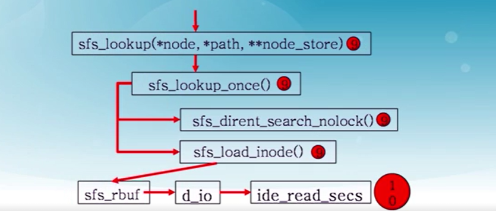

# lab8 实验报告 #

201908010502 林观田

## 实验目的

- 了解基本的文件系统系统调用的实现方法；
- 了解一个基于索引节点组织方式的Simple FS文件系统的设计与实现；
- 了解文件系统抽象层-VFS的设计与实现；

## 实验内容

实验七完成了在内核中的同步互斥实验。本次实验涉及的是文件系统，通过分析了解ucore文件系统的总体架构设计，完善读写文件操作，从新实现基于文件系统的执行程序机制（即改写do_execve），从而可以完成执行存储在磁盘上的文件和实现文件读写等功能。

## 预备知识

### 一、文件系统

UNIX提出了四个文件系统抽象概念：文件(file)、目录项(dentry)、索引节点(inode)和安装点(mount point)。

- 文件：UNIX文件中的内容可理解为是一有序字节buffer，文件都有一个方便应用程序识别的文件名称（也称文件路径名）。典型的文件操作有读、写、创建和删除等。
- 目录项：目录项不是目录，而是目录的组成部分。在UNIX中目录被看作一种特定的文件，而目录项是文件路径中的一部分。如一个文件路径名是“/test/testfile”，则包含的目录项为：根目录“/”，目录“test”和文件“testfile”，这三个都是目录项。一般而言，目录项包含目录项的名字（文件名或目录名）和目录项的索引节点（见下面的描述）位置。
- 索引节点：UNIX将文件的相关元数据信息（如访问控制权限、大小、拥有者、创建时间、数据内容等等信息）存储在一个单独的数据结构中，该结构被称为索引节点。
- 安装点：在UNIX中，文件系统被安装在一个特定的文件路径位置，这个位置就是安装点。所有的已安装文件系统都作为根文件系统树中的叶子出现在系统中。

文件元数据信息存储在磁盘块中的索引节点上。当文件被载如内存时，内核需要使用磁盘块中的索引点来构造内存中的索引节点。

### 二、ucore中的文件系统

ucore模仿了UNIX的文件系统设计，ucore的文件系统架构主要由四部分组成：

- **通用文件系统访问接口层**：该层提供了一个从用户空间到文件系统的标准访问接口。这一层访问接口让应用程序能够通过一个简单的接口获得ucore内核的文件系统服务。
- **文件系统抽象层**：向上提供一个一致的接口给内核其他部分（文件系统相关的系统调用实现模块和其他内核功能模块）访问。向下提供一个同样的抽象函数指针列表和数据结构屏蔽不同文件系统的实现细节。
- **Simple FS文件系统层**：一个基于索引方式的简单文件系统实例。向上通过各种具体函数实现以对应文件系统抽象层提出的抽象函数。向下访问外设接口。
- **外设接口层**：向上提供device访问接口屏蔽不同硬件细节。向下实现访问各种具体设备驱动的接口，比如disk设备接口/串口设备接口/键盘设备接口等。

**应用程序访问文件的流程：**

应用程序操作文件（打开/创建/删除/读写），首先需要通过文件系统的通用文件系统访问接口层给用户空间提供的访问接口进入文件系统内部，接着由文件系统抽象层把访问请求转发给某一具体文件系统（比如SFS文件系统），具体文件系统（Simple FS文件系统层）把应用程序的访问请求转化为对磁盘上的block的处理请求，并通过外设接口层交给磁盘驱动例程来完成具体的磁盘操作。

**ucore文件系统总体结构**

从ucore操作系统不同的角度来看，ucore中的文件系统架构包含四类主要的数据结构, 它们分别是：

- 超级块（SuperBlock），它主要从文件系统的全局角度描述特定文件系统的全局信息。它的作用范围是整个OS空间。
- 索引节点（inode）：它主要从文件系统的单个文件的角度它描述了文件的各种属性和数据所在位置。它的作用范围是整个OS空间。
- 目录项（dentry）：它主要从文件系统的文件路径的角度描述了文件路径中的特定目录。它的作用范围是整个OS空间。
- 文件（file），它主要从进程的角度描述了一个进程在访问文件时需要了解的文件标识，文件读写的位置，文件引用情况等信息。它的作用范围是某一具体进程。

### 三、通用文件系统访问接口

在文件操作方面，最基本的相关函数是open、close、read、write。在读写一个文件之前，首先要用open系统调用将其打开。open的第一个参数指定文件的路径名，可使用绝对路径名；第二个参数指定打开的方式，可设置为O_RDONLY、O_WRONLY、O_RDWR，分别表示只读、只写、可读可写。在打开一个文件后，就可以使用它返回的文件描述符fd对文件进行相关操作。在使用完一个文件后，还要用close系统调用把它关闭，其参数就是文件描述符fd。

读写文件内容的系统调用是read和write。read系统调用有三个参数：一个指定所操作的文件描述符，一个指定读取数据的存放地址，最后一个指定读多少个字节。在C程序中调用该系统调用的方法如下：

```c
count = read(filehandle, buffer, nbytes);
```

该系统调用会把实际读到的字节数返回给count变量。

对于目录而言，最常用的操作是跳转到某个目录，对应的用户库函数是chdir。然后就需要读目录的内容了，即列出目录中的文件或目录名，需要通过opendir函数打开目录，通过readdir来获取目录中的文件信息，读完后还需通过closedir函数来关闭目录。由于在ucore中把目录看成是一个特殊的文件，所以opendir和closedir实际上就是调用与文件相关的open和close函数。只有readdir需要调用获取目录内容的特殊系统调用sys_getdirentry。

与文件相关的open、close、read、write用户库函数对应的是sys_open、sys_close、sys_read、sys_write四个系统调用接口。与目录相关的readdir用户库函数对应的是sys_getdirentry系统调用。这些系统调用函数接口将通过syscall函数来获得ucore的内核服务。当到了ucore内核后，在调用文件系统抽象层的file接口和dir接口。

### 四、SFS文件系统

#### （1）ucore支持的文件

- 常规文件：文件中包括的内容信息是由应用程序输入。SFS文件系统在普通文件上不强加任何内部结构，把其文件内容信息看作为字节。
- 目录：包含一系列的entry，每个entry包含文件名和指向与之相关联的索引节点（index node）的指针。目录是按层次结构组织的。
- 链接文件：实际上一个链接文件是一个已经存在的文件的另一个可选择的文件名。
- 设备文件：不包含数据，但是提供了一个映射物理设备（如串口、键盘等）到一个文件名的机制。可通过设备文件访问外围设备。
- 管道：管道是进程间通讯的一个基础设施。管道缓存了其输入端所接受的数据，以便在管道输出端读的进程能一个先进先出的方式来接受数据。

在lab8中关注的主要是SFS支持的常规文件、目录和链接中的 hardlink 的设计实现。

SFS通过索引节点来管理目录和常规文件，索引节点包含操作系统所需要的关于某个文件的关键信息，比如文件的属性、访问许可权以及其它控制信息都保存在索引节点中。

#### （2）SFS文件系统的布局和相关数据结构

**1）布局**


第0块——超级块：

```c
struct sfs_super {
    uint32_t magic;   /* SFS_MAGIC，内核通过它来检查磁盘镜像是否是合法的 SFS img*/
    uint32_t blocks;  /* 记录了SFS中所有block的数量，即 img 的大小 */
    uint32_t unused_blocks; /* 记录了SFS中还没有被使用的block的数量 */
    char info[SFS_MAX_INFO_LEN + 1];                /* infomation for sfs  */
};
```

第1个块放了一个root-dir的inode，用来记录根目录的相关信息。通过这个root-dir的inode信息就可以定位并查找到根目录下的所有文件信息。

从第2个块开始，根据SFS中所有块的数量，用1个bit来表示一个块的占用和未被占用的情况。

最后在剩余的磁盘空间中，存放了所有其他目录和文件的inode信息和内容数据信息。

**2）磁盘索引节点：sfs_disk_inode**

```c
struct sfs_disk_inode {
    uint32_t size;  //如果inode表示常规文件，则size是文件大小
    uint16_t type;  //inode的文件类型
    uint16_t nlinks;   //此inode的硬链接数
    uint32_t blocks;   //此inode的数据块数的个数
    uint32_t direct[SFS_NDIRECT];   //此inode的直接数据块索引值（有SFS_NDIRECT个）
    uint32_t indirect;  //此inode的一级间接数据块索引值
};
```

默认的，ucore 里 SFS_NDIRECT 是 12，即直接索引的数据页大小为 12 * 4k = 48k；当使用一级间接数据块索引时，ucore 支持最大的文件大小为 12 * 4k + 1024 * 4k = 48k + 4m。

**3）sfs_disk_entry**

对于普通文件，索引值指向的 block 中保存的是文件中的数据。而对于目录，索引值指向的数据保存的是目录下所有的文件名以及对应的索引节点所在的索引块（磁盘块）所形成的数组。数据结构如下：

```c
struct sfs_disk_entry {
    uint32_t ino;                                   //索引节点所占数据块索引值
    char name[SFS_MAX_FNAME_LEN + 1];               //文件名
};
```

**4）内存中的索引节点：sfs_inode**

```c
struct sfs_inode {
    struct sfs_disk_inode *din;                     /* on-disk inode */
    uint32_t ino;                                   /* inode number */
    uint32_t flags;                                 /* inode flags */
    bool dirty;                                     /* true if inode modified */
    int reclaim_count;                              /* kill inode if it hits zero */
    semaphore_t sem;                                /* semaphore for din */
    list_entry_t inode_link;                        /* entry for linked-list in sfs_fs */
    list_entry_t hash_link;                         /* entry for hash linked-list in sfs_fs */
};
```

可以看到SFS中的内存inode包含了SFS的硬盘inode信息，而且还增加了其他一些信息，这属于是便于进行是判断否改写、互斥操作、回收和快速地定位等作用。需要注意，一个内存inode是在打开一个文件后才创建的，如果关机则相关信息都会消失。而硬盘inode的内容是保存在硬盘中的，只是在进程需要时才被读入到内存中，用于访问文件或目录的具体内容数据。

为了方便实现上面提到的多级数据的访问以及目录中 entry 的操作，对 inode SFS实现了一些辅助的函数：

1. sfs_bmap_load_nolock：将对应 sfs_inode 的第 index 个索引指向的 block 的索引值取出存到相应的指针指向的单元（ino_store）。
2. sfs_bmap_truncate_nolock：将多级数据索引表的最后一个 entry 释放掉。
3. sfs_dirent_read_nolock：将目录的第 slot 个 entry 读取到指定的内存空间。
4. sfs_dirent_write_nolock：用指定的 entry 来替换某个目录下的第 slot 个entry。
5. sfs_dirent_search_nolock：是常用的查找函数。它在目录下查找 name，并且返回相应的搜索结果（文件或文件夹）的 inode 的编号（也是磁盘编号），和相应的 entry 在该目录的 index 编号以及目录下的数据页是否有空闲的 entry。

#### （3）文件系统抽象层

文件系统抽象层是把不同文件系统的对外共性接口提取出来，形成一个函数指针数组，这样，通用文件系统访问接口层只需访问文件系统抽象层，而不需关心具体文件系统的实现细节和接口。

**1）file & dir接口**

file&dir接口层定义了进程在内核中直接访问的文件相关信息，这定义在file数据结构中，具体描述如下：

```c
struct file {
    enum {
        FD_NONE, FD_INIT, FD_OPENED, FD_CLOSED,
    } status;                          //访问文件的执行状态
    bool readable;                     //文件是否可读
    bool writable;                     //文件是否可写
    int fd;                           //文件在filemap中的索引值
    off_t pos;                        //访问文件的当前位置
    struct inode *node;               //该文件对应的内存inode指针
    atomic_t open_count;              //打开此文件的次数
};
```

而在kern/process/proc.h中的proc_struct结构中描述了进程访问文件的数据接口fs_struct，其数据结构定义如下：

```c
struct fs_struct {
    struct inode *pwd;                //进程当前执行目录的内存inode指针
    struct file *filemap;             //进程打开文件的数组
    atomic_t fs_count;                //访问此文件的线程个数
    semaphore_t fs_sem;                //确保对进程控制块中fs_struct的互斥访问
};
```

当创建一个进程后，该进程的fs_struct将会被初始化或复制父进程的fs_struct。当用户进程打开一个文件时，将从filemap数组中取得一个空闲file项，然后会把此file的成员变量node指针指向一个代表此文件的inode的起始地址。

**2）inode 接口**

index node是位于内存的索引节点，它是VFS结构中的重要数据结构，因为它实际负责把不同文件系统的特定索引节点信息（甚至不能算是一个索引节点）统一封装起来，避免了进程直接访问具体文件系统。其定义如下：

```c
struct inode {
    union {                                 //包含不同文件系统特定inode信息的union成员变量
        struct device __device_info;          //设备文件系统内存inode信息
        struct sfs_inode __sfs_inode_info;    //SFS文件系统内存inode信息
    } in_info;   
    enum {
        inode_type_device_info = 0x1234,
        inode_type_sfs_inode_info,
    } in_type;                          //此inode所属文件系统类型
    atomic_t ref_count;                 //此inode的引用计数
    atomic_t open_count;                //打开此inode对应文件的个数
    struct fs *in_fs;                   //抽象的文件系统，包含访问文件系统的函数指针
    const struct inode_ops *in_ops;     //抽象的inode操作，包含访问inode的函数指针     
};
```

在inode中，有一成员变量为in_ops，这是对此inode的操作函数指针列表，其数据结构定义如下：

```c
struct inode_ops {
    unsigned long vop_magic;
    int (*vop_open)(struct inode *node, uint32_t open_flags);
    int (*vop_close)(struct inode *node);
    int (*vop_read)(struct inode *node, struct iobuf *iob);
    int (*vop_write)(struct inode *node, struct iobuf *iob);
    int (*vop_getdirentry)(struct inode *node, struct iobuf *iob);
    int (*vop_create)(struct inode *node, const char *name, bool excl, struct inode **node_store);
int (*vop_lookup)(struct inode *node, char *path, struct inode **node_store);
……
 };
```

#### （4）设备层文件IO层

为了统一地访问设备，我们可以把一个设备看成一个文件，通过访问文件的接口来访问设备。目前实现了stdin设备文件文件、stdout设备文件、disk0设备。stdin设备就是键盘，stdout设备就是CONSOLE（串口、并口和文本显示器），而disk0设备是承载SFS文件系统的磁盘设备。

为了表示一个设备，需要有对应的数据结构，ucore为此定义了struct device，其描述如下：

```c
struct device {
    size_t d_blocks;    //设备占用的数据块个数            
    size_t d_blocksize;  //数据块的大小
    int (*d_open)(struct device *dev, uint32_t open_flags);  //打开设备的函数指针
    int (*d_close)(struct device *dev); //关闭设备的函数指针
    int (*d_io)(struct device *dev, struct iobuf *iob, bool write); //读写设备的函数指针
    int (*d_ioctl)(struct device *dev, int op, void *data); //用ioctl方式控制设备的函数指针
};
```

该数据结构能够支持对块设备（比如磁盘）、字符设备（比如键盘、串口）的表示，完成对设备的基本操作。

`vfs_dev_t`结构体将device和inode联通起来：

```c
// device info entry in vdev_list 
typedef struct {
    const char *devname;
    struct inode *devnode;
    struct fs *fs;
    bool mountable;
    list_entry_t vdev_link;
} vfs_dev_t;
```

利用该数据结构，就可以让文件系统通过一个链接`vfs_dev_t`结构的双向链表找到device对应的inode数据结构。

#### （5）文件系统的初始化过程

总控函数`kern_init()` 增添了`fs_init()`对文件管理系统的初始化。

```c
//called when init_main proc start
void fs_init(void) {
    vfs_init();
    dev_init();
    sfs_init();
}
```

可知调用`fs_init()`将调用`vfs_init()`、`dev_init()`、`sfs_init()`进行初始化。

`vfs_init()`函数：

```c
// vfs_init -  vfs initialize
void vfs_init(void) {
    sem_init(&bootfs_sem, 1);
    vfs_devlist_init();
}
```

调用了两个init函数，分别为初始化信号量以及创建并初始化用于管理设备的链表。

`dev_init()`函数：

```c
/* dev_init - Initialization functions for builtin vfs-level devices. */
void dev_init(void) {
   // init_device(null);
    init_device(stdin);
    init_device(stdout);
    init_device(disk0);
}
```

`dev_init()`函数完成对输入设备、输出设备、disk0的初始化。

`sys_init()`完成对信号量的初始化。

#### （6）ucore系统中用户读写文件流程

在ucore文件系统中，是这样处理读写硬盘操作的：

（1）首先是应用程序发出请求，请求硬盘中写数据或读数据，应用程序通过FS syscall接口执行系统调用，获得ucore操作系统关于文件的一些服务；

（2）之后，一旦操作系统内系统调用得到了请求，就会到达VFS层面（虚拟文件系统），包含很多部分比如文件接口、目录接口等，是一个抽象层面，它屏蔽底层具体的文件系统；

（3）VFS如果得到了处理，那么VFS会将这个inode传递给SFS，注意，此时，VFS中的inode还是一个抽象的结构，在SFS中会转化为一个具体的inode；

（4）通过该inode经过IO接口对于磁盘进行读写。

（写磁盘操作流程如下图）


## 练习

### 练习零：填写已有实验

本实验依赖实验1/2/3/4/5/6/7。请把你做的实验1/2/3/4/5/6/7的代码填入本实验中代码中有“LAB1”/“LAB2”/“LAB3”/“LAB4”/“LAB5”/“LAB6” /“LAB7”的注释相应部分。并确保编译通过。注意：为了能够正确执行lab8的测试应用程序，可能需对已完成的实验1/2/3/4/5/6/7的代码进行进一步改进。

------

### 练习一: 完成读文件操作的实现（需要编码）

> 首先了解打开文件的处理流程，然后参考本实验后续的文件读写操作的过程分析，编写在sfs_inode.c中sfs_io_nolock读文件中数据的实现代码。
>
> 请在实验报告中给出设计实现”UNIX的PIPE机制“的概要设方案，鼓励给出详细设计方案


#### （1）用户打开文件的过程


首先假定用户进程需要打开的文件已经存在在硬盘上。以 user/sfs_filetest1.c 为例，首先用户进程会调用在 main 函数中的如下语句：

```
int fd1 = safe_open("/test/testfile", O_RDWR | O_TRUNC);
```

如果 ucore 能够正常查找到这个文件，就会返回一个代表文件的文件描述符 fd1，这样在接下来的读写文件过程中，就直接用这样 fd1 来代表就可以了。

**通用文件访问接口层的处理流程**

进入通用文件访问接口层的处理流程后，进一步调用用户态函数： open->sys_open->syscall，进入到内核态。到了内核态后，通过中断处理例程，会调用到sys_open内核函数，并进一步调用sysfile_open内核函数。到了这里，需要把位于用户空间的字串"/test/testfile"拷贝到内核空间中的字符串path中，并进入到文件系统抽象层的处理流程完成进一步的打开文件操作中。


**文件系统抽象层的处理流程**

- 在文件系统抽象层，将分配一个空闲的file数据结构变量file在文件系统抽象层的处理中（当前进程的打开文件数组current->fs_struct->filemap[]中的一个空闲元素）。这个元素的索引值就是最终要返回到用户进程并赋值给变量fd1。

- 进一步调用vfs_lookup函数来找到path指出的文件所对应的基于inode数据结构的VFS索引节点node。

  vfs_lookup函数是一个针对目录的操作函数，它会调用vop_lookup函数来找到SFS文件系统中的“/test”目录下的“testfile”文件。vfs_lookup函数首先调用get_device函数，并进一步调用vfs_get_bootfs函数来找到根目录“/”对应的inode。这个inode就是位于vfs.c中的inode变量bootfs_node。

- 把file和node建立联系。完成上一步后，将返回到file_open函数中，通过执行语句file->node=node;就把当前进程的current->fs_struct->filemap[fd]（即file所指变量）的成员变量node指针指向了代表文件的索引节点node。这时返回fd。经过重重回退，通过系统调用返回，用户态的 syscall->sys_open->open->safe_open 等用户函数的层层函数返回，最终把把fd赋值给fd1。自此完成了打开文件操作。



在此过程中，包含了调用SFS文件系统提供的函数找位于SFS文件系统上的“/test/testfile”所对应的sfs磁盘inode。其中最主要的是在sfs_inode.c中的sfs_node_dirops变量定义了“.vop_lookup = sfs_lookup”，这是实现vfs_lookup函数的关键。

sfs_lookup有三个参数：node，path，node_store。其中node是根目录“/”所对应的inode节点；path是文件“testfile”的绝对路径“/test/testfile”，而node_store是经过查找获得的“testfile”所对应的inode节点。

sfs_lookup_once将调用sfs_dirent_search_nolock函数来查找与路径名匹配的目录项，如果找到目录项，则根据目录项中记录的inode所处的数据块索引值找到路径名对应的SFS磁盘inode，并读入SFS磁盘inode对的内容，创建SFS内存inode。

```c
static int sfs_lookup(struct inode *node, char *path, struct inode **node_store) {
    struct sfs_fs *sfs = fsop_info(vop_fs(node), sfs);
    assert(*path != '\0' && *path != '/');    
    //以“/”为分割符，从左至右分解path获得各子目录和最终文件对应的inode节点。
    vop_ref_inc(node);
    struct sfs_inode *sin = vop_info(node, sfs_inode);
    if (sin->din->type != SFS_TYPE_DIR) {//检查文件类型
            vop_ref_dec(node);
            return -E_NOTDIR;
    }
    struct inode *subnode;
    //循环进一步调用sfs_lookup_once查找以“test”子目录下的文件“testfile1”所对应的inode节点。
    int ret = sfs_lookup_once(sfs, sin, path, &subnode, NULL);  
    vop_ref_dec(node);
    if (ret != 0) {  
            return ret;
    }
    *node_store = subnode;  
    //当无法分解path后，就意味着找到了需要对应的inode节点，就可顺利返回了。
    return 0;
}
```

#### （2）分析与实现

sfs_io_nolock函数主要用来将磁盘中的一段数据读入到内存中或者将内存中的一段数据写入磁盘。

该函数会进行一系列的边缘检查，检查访问是否越界、是否合法。之后将具体的读/写操作使用函数指针统一起来，统一成针对整块的操作。然后完成不落在整块数据块上的读/写操作，以及落在整块数据块上的读写。

实现思路如下：

- 如果偏移量与第一个块不对齐，则从偏移量到第一个块的末尾对某些内容进行Rd/Wr
- Rd/Wr对齐块
- 如果结束位置与最后一个块不对齐，则从开始到最后一个块的（结束位置%`SFS_BLKSIZE`）Rd/Wr一些内容。

结合练习所给的注释实现如下：

```c
static int
sfs_io_nolock(struct sfs_fs *sfs, struct sfs_inode *sin, void *buf, off_t offset, size_t *alenp, bool write) 
{	//创建一个磁盘索引节点指向要访问文件的内存索引节点
    struct sfs_disk_inode *din = sin->din;
    assert(din->type != SFS_TYPE_DIR);
    //确定读取的结束位置
    off_t endpos = offset + *alenp, blkoff;
    *alenp = 0;
	// 进行一系列的边缘检测，避免非法访问
    if (offset < 0 || offset >= SFS_MAX_FILE_SIZE || offset > endpos) {//越界检测
        return -E_INVAL;
    }
    if (offset == endpos) {
        return 0;
    }
    if (endpos > SFS_MAX_FILE_SIZE) {
        endpos = SFS_MAX_FILE_SIZE;
    }
    if (!write) {//权限检测
        if (offset >= din->size) {
            return 0;
        }
        if (endpos > din->size) {
            endpos = din->size;
        }
    }
    int (*sfs_buf_op)(struct sfs_fs *sfs, void *buf, size_t len, uint32_t blkno, off_t offset);
    int (*sfs_block_op)(struct sfs_fs *sfs, void *buf, uint32_t blkno, uint32_t nblks);
    //确定是读操作还是写操作，并确定相应的系统函数
    if (write) {
        sfs_buf_op = sfs_wbuf, sfs_block_op = sfs_wblock;
    }
    else {
        sfs_buf_op = sfs_rbuf, sfs_block_op = sfs_rblock;
    }
    int ret = 0;
    size_t size, alen = 0;
    uint32_t ino;
    uint32_t blkno = offset / SFS_BLKSIZE;          // The NO. of Rd/Wr begin block，读/写块开始位置对应的块
    uint32_t nblks = endpos / SFS_BLKSIZE - blkno;  // The size of Rd/Wr blocks，读写块的大小
	// 判断被需要操作的区域的数据块中的第一块是否是完全被覆盖的，
	// 如果不是，则需要调用非整块数据块进行读或写的函数来完成相应操作
      if ((blkoff = offset % SFS_BLKSIZE) != 0)  {
        // 第一块数据块中进行操作的偏移量
          blkoff = offset % SFS_BLKSIZE;
        // 第一块数据块中进行操作的数据长度 
        size = (nblks != 0) ? (SFS_BLKSIZE - blkoff) : (endpos - offset); 
       //获取这些数据块对应到磁盘上的数据块的编号
        if ((ret = sfs_bmap_load_nolock(sfs, sin, blkno, &ino)) != 0) {
            goto out;
        }
        //对数据块进行读或写操作
        if ((ret = sfs_buf_op(sfs, buf, size, ino, blkoff)) != 0) {
            goto out;
        }
        //已经完成读写的数据长度
        alen += size;         
        if (nblks == 0) {
            goto out;
        }
        buf += size, blkno++; nblks--;
    }

    //读取中间部分的数据，将其分为大小为size的块，然后一块一块操作，直至完成
    size = SFS_BLKSIZE;
    while (nblks != 0) 
    {
        //通过sfs_bmap_load_nolock函数获取磁盘上的数据块的编号
        if ((ret = sfs_bmap_load_nolock(sfs, sin, blkno, &ino)) != 0) {
            goto out;
        }
        //对数据块进行读或写操作
        if ((ret = sfs_block_op(sfs, buf, ino, 1)) != 0) {
            goto out;
        }
        //更新相应的变量
        alen += size, buf += size, blkno++, nblks--;
    }

    // 最后一页，可能出现不对齐的现象:
    if ((size = endpos % SFS_BLKSIZE) != 0) 
    {
         // 获取该数据块对应到磁盘上的数据块的编号
        if ((ret = sfs_bmap_load_nolock(sfs, sin, blkno, &ino)) != 0) {
            goto out;
        }
        // 进行非整块的读或者写操作
        if ((ret = sfs_buf_op(sfs, buf, size, ino, 0)) != 0) {
            goto out;
        }
        alen += size;
    }
out:
    *alenp = alen;
    if (offset + alen > sin->din->size) {
        sin->din->size = offset + alen;
        sin->dirty = 1;
    }
    return ret;
}
```

#### （3）回答问题

> 请在实验报告中给出设计实现”UNIX的PIPE机制“的概要设方案，鼓励给出详细设计方案

> 什么是管道？
>
> 管道可用于具有亲缘关系进程间的通信，管道是由内核管理的一个缓冲区，相当于我们放入内存中的一个纸条。管道的一端连接一个进程的输出。这个进程会向管道中放入信息。管道的另一端连接一个进程的输入，这个进程取出被放入管道的信息。一个缓冲区不需要很大，它被设计成为环形的数据结构，以便管道可以被循环利用。当管道中没有信息的话，从管道中读取的进程会等待，直到另一端的进程放入信息。当管道被放满信息的时候，尝试放入信息的进程会等待，直到另一端的进程取出信息。当两个进程都终结的时候，管道也自动消失。
>
> 管道是进程间通讯的一个基础设施。管道缓存了其输入端所接受的数据，以便在管道输出端读的进程能一个先进先出的方式来接受数据。

为了实现 UNIX 的 PIPE 机制，可以考虑在磁盘上保留一部分空间或者是一个特定的文件来作为 pipe 机制的缓冲区，接下来将说明如何完成对 pipe 机制的支持：

- 当某两个进程之间要求建立管道，假定将进程 A 的标准输出作为进程B的标准输入，那么可以在这两个进程的进程控制块上新增变量来记录进程的这种属性；并且同时生成一个临时的文件，并将其在进程A, B中打开;
- 当进程 A 使用标准输出进行 write 系统调用的时候，通过PCB中的变量可以知道，需要将这些标准输出的数据输出到先前提高的临时文件中去；
- 当进程 B 使用标准输入的时候进行 read 系统调用的时候，根据其PCB中的信息可以知道，需要从上述的临时文件中读取数据；
- 至此完成了对 pipe 机制的设计；

事实上，由于在真实的文件系统和用户之间还由一层虚拟文件系统，因此我们也可以不把数据缓冲在磁盘上，而是直接保存在内存中，然后完成一个根据虚拟文件系统的规范完成一个虚拟的 pipe 文件，然后进行输入输出的时候只要对这个文件进行操作即可；

------

### 练习二: 完成基于文件系统的执行程序机制的实现（需要编码）

> 改写proc.c中的load_icode函数和其他相关函数，实现基于文件系统的执行程序机制。执行：make qemu。如果能看看到sh用户程序的执行界面，则基本成功了。如果在sh用户界面上可以执行”ls”,”hello”等其他放置在sfs文件系统中的其他执行程序，则可以认为本实验基本成功。
>
> 请在实验报告中给出设计实现基于”UNIX的硬链接和软链接机制“的概要设方案，鼓励给出详细设计方案

#### （1）初始化fs中的进程控制结构

在 proc.c 中，需要先初始化 fs 中的进程控制结构，即需要在 alloc_proc 函数中做以下修改，从而完成初始化。

```c
//LAB8:EXERCISE2 YOUR CODE HINT:need add some code to init fs in proc_struct, ...
static struct proc_struct *alloc_proc(void) {
    struct proc_struct *proc = kmalloc(sizeof(struct proc_struct));
    if (proc != NULL) {
        ...
        proc->filesp = NULL;  //初始化fs中的进程控制结构
    }
    return proc;
}
```

#### （2）修改load_icode函数

本练习需要在原来实现的`load_icode`基础上，实现从磁盘上读取可执行文件，并且加载到内存中，完成内存空间的初始化，使其支持文件系统操作。(原来实现的`load_icode`仅是从内存中加载ELF格式的执行程序)

load_icode函数的主要工作就是给用户进程建立一个能够让用户进程正常运行的用户环境。基本流程：

- 调用mm_create函数来申请进程的内存管理数据结构mm所需内存空间，并对mm进行初始化；
- 调用setup_pgdir来申请一个页目录表所需的一个页大小的内存空间，并把描述ucore内核虚空间映射的内核页表（boot_pgdir所指）的内容拷贝到此新目录表中，最后让mm->pgdir指向此页目录表，这就是进程新的页目录表了，且能够正确映射内核虚空间；
- 将磁盘中的文件加载到内存中，并根据应用程序执行码的起始位置来解析此ELF格式的执行程序，并根据ELF格式的执行程序说明的各个段（代码段、数据段、BSS段等）的起始位置和大小建立对应的vma结构，并把vma插入到mm结构中，从而表明了用户进程的合法用户态虚拟地址空间；
- 调用根据执行程序各个段的大小分配物理内存空间，并根据执行程序各个段的起始位置确定虚拟地址，并在页表中建立好物理地址和虚拟地址的映射关系，然后把执行程序各个段的内容拷贝到相应的内核虚拟地址中
- 需要给用户进程设置用户栈，并处理用户栈中传入的参数
- 先清空进程的中断帧，再重新设置进程的中断帧，使得在执行中断返回指令“iret”后，能够让CPU转到用户态特权级，并回到用户态内存空间，使用用户态的代码段、数据段和堆栈，且能够跳转到用户进程的第一条指令执行，并确保在用户态能够响应中断。

简单来讲，就是：

- 建立内存管理器
- 建立页目录
- 将文件逐个段加载到内存中，这里要注意设置虚拟地址与物理地址之间的映射
- 建立相应的虚拟内存映射表
- 建立并初始化用户堆栈
- 处理用户栈中传入的参数
- 设置用户进程的中断帧

代码实现如下：

```c
static int load_icode(int fd, int argc, char **kargv) {//参数为fd，即指向ELF文件存储在磁盘中的位置
    assert(argc >= 0 && argc <= EXEC_MAX_ARG_NUM);
    //(1)建立内存管理器
    // 判断当前进程的 mm 是否已经被释放掉了
    if (current->mm != NULL) {    //要求当前内存管理器为空
        panic("load_icode: current->mm must be empty.\n");
    }

    int ret = -E_NO_MEM;    // E_NO_MEM 代表因为存储设备产生的请求错误
    struct mm_struct *mm;  //建立内存管理器
    if ((mm = mm_create()) == NULL) {// 为进程创建一个新的 mm
        goto bad_mm;
    }

    //(2)建立页目录
    if (setup_pgdir(mm) != 0) {// 进行页表项的设置
        goto bad_pgdir_cleanup_mm;
    }
    struct Page *page;//建立页表

    //(3)从文件加载程序到内存
    struct elfhdr __elf, *elf = &__elf;
    // 从磁盘上读取出 ELF 可执行文件的 elf-header
    // load_icode_read包含调用sysfile_seek和sysfile_read两个函数，定位和读取
    if ((ret = load_icode_read(fd, elf, sizeof(struct elfhdr), 0)) != 0) {//读取 elf 文件头
        goto bad_elf_cleanup_pgdir;           
    }

    if (elf->e_magic != ELF_MAGIC) {// 判断该 ELF 文件是否合法
        ret = -E_INVAL_ELF;
        goto bad_elf_cleanup_pgdir;
    }

    struct proghdr __ph, *ph = &__ph;
    uint32_t vm_flags, perm, phnum;
    // 根据 elf-header 中的信息，找到每一个 program header，e_phnum代表程序段入口地址数目
    for (phnum = 0; phnum < elf->e_phnum; phnum ++) {  //e_phnum 代表程序段入口地址数目，即多少各段
        off_t phoff = elf->e_phoff + sizeof(struct proghdr) * phnum;  //循环读取程序的每个段的头部   
        if ((ret = load_icode_read(fd, ph, sizeof(struct proghdr), phoff)) != 0) {// 读取program header
            goto bad_cleanup_mmap;
        }
        if (ph->p_type != ELF_PT_LOAD) {
            continue ;
        }
        if (ph->p_filesz > ph->p_memsz) {
            ret = -E_INVAL_ELF;
            goto bad_cleanup_mmap;
        }
        if (ph->p_filesz == 0) {
            continue ;
        }
        vm_flags = 0, perm = PTE_U;//建立虚拟地址与物理地址之间的映射（建立对应的VMA）
        if (ph->p_flags & ELF_PF_X) vm_flags |= VM_EXEC;// 根据 ELF 文件中的信息，对各个段的权限进行设置
        if (ph->p_flags & ELF_PF_W) vm_flags |= VM_WRITE;
        if (ph->p_flags & ELF_PF_R) vm_flags |= VM_READ;
        if (vm_flags & VM_WRITE) perm |= PTE_W;
        if ((ret = mm_map(mm, ph->p_va, ph->p_memsz, vm_flags, NULL)) != 0) {// 将这些段的虚拟内存地址设置为合法的
            goto bad_cleanup_mmap;
        }
        off_t offset = ph->p_offset;
        size_t off, size;
        uintptr_t start = ph->p_va, end, la = ROUNDDOWN(start, PGSIZE);


        ret = -E_NO_MEM;

        //复制数据段和代码段
        end = ph->p_va + ph->p_filesz;      //计算数据段和代码段终止地址
        while (start < end) {               
            if ((page = pgdir_alloc_page(mm->pgdir, la, perm)) == NULL) {// 为 TEXT/DATA 段逐页分配物理内存空间
                ret = -E_NO_MEM;
                goto bad_cleanup_mmap;
            }
            off = start - la, size = PGSIZE - off, la += PGSIZE;
            if (end < la) {
                size -= la - end;
            }
            //每次读取size大小的块，直至全部读完
            if ((ret = load_icode_read(fd, page2kva(page) + off, size, offset)) != 0) {       //load_icode_read 通过 sysfile_read 函数实现文件读取，将磁盘上的 TEXT/DATA 段读入到分配好的内存空间中去
                goto bad_cleanup_mmap;
            }
            start += size, offset += size;
        }
        //建立BSS段
        end = ph->p_va + ph->p_memsz;   //同样计算终止地址

        if (start < la) {// 如果存在 BSS 段，并且先前的 TEXT/DATA 段分配的最后一页没有被完全占用，则剩余的部分被BSS段占用，因此进行清零初始化     
            if (start == end) {   
                continue ;
            }
            off = start + PGSIZE - la, size = PGSIZE - off;
            if (end < la) {
                size -= la - end;
            }
            memset(page2kva(page) + off, 0, size);
            start += size;
            assert((end < la && start == end) || (end >= la && start == la));
        }

        while (start < end) {// 如果 BSS 段还需要更多的内存空间的话，进一步进行分配
            if ((page = pgdir_alloc_page(mm->pgdir, la, perm)) == NULL) {// 为 BSS 段分配新的物理内存页
                ret = -E_NO_MEM;
                goto bad_cleanup_mmap;
            }
            off = start - la, size = PGSIZE - off, la += PGSIZE;
            if (end < la) {
                size -= la - end;
            }
            //每次操作 size 大小的块
            memset(page2kva(page) + off, 0, size);// 将分配到的空间清零初始化
            start += size;
        }
    }
    // 关闭传入的文件，因为在之后的操作中已经不需要读文件了
    sysfile_close(fd);//关闭文件，加载程序结束

    //(4)建立相应的虚拟内存映射表
    vm_flags = VM_READ | VM_WRITE | VM_STACK;// 设置用户栈的权限
    if ((ret = mm_map(mm, USTACKTOP - USTACKSIZE, USTACKSIZE, vm_flags, NULL)) != 0) {// 将用户栈所在的虚拟内存区域设置为合法的
        goto bad_cleanup_mmap;
    }
    assert(pgdir_alloc_page(mm->pgdir, USTACKTOP-PGSIZE , PTE_USER) != NULL);
    assert(pgdir_alloc_page(mm->pgdir, USTACKTOP-2*PGSIZE , PTE_USER) != NULL);
    assert(pgdir_alloc_page(mm->pgdir, USTACKTOP-3*PGSIZE , PTE_USER) != NULL);
    assert(pgdir_alloc_page(mm->pgdir, USTACKTOP-4*PGSIZE , PTE_USER) != NULL);
    //(5)设置用户栈
    mm_count_inc(mm);// 切换到用户的内存空间，这样的话后文中在栈上设置参数部分的操作将大大简化，因为具体因为空间不足而导致的分配物理页的操作已经交由page fault处理了，是完全透明的
    current->mm = mm;
    current->cr3 = PADDR(mm->pgdir);
    lcr3(PADDR(mm->pgdir));

    //(6)处理用户栈中传入的参数，其中 argc 对应参数个数，uargv[] 对应参数的具体内容的地址
    uint32_t argv_size=0, i;
    for (i = 0; i < argc; i ++) {// 先算出所有参数加起来的长度
        argv_size += strnlen(kargv[i],EXEC_MAX_ARG_LEN + 1)+1;
    }

    uintptr_t stacktop = USTACKTOP - (argv_size/sizeof(long)+1)*sizeof(long);
    char** uargv=(char **)(stacktop  - argc * sizeof(char *));

    argv_size = 0;
    for (i = 0; i < argc; i ++) {         //将所有参数取出来放置 uargv
        uargv[i] = strcpy((char *)(stacktop + argv_size ), kargv[i]);
        argv_size +=  strnlen(kargv[i],EXEC_MAX_ARG_LEN + 1)+1;
    }

    stacktop = (uintptr_t)uargv - sizeof(int);   //计算当前用户栈顶
    *(int *)stacktop = argc;              
    //(7)设置进程的中断帧   
    struct trapframe *tf = current->tf;// 设置中断帧    
    memset(tf, 0, sizeof(struct trapframe));//初始化 tf，设置中断帧
    tf->tf_cs = USER_CS;// 需要返回到用户态，因此使用用户态的数据段和代码段的选择子      
    tf->tf_ds = tf->tf_es = tf->tf_ss = USER_DS;
    tf->tf_esp = stacktop;// 栈顶位置为先前计算过的栈顶位置，注意在C语言的函数调用规范中，栈顶指针指向的位置应该是返回地址而不是第一个参数，这里让栈顶指针指向了第一个参数的原因在于，在中断返回之后，会跳转到ELF可执行程序的入口处，在该入口处会进一步使用call命令调用主函数，这时候也就完成了将 Return address 入栈的功能，因此这里无需画蛇添足压入返回地址
    tf->tf_eip = elf->e_entry;// 将返回地址设置为用户程序的入口
    tf->tf_eflags = FL_IF;// 允许中断，根据 IA32 的规范，eflags 的第 1 位需要恒为 1
    ret = 0;
    //(8)错误处理部分
out:
    return ret;           //返回
bad_cleanup_mmap:
    exit_mmap(mm);
bad_elf_cleanup_pgdir:
    put_pgdir(mm);
bad_pgdir_cleanup_mm:
    mm_destroy(mm);
bad_mm:
    goto out;
}
```

#### （3）回答问题

> 请在实验报告中给出设计实现基于”UNIX的硬链接和软链接机制“的概要设方案，鼓励给出详细设计方案


> 硬链接：是给文件一个副本，多个文件名指向同一索引节点
>
> 软链接：符号连接，类似于windows系统中的快捷方式，软链接就是一个普通文件，只是数据块内容有点特殊，文件用户数据块中存放的内容是另一文件的路径名的指向，通过这个方式可以快速定位到软连接所指向的源文件实体。
>
> 硬链接和软链接的主要特征:
>
> 由于硬链接是有着相同 inode 号仅文件名不同的文件，因此硬链接存在以下几点特性：
>
> - 文件有相同的 inode 及 data block；
>
> - 只能对已存在的文件进行创建；
> - 不能在不同的文件系统进行硬链接的创建；
> - 不能对目录进行创建，只可对文件创建；
> - 删除一个硬链接文件并不影响其他有相同 inode 号的文件
>
> 软链接的创建与使用没有类似硬链接的诸多限制：
>
> - 软链接有自己的文件属性及权限等；
> - 可对不存在的文件或目录创建软链接；
> - 软链接可交叉文件系统；
> - 软链接可对文件或目录创建；
> - 创建软链接时，链接计数 i_nlink 不会增加；
> - 删除软链接并不影响被指向的文件，但若被指向的原文件被删除，则相关软连接被称为死链接（即 dangling link，若被指向路径文件被重新创建，死链接可恢复为正常的软链接）。

观察到保存在磁盘上的 inode 信息均存在一个 nlinks 变量用于表示当前文件的被链接的计数，因而支持实现硬链接和软链接机制；

- 如果在磁盘上创建一个文件 A 的软链接 B，那么将 B 当成正常的文件创建 inode和data block，type设定为link类型，但是它的数据块保存的是指向 A 位置路径信息。
- 当访问到文件 B（read，write 等系统调用），判断如果 B 是一个软链接，则实际是将对B指向的文件A（已经知道了 A 的 inode 位置）进行操作；
- 当删除一个软链接 B 的时候，直接将其在磁盘上的 inode和数据块删掉即可；
- 如果在磁盘上的文件 A 创建一个硬链接 B，首先在B所在目录创建B的条目并指向A的inode，还需要将 A 中的被引用的计数加 1；
- 访问硬链接的方式与访问软链接是一致的；
- 当删除一个硬链接B的时候，除了需要删除掉 B 的 inode 之外，还需要将 B 指向的文件 A 的被引用计数减 1。

------

### 运行结果

执行`make qemu`


执行`make grade`


------

### 列出本实验中重要的知识点，以及与对应的OS原理中的知识点，并简要说明你对二者的含义，关系，差异等方面的理解。

1、文件系统的实现

2、文件读写过程

3、文件系统的硬链接和软链接